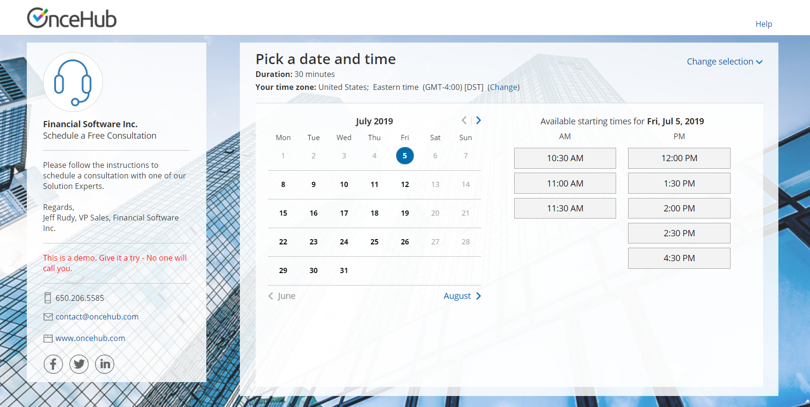

import { Aside } from "@astrojs/starlight/components";

The [Theme designer](/scheduleonce/customization-branding/theme-designer/introduction-to-theme-designer "Introduction to the ScheduleOnce Theme designer") allows you to fully customize the look and feel of your [Booking pages](/scheduleonce/event-types-booking-pages/booking-pages/introduction-to-booking-pages "Introduction to Booking pages") and [Master pages](/scheduleonce/master-pages-resource-pools/master-pages/introduction-to-master-pages "Introduction to Master pages").

You can add your logo to your Booking pages from the [Theme designer](/scheduleonce/customization-branding/theme-designer/introduction-to-theme-designer "The Theme designer"). Your logo can be added to any of the [out-of-the-box System themes](/scheduleonce/customization-branding/theme-designer/system-themes "System themes"), or any [Custom theme](/scheduleonce/customization-branding/theme-designer/custom-themes "Custom themes") that you create. Your Customers will see your logo in the top left corner of the page when they access your Booking pages or Master pages, ensuring that the scheduling experience is completely under your brand.

You do not need an assigned product license to update the Theme designer, create custom themes, or update a Booking page's theme. [Learn more](/account-administration/user-management/user-management-and-seats)

Figure 1: Booking page with OnceHub logo

## Adding your logo to a theme

1. Go to **Booking pages** in the bar on the left .
2. On the left, select **Theme designer**.
3. Select the System theme or Custom theme that you would like to add your logo to (Figure 1). 

   Figure 1: Selecting a theme

4. In the **Core properties** section, click the **Choose image** button (Figure 2). 

   Figure 2: Choose an image for your Header logo

5. Select the image that you would like to use for your Booking page logo. The recommended size of the **Header logo** is 200px wide by 50px high.

If you would like to use different branding for different Booking pages, you can create multiple themes with different logos. Each of your Booking pages can have its own theme with its own logo.

## Using a link with your logo

You can also define a link for your logo in your [Booking page's Public content section](/scheduleonce/event-types-booking-pages/booking-pages/booking-pages-public-content "Booking page: Public content section") or your [Master page's Public content section](/scheduleonce/master-pages-resource-pools/master-pages/master-pages-public-content "Master Page: Public Content section").

If your Customer clicks on the logo on your Booking page or Master page, a new tab will open with the website you defined.

<Aside type="note">

If you have added a website to the Public content section of your Master page, it will override any website added in the Public content section of any Booking pages you include in the Master page.

</Aside>
