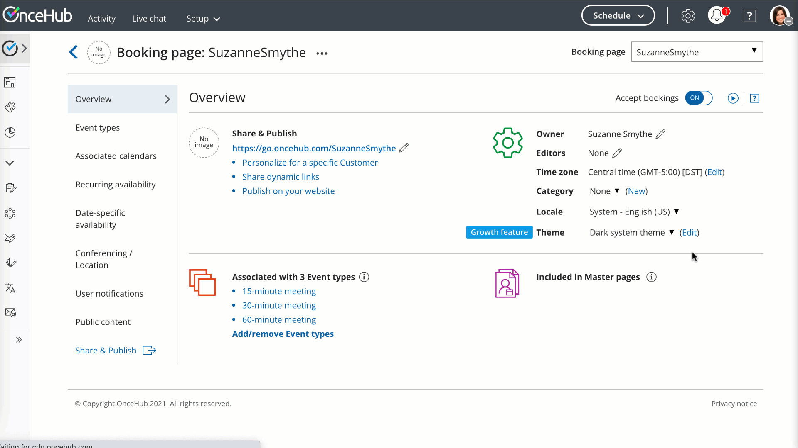
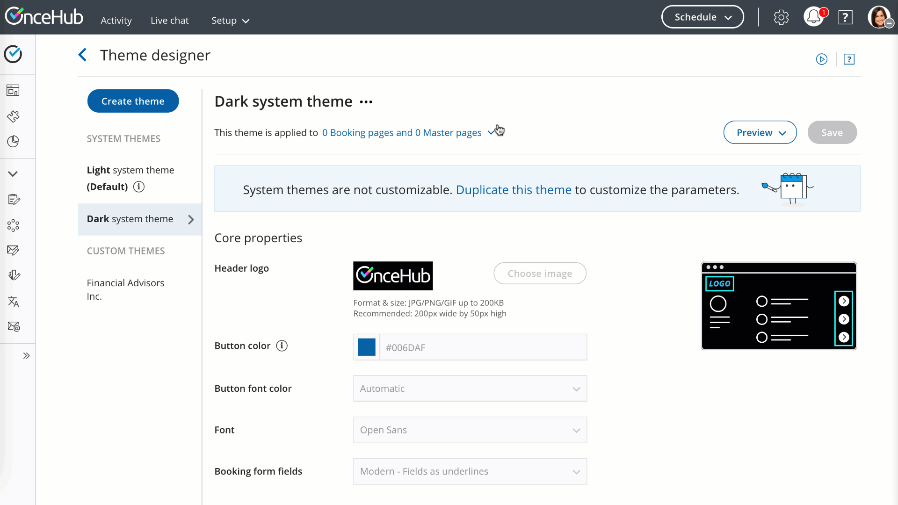
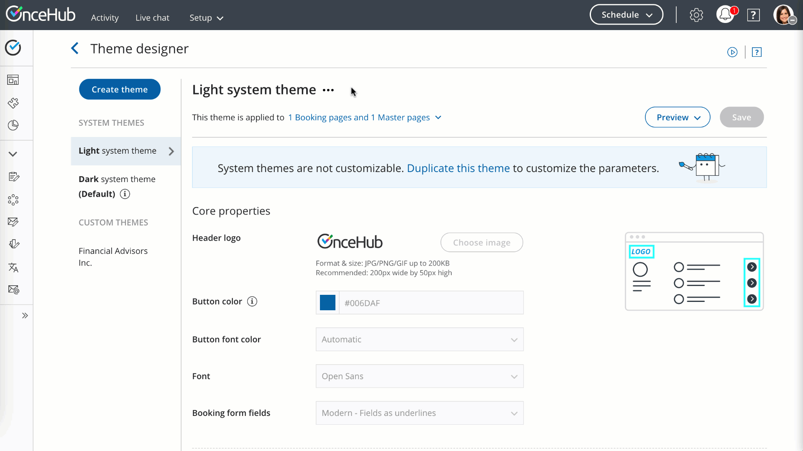

import { Aside } from "@astrojs/starlight/components";

The [Theme designer](/scheduleonce/customization-branding/theme-designer/introduction-to-theme-designer "Introduction to the ScheduleOnce Theme designer") allows you to fully customize the look and feel of your [Booking pages](/scheduleonce/event-types-booking-pages/booking-pages/introduction-to-booking-pages "Introduction to Booking pages") and [Master pages](/scheduleonce/master-pages-resource-pools/master-pages/introduction-to-master-pages "Introduction to Master pages").

Themes are applied to each Booking page and Master page individually. However, applying a theme to a Master page always overrides the themes applied to the Booking pages included in that Master page.

Themes determine the logo, branding. and look and feel of your Booking pages and Master pages. Any changes made to a theme that has already been applied to a page are immediately visible on the Customer app.

## Applying a theme

You can apply a theme in a couple places: on the relevant **booking page** or on the relevant theme in the [Theme designer](/scheduleonce/customization-branding/theme-designer/introduction-to-theme-designer).

### Apply a theme directly to a page

1. Go to **Booking pages** in the bar on the left.
2. Select the [Booking page](/scheduleonce/event-types-booking-pages/booking-pages/introduction-to-booking-pages "Introduction to Booking pages") or [Master page](/scheduleonce/master-pages-resource-pools/master-pages/introduction-to-master-pages "Introduction to Master pages") for which you want to change the theme.
3. In the **Overview** section, select a theme from the **Theme** drop-down menu (Figure 1).

Figure 1: Apply a theme directly to a page

### Apply on a specific theme

1. Go to **Booking pages** in the bar on the left.
2. On the left, select **Theme designer**.
3. Select the theme you want to apply.
4. In the three-dot menu, click on **Apply** (Figure 2).
5. Select the relevant page(s) you want to use that theme and select the **Apply** button.

Figure 2: Apply a theme

### Your default theme

In the [Theme designer](/scheduleonce/customization-branding/theme-designer/introduction-to-theme-designer), you can set a default theme that applies to any newly created Booking page or Master page.

Figure 3: Apply a default theme
