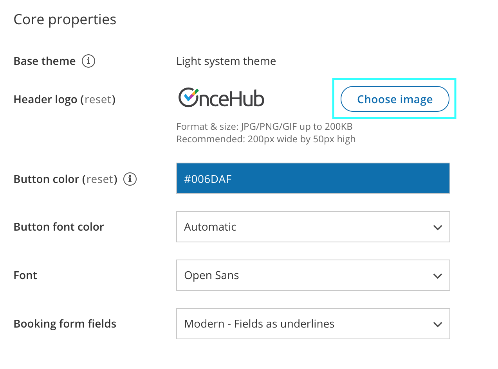
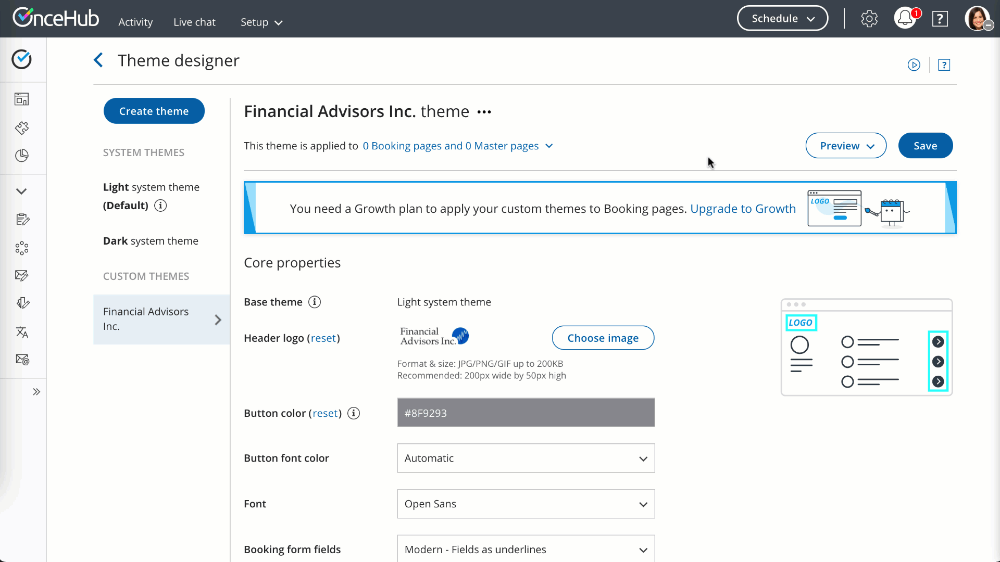

import { Aside } from "@astrojs/starlight/components";

The [Theme designer](/scheduleonce/customization-branding/theme-designer/introduction-to-theme-designer "Introduction to the ScheduleOnce Theme designer") allows you to fully customize the look and feel of your [Booking pages](/scheduleonce/event-types-booking-pages/booking-pages/introduction-to-booking-pages "Introduction to Booking pages") and [Master pages](/scheduleonce/master-pages-resource-pools/master-pages/introduction-to-master-pages "Introduction to Master Pages").

The Theme designer comes with two[ system themes](/scheduleonce/customization-branding/theme-designer/system-themes "System Themes"). If you need more customization for your theme, you can create a custom theme by duplicating an existing theme and modifying it, or you can create a new custom theme from scratch.

You do not need an assigned product license to create custom themes in the Theme designer. [Learn more](/account-administration/user-management/user-management-and-seats)

However, you may need to upgrade your plan to apply a custom theme to your page(s).

In this article, you'll learn about creating a custom theme.

## Creating a custom theme

1. Go to **Booking pages** in the bar on the left.

2. On the left, select **Theme designer**.

3. Click the **Create theme** button on the top left corner.

4. In the **Create theme** pop-up, enter a **Theme name** and select a **Base theme** for your new Custom theme. Then click **Create**.

   <Aside type="note">

   **Note** The **Base theme** cannot be changed once the theme is created.

   </Aside>

5. Alternatively, you can duplicate an existing theme by clicking the **Duplicate theme** button (Figure 2). <video src="/videos/duplicate-theme.mp4" autoplay loop muted playsinline></video>

   Figure 2: Duplicate theme button

6. Configure your custom theme as required by modifying the Core properties (Figure 3), Page background properties, Interaction pane properties, and Information pane properties. [Learn more about Theme properties](/scheduleonce/customization-branding/theme-designer/theme-properties "Theme properties") Figure 3: Core properties

7. Click **Save**.

### Default theme

You can set any theme as your default theme, including a system theme. The default theme is automatically applied to all newly created pages, but not to existing pages.

Figure 4: Default theme

## Previewing and applying a Custom theme

You can preview a theme on a Booking page or Master page by selecting it from the drop-down menu in the top right of the Theme designer and clicking the **Preview** button (Figure 4). Previewing a theme does not apply the theme to the page.

Figure 5: Previewing a theme

Once you're happy with it, you can [apply the theme](/scheduleonce/customization-branding/theme-designer/applying-theme "Applying a theme ").
