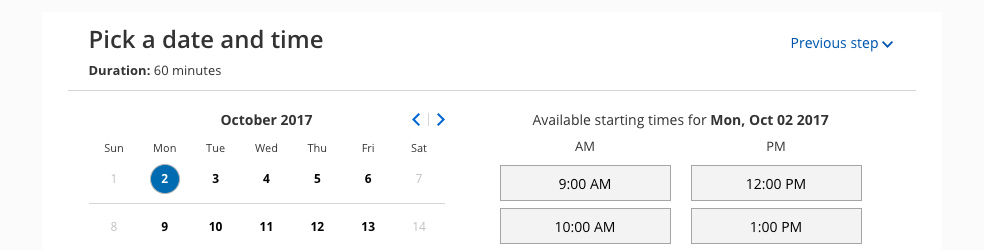

import { Aside } from "@astrojs/starlight/components";

The OnceHub [Theme designer](/scheduleonce/customization-branding/theme-designer/introduction-to-theme-designer "Introduction to the ScheduleOnce Theme designer") provides two system themes for your [Booking pages](/scheduleonce/event-types-booking-pages/booking-pages/introduction-to-booking-pages "Introduction to Booking pages") and [Master pages](/scheduleonce/master-pages-resource-pools/master-pages/introduction-to-master-pages "Introduction to Master pages"). You can use these themes as they are, or adjust them according to your needs.

In this article, you'll learn about System themes.

## Editing a system theme

1. Go to **Setup → OnceHub setup** and open the lefthand sidebar.
2. In the **Tools** section, select **Theme designer**.
3. Select a System theme from the list on the left hand side of the page (Figure 1). 

   Figure 1: Select a System theme

4. If required, you can add a **header logo**, edit the **button color**, and edit the **button font color**.
5. When you're done making changes, click **Save**.

## Theme properties of a System theme

You can customize the following [Theme properties](/scheduleonce/customization-branding/theme-designer/theme-properties "Theme properties") of a System theme:

- **Header logo:** This image is visible to your Customers.
- **Button color:** This is the color of the buttons and other properties on your page. It is intended to attract your Customer's attention to specific elements.
- **Button font color:** This can be used to maximize contrast against the button background color. We recommend keeping it on **Automatic**.

<Aside type="note">

&#x20;If you want to customize additional Theme properties, you'll need to [create a Custom theme](/scheduleonce/customization-branding/theme-designer/custom-themes "Custom themes").

You may need to upgrade your plan to apply a custom theme to your page(s).

</Aside>

## Previewing and applying a System theme

To preview a theme on a Booking page or Master page, select it from the drop-down menu in the top right of the Theme designer and click the **Preview** button (Figure 2). Previewing a theme does not apply the theme to the page.

Figure 2: Preview a System theme

[Learn more about applying a theme](/scheduleonce/customization-branding/theme-designer/applying-theme "Applying a theme ")

### Default theme

You can set any theme as your default theme, including a system theme. The default theme is automatically applied to all newly created pages, but not to existing pages.

Figure 3: Set as default theme

## Available System themes

- **Light** (This is the default theme) 

  Figure 4: Light system theme

- **DarkFigure 5: Dark system theme**
