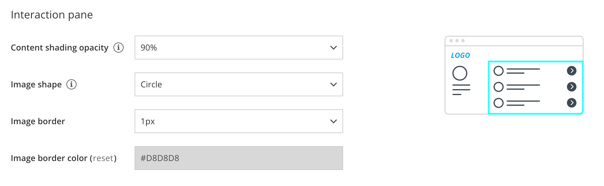
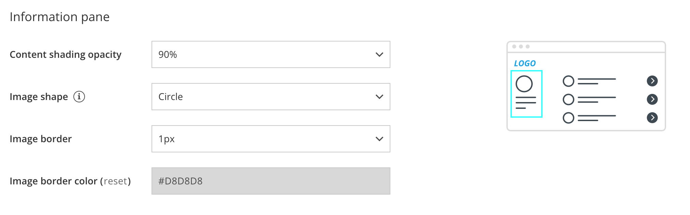

import { Aside } from "@astrojs/starlight/components";

The OnceHub Theme designer allows you to fully customize the look and feel of your [Booking pages](/scheduleonce/event-types-booking-pages/booking-pages/introduction-to-booking-pages "Introduction to Booking pages") and [Master pages](/scheduleonce/master-pages-resource-pools/master-pages/introduction-to-master-pages "Introduction to Master Pages").

The specific design of a theme comes from the properties you can define in four sections of the Theme designer:

- Core properties
- Page background
- Interaction pane
- Information pane

<Aside type="note">

System themes allow you to define the **Header logo**, **Button color**, and **Button font color** of the theme. If you'd like to define more properties, you'll need to [create a custom theme](/scheduleonce/customization-branding/theme-designer/custom-themes "Custom Themes").

</Aside>

In this article, you'll learn about Theme properties.

## Core properties

Figure 1: Core properties for a Custom theme

The Core properties of a theme define the base theme color palette, the font of the theme, button and font colors, and the style of the Booking form fields.

- **Base theme:** Each theme is based on either the Light color palette or Dark color palette. This cannot be changed once the theme is created.
- **Header logo:** The Header logo visible to your Customers on the Booking page. The recommended size of the Header logo is 200px wide by 50px high.
- **Button color:** The background color of buttons and other key components on your page.
- **Button font color:** The color of text on buttons can be set either automatically (to maximize contrast against the Button background color), or manually to white or black.
- **Font:** The font family to be used across the Customer booking process.
- **Booking form fields:** The style can be either Modern (fields as underlines) or Classic (fields as boxes). Modern form fields are selected by default.

## Page background

Figure 2: Page background properties

- **Background color:** This color will show when no background image is selected, before the background image is loaded, and when the background image is hidden.

- **Background image:** You can upload any background image, texture, or pattern. The image may appear cropped in order to always cover the entire background of the browser window. The recommended size for your background image is 2000px wide by 1000px high.

  <Aside type="note">

  **Note**You should make sure that you own the copyright to an image, texture, or pattern before using it as a background image.

  </Aside>

- **Hide background image:** You may want to hide the background image on mobile devices or when your Booking page is [integrated into your website](/scheduleonce/sharing-publishing/publishing-on-websites/website-embed "Website embed").

## Interaction pane

Figure 3: Interaction pane properties

The Interaction pane of your [Booking page](/scheduleonce/event-types-booking-pages/booking-pages/introduction-to-booking-pages "Introduction to Booking pages") or [Master page](/scheduleonce/master-pages-resource-pools/master-pages/introduction-to-master-pages "Introduction to Master pages") is where the scheduling process takes place. This is where your Customers selects a Booking page or [Event type](/scheduleonce/event-types-booking-pages/event-types/introduction-to-event-types "Introduction to Event types"), selects a time, and fills out the [Booking form](/scheduleonce/customization-branding/booking-forms-editor/introduction-to-booking-forms-editor "Introduction to the Booking forms editor").

- **Content shading opacity:** Determine the opacity to optimize the readability of text over your background image or background color.
- **Image shape:** Apply a uniform shape or mask to all of the images that you uploaded for the Public content sections of your [Event types](/scheduleonce/event-types-booking-pages/event-types/public-content "Event type: Public content section") and [Booking pages](/scheduleonce/event-types-booking-pages/booking-pages/booking-pages-public-content "Booking page: Public content section"). You can choose for the shape of your images to be a **Circle**, **Rounded square**, **Square**, or to use **No mask** on your images.
- **Image border:** Apply a uniform border width to all of your images.
- **Image border color:** Apply a uniform border color to all of your images.

## Information pane

Figure 4: Information pane properties

The Information pane displays the information about your Booking page or Master page. It includes the page’s image, description, and contact information.

- **Content shading opacity:** Determine the opacity to optimize the readability of text over your background image or color.
- **Image shape:** Apply a shape or mask to the image that you uploaded for the Public content section of your [Booking page](/scheduleonce/event-types-booking-pages/booking-pages/booking-pages-public-content "Booking page: Public content section") or [Master page](/scheduleonce/master-pages-resource-pools/master-pages/master-pages-public-content "Master page: Public content section"). You can choose for the shape of your images to be a **Circle**, **Rounded square**, **Square**, or to use **No mask** on your images.
- **Image border:** Apply a border width to this image.
- **Image border color:** Apply a border color to this image.
