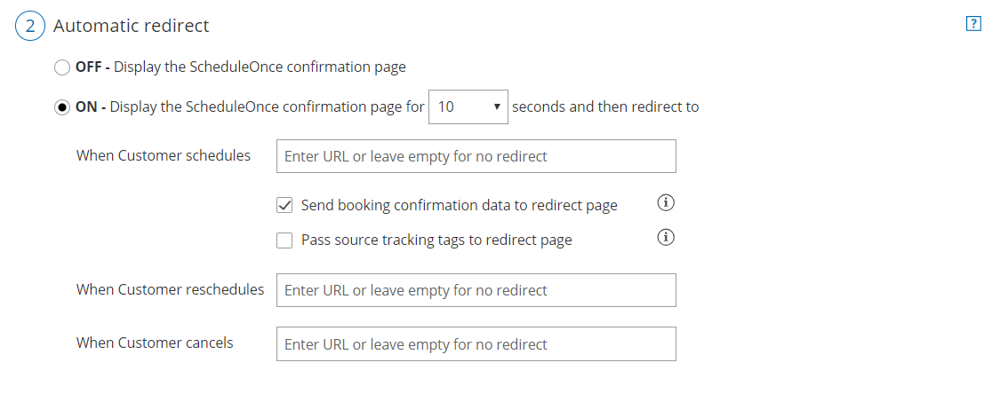

import { Aside } from "@astrojs/starlight/components";

You can automatically redirect your customers to different web pages after they schedule, [reschedule](/scheduleonce/managing-bookings/cancel-reschedule/customer-action-reschedule-single-booking "Customer Action: Reschedule a single booking") or [cancel](/scheduleonce/managing-bookings/cancel-reschedule/customer-action-cancel-single-booking "Customer Action: Cancel a single booking") a booking.

In this article, you'll learn about the automatic redirect settings.

## Configuring the automatic redirect

You can configure the automatic redirect in the **booking form and redirect** section. The [location of the booking form and redirect section](/scheduleonce/event-types-booking-pages/event-types/booking-form-and-customer-notifications "Location of the Booking form and the Customer notifications sections") depends on whether or not your b[ooking page](/scheduleonce/event-types-booking-pages/booking-pages/introduction-to-booking-pages "Introduction to Booking pages") has any [event types](/scheduleonce/event-types-booking-pages/event-types/introduction-to-event-types "Introduction to Event types") associated with it.

- For booking pages **associated** with event types, go to **booking pages** in the bar on the left → select the relevant **event type → booking form and redirect** section.
- For booking pages **not associated** with event types, go to **booking pages** in the bar on the left → select the relevant **booking page → booking form and redirect** section.

Figure 1: Automatic redirect settings

<Aside type="caution">

You can change the location of the **Booking form and redirect** section to be located on the Booking page or the Event type. To set the location, go to **Booking pages** in the bar on the left → **Event types** pane → action menu (three dots) → **Event type sections**. [Learn more about Event type sections](/scheduleonce/event-types-booking-pages/event-types/booking-form-and-customer-notifications "Location of the Booking form and the Customer notifications sections")

</Aside>

## Automatic redirect set to OFF

This is the default option. When Automatic redirect is set to **OFF**, the Customer will see the Booking confirmation after they schedule, reschedule or cancel a booking.

This page gives the Customer information about the booking that they've just made. It also gives the Customer the option to download the meeting’s ICS file into their calendar.

If you're working in [Booking with approval mode](/scheduleonce/event-types-booking-pages/scheduling-options/automatic-booking-or-booking-with-approval "Automatic booking or Booking with approval"), the confirmation page will display the requested times that the Customer gave as options. If you're using [Session packages](/scheduleonce/event-types-booking-pages/scheduling-options/session-packages "Session packages"), the meeting time for every session will be displayed.

## Automatic redirect set to ON

When Automatic redirect is set to **ON**, the Customer will be automatically redirected from the Booking confirmation page to the URL of your choice.

You can redirect immediately after the schedule, reschedule or cancellation process is completed, or choose to have the Customer stay on the confirmation page for a short amount of time and then be redirected.

You can also choose to redirect to different pages when a Customer makes a new booking, reschedules or cancels. Redirect will only take place if a URL was provided.

<Aside type="note">

Automatic redirect can also be used when the page is embedded.

</Aside>

## Using Automatic redirect

If enabled, Automatic redirect takes effect after the Customer completes a scheduling, rescheduling or cancellation process.

By default, all booking processes end on the confirmation page. Automatic redirect allows you to skip this confirmation page completely, or show it for a limited time and then redirect to a page of your choice.

You can also pass [source tracking](/scheduleonce/managing-bookings/analytics/using-oncehub-with-utm-tracking "Using ScheduleOnce with source tracking (UTM tags)") tags to the redirect page, or redirect booking confirmation data to a custom confirmation page.

Automatic redirect is used for several purposes:

- **Align with your business process:** After scheduling, Customers can fill out a form or perform additional steps.
- **Measure your campaign effectiveness:** You can accurately measure traffic and funnel conversion by adding Google analytics, Facebook pixel, Adwords, or other tracking mechanisms to the redirect target pages.
- **Brand your "thank you" pages:** You can design and create your own "thank you" pages. These can be shown to Customers either after the Booking confirmation page or instead of it.
