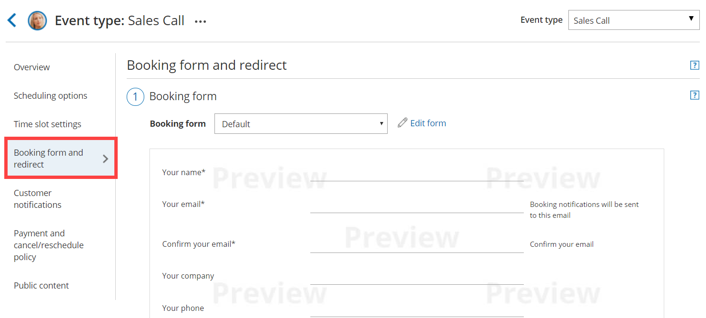
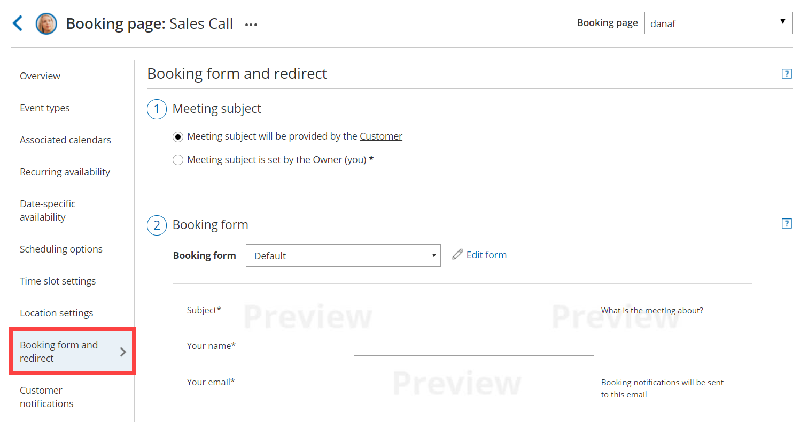
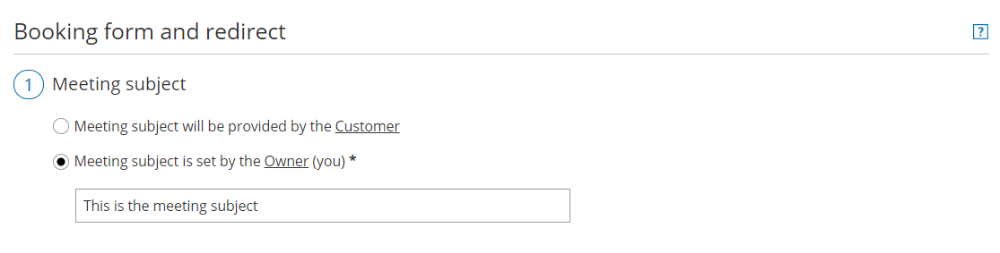
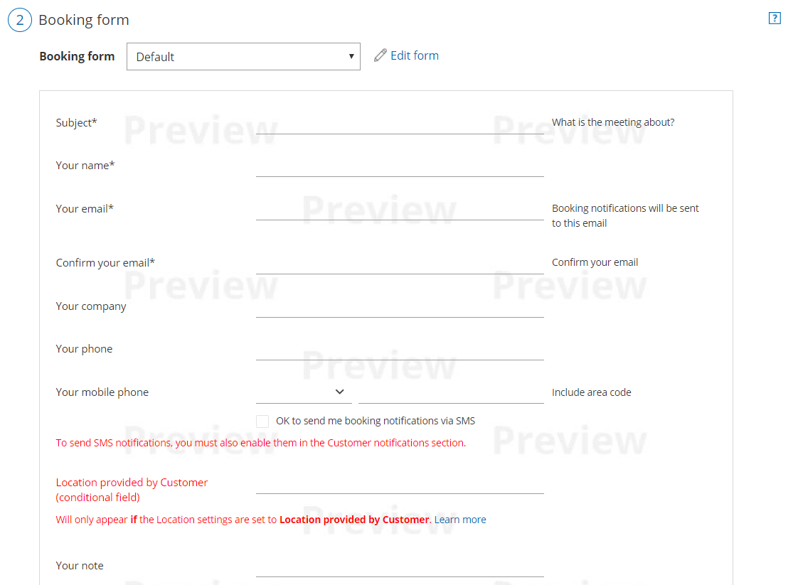
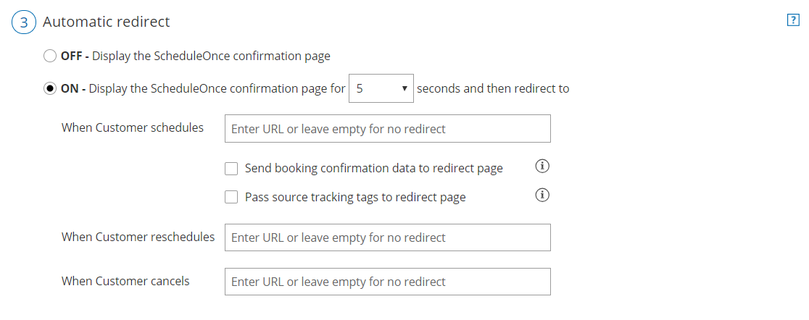

import { Aside } from "@astrojs/starlight/components";
import YouTubeEmbed from "~/components/YouTubeEmbed.astro";

<YouTubeEmbed
  id="VSI5TMob96k"
  title="Introduction to the Booking form and redirect"
/>
In the **Booking form and redirect** section, you can define the meeting
subject, the Booking form you wish to use, and the redirect options when your
Customer makes a booking.

You can also decide to skip or [prepopulate](/scheduleonce/event-types-booking-pages/booking-forms-redirect/prepopulated-booking-forms "Prepopulated Booking forms") the Booking form when a Customer makes a booking. This can be achieved when Customer data is passed to your [Sharing links or Publishing options](/scheduleonce/sharing-publishing/general-one-time-links/introduction-to-general-and-one-time-links "Introduction to general and one-time links").

## Location of the Booking form and redirect section

The [location of the Booking form and redirect section](/scheduleonce/event-types-booking-pages/event-types/booking-form-and-customer-notifications "Location of the Booking form and the Customer notifications sections") depends on whether or not your [Booking page](/scheduleonce/event-types-booking-pages/booking-pages/introduction-to-booking-pages "Introduction to Booking pages") has any [Event types](/scheduleonce/event-types-booking-pages/event-types/introduction-to-event-types "Introduction to Event types") associated with it.

- For Booking pages **associated** with Event types, go to **Booking pages** in the bar on the left → select the relevant **Event type → Booking form and redirect** section (Figure 1). Figure 1: Booking form and redirect section on Event type
- For Booking pages **not associated** with Event types, go to **Booking pages** in the bar on the left → select the relevant **Booking page →** **Booking form and redirect** section (Figure 2). Figure 2: Booking form and redirect section on Booking page

<Aside type="caution">

You can change the location of the **Booking form and redirect** section to be located on the Booking page or the Event type. To set the location, go to **Booking pages** in the bar on the left → **Event types** pane→ action menu (three dots) → **Event type sections**. [Learn more about Event type sections](/scheduleonce/event-types-booking-pages/event-types/booking-form-and-customer-notifications "Location of the Booking form and the Customer notifications sections")

</Aside>

## Meeting subject

You can choose if you want the meeting subject to be set by the Owner (you) or by the Customer (Figure 1).

If you choose to let the Customer provide the meeting subject, it will be a required field on the Booking form. The Customer will not be able to make a booking without completing this field.

Figure 1: Meeting subject

When your Booking page is associated with an Event type, this section will not be visible. The meeting subject is set by default to the Event type name and cannot be changed.

<Aside type="note">

If the [Booking form is skipped](/scheduleonce/event-types-booking-pages/booking-forms-redirect/collecting-customer-data-with-booking-forms "Collecting Customer data with Booking forms") and the Meeting subject is set by the Customer, the Meeting subject is automatically set to _Personal meeting_.

</Aside>

## Booking form

The drop-down menu contains the Booking forms that have been created in the [Booking forms editor](/scheduleonce/customization-branding/booking-forms-editor/introduction-to-booking-forms-editor "Introduction to the Booking forms editor"). A preview of the Booking form can be seen below the drop-down menu. The preview includes all the fields in the Booking form, in the exact order in which they will appear to your Customers.

If you wish to edit the Booking form, click **Edit form**. [Learn more about the Booking forms editor](/scheduleonce/customization-branding/booking-forms-editor/introduction-to-booking-forms-editor "Introduction to the Booking forms editor")

Figure 2: Booking form

## Automatic redirect

This setting allows you to decide what will happen after your Customers complete the booking process.

Figure 3: Automatic redirect

When Automatic redirect is set to **OFF**, the Customer will see a comprehensive confirmation page with the meeting information. This is the default setting.

When Automatic redirect is set to **ON,** the Customer will be [automatically redirected](/scheduleonce/event-types-booking-pages/booking-forms-redirect/automatic-redirect "Automatic redirect") to a web page of your choice when the booking is submitted.

- This can be used to redirect the Customer to a thank you/landing page or to a payment page.
- Another use case is to measure the effectiveness of your marketing campaigns by adding tracking code such as Adwords, Facebook pixel or Google Analytics code to the redirect target page.
- You can also pass [source tracking](/scheduleonce/managing-bookings/analytics/using-oncehub-with-utm-tracking "Using ScheduleOnce with source tracking (UTM tags)") tags to the redirect page, or redirect booking confirmation data to a custom confirmation page.

Separate fields are provided for scheduling, rescheduling and canceling redirect target pages. You can use the same URL for all three processes, or enter different URLs to serve each purpose. Note that automatic redirect can also be used when the page is embedded.
