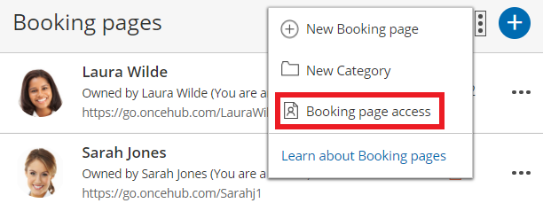

import { Aside } from "@astrojs/starlight/components";
import YouTubeEmbed from "~/components/YouTubeEmbed.astro";

Booking pages in a multi-User account are portable and shareable. This means they can be moved between User profiles and accessed by multiple Users. Additionally, any User in the account can choose to subscribe to email or SMS [User notifications](/scheduleonce/event-types-booking-pages/user-notifications/introduction-to-user-notifications "Introduction to User notifications section") for a specific Booking page.

In this article, you'll learn about the different types of Booking page access permission.

<YouTubeEmbed id="yPMp3T8fqWI" title="Booking page access permissions" />

## Access permission levels

Access to Booking pages is determined by a User's **Access permission** for that specific page. There are four levels of permission that Users can have for a Booking page: **Owner**, **Editor**, **Viewer**, and **No access**. See below for more details on each level.

To edit Booking page access permissions, you must be a [OnceHub Administrator](/account-administration/user-management/user-roles-overview "Differences between Administrator and Member"). However, you do not need a license. [Learn more](/account-administration/user-management/user-management-and-seats)

## Editing Booking page access permissions

1. In OnceHub, click **Booking Pages** in the left-hand navigation bar.
2. Then, open the Booking page action menu (three dots) in the **Booking pages** pane (Figure 1).
3. Select **Booking page access**. 

   Figure 1: Booking page action menu

4. Use the **User** drop-down in the top right-hand corner to switch between Users. Use the **Access permission** drop-down to determine the User's access permissions for each Booking page in the account. 

   Figure 2: Booking page access

Alternatively, go to **Booking pages** in the bar on the left, then select the relevant Booking page → [Overview ](/scheduleonce/event-types-booking-pages/booking-pages/booking-pages-overview "Booking page: Overview section")section. Here you can edit the specific Booking page's Owner and Editor (Figure 3). This method is only possible if the Administrator is able to edit the specific Booking page.

Figure 3: Edit the Owner and Editors in the Booking page Overview section

<Aside type="note">

If you change the Owner of a Booking page, any [User notifications](/scheduleonce/event-types-booking-pages/user-notifications/introduction-to-user-notifications "Introduction to User notifications section") settings you have previously customized for the Owner will be returned to the default settings for the new Booking page Owner.

</Aside>

## Booking page access permission levels

There are four levels of permission that Users can have for a Booking page.

### Owner

This level of permission is available for both Administrator and Member User roles. The [Booking page Owner ](/scheduleonce/event-types-booking-pages/booking-pages/booking-page-ownership "Booking Page Ownership")is the person who receives the bookings created via the Booking page. The Owner is the only User who can see the details of their calendar appointments. The Owner also receives the Booking page's activity in their [Activity stream](/scheduleonce/managing-bookings/analytics/activity-stream-viewing-activities "Introduction to the ScheduleOnce Activity stream") and is automatically subscribed to all email [User notifications](/scheduleonce/event-types-booking-pages/user-notifications/introduction-to-user-notifications "Introduction to User notifications section") for that Booking page. There can only be one Owner for each Booking page.

- When using booking pages with a connected calendar, the booking is automatically created in the Owner’s connected calendar.
- When using booking pages without a connected calendar, the Owner and any additional Editors can receive a scheduling confirmation email with a calendar event that can be manually added to the calendar.

You must be assigned a scheduled meetings license to be Owner of an enabled Booking page. [Learn more](/account-administration/user-management/user-management-and-seats#frequently-asked-questions)

[Learn more about Booking page ownership](/scheduleonce/event-types-booking-pages/booking-pages/booking-page-ownership "Booking Page Ownership")

### Editor

This level of permission is available for both Administrator and Member User roles. By default, an Editor has almost complete access rights to the Booking page. An Editor also receives all activity for that Booking page in their Activity stream. An Editor can't view the detailed information of the appointments from the Owner's calendar in the [Date-specific Availability section](/scheduleonce/event-types-booking-pages/booking-pages/booking-pages-date-specific-availability "Booking Page: Date-specific availability section"). The Editor can subscribe to all email and SMS User notifications for that Booking page.

You do not need an assigned scheduled meetings license to be Editor of a Booking page. [Learn more](/account-administration/user-management/user-management-and-seats)

### Viewer

Only Admins can have this access level and it is the default permission when an Administrator User is created.

Viewers can see all Booking pages, Event types, and Master pages on the **Booking pages** **setup** page. Viewers also receive all activity for all Booking pages in the Activity stream. Viewers can't edit the settings of Booking pages and don't receive booking notifications.

You do not need an assigned scheduled meetings license to be Viewer of a Booking page. [Learn more](/account-administration/user-management/user-management-and-seats)

### No access

This level of permission is available for Member User role only. With this access level, the specific Booking page won't show at all in the Member's account. Only Members can have this access level and it is the default permission when a new Member User is created.

## Granular-level access permissions

In addition to the four access levels described above, you can define **granular-level (section-specific) access** (Figure 4) to Booking page sections. This applies to both Owner and Editor access levels. An Administrator editing a User profile can choose whether to grant that User read-only or editing privileges for all Booking page sections.

To edit these settings, go to the **Booking page access** section and click the  icon at the left of each row where the User is Owner/Editor.

Figure 4: Granular permissions
