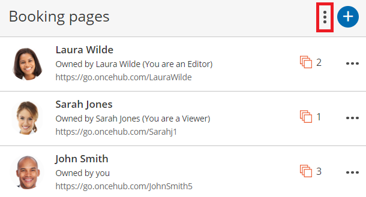
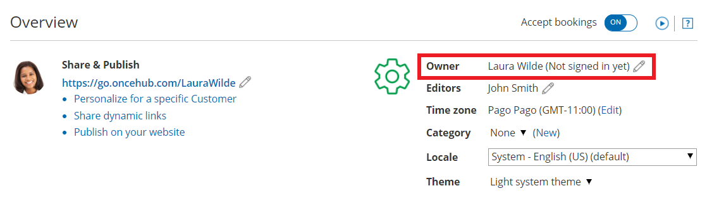

import { Aside } from "@astrojs/starlight/components";

In this article, you'll learn about assigning Booking page ownership to a User.

The ownership of Booking pages can be changed by any [OnceHub Administrator](/account-administration/user-management/user-roles-overview "Differences between Administrator and Member") with a scheduled meetings license. You do not need to have a license to assign Booking page ownership. [Learn more](/account-administration/user-management/user-management-and-seats)

## Assigning Booking page ownership

There are two ways to assign ownership of a [Booking page](/scheduleonce/event-types-booking-pages/booking-pages/introduction-to-booking-pages "Introduction to Booking pages") to a User:

1. Go to **Booking pages** in the bar on the left \***\*→**&#x20;**&#x42;ooking pages action menu (three dots) \*\***→** [Booking page access](/scheduleonce/event-types-booking-pages/booking-pages/booking-page-access-permissions "Booking page access permissions")**. In this section, you can determine which Booking pages each specific User owns.

   Figure 1: Booking page action menu

2. Go to **Booking pages** in the bar on the left **→ Relevant Booking page **→** [Overview section](/scheduleonce/event-types-booking-pages/booking-pages/booking-pages-overview "Booking page: Overview section")** (Figure 2). Here you can edit the specific Booking page's Owner.

   Figure 2: Booking page Overview section

<Aside type="note">

If you change the Owner of a Booking page, any [User notifications](/scheduleonce/event-types-booking-pages/user-notifications/introduction-to-user-notifications "Introduction to User notifications section") settings you have previously customized for the Owner will be returned to the default settings for the new Booking page Owner.

</Aside>

## Assignment scenarios

Users can be connected to various applications: a calendar, a video conferencing solution, and also a CRM system. When you assign Booking pages, you might experience inconsistencies in application connections.

There are three assignment scenarios:

### Assigning Booking page ownership to a new User

In this case, the new User profile does not yet exist. The Administrator invites the User to join the organization’s account and at the same time assigns ownership of one or more Booking pages. Booking pages remain enabled even if the Owner has not signed up yet.

It is recommended that the new User review the settings of the Booking page, especially the [Associated calendars section](/scheduleonce/event-types-booking-pages/booking-pages/booking-pages-associated-calendars "Booking page: Associated calendars section"), to ensure that the desired calendars are selected.

The User must have a scheduled meetings license assigned to them in order to be Owner of an enabled Booking page. [Learn more](/account-administration/user-management/user-management-and-seats#frequently-asked-questions)

### New Owner of a Booking page are not connected to any application, or connected to the same application

If both the original and new Owners of a Booking page are connected to the same account within a specific application, they will remain connected and no action is required.

### No connection differences between the original Owner and new Owner of a Booking page

In this case, the original Owner will be disconnected from the applications. When you update the changes in the new Owner’s User profile, a message appears indicating the changes that will occur upon transfer of ownership.

### An Administrator unassigns the Owner's scheduled meetings license

If you unassign someone's scheduled meetings license and they were Owner of a Booking page, that Booking page will be disabled automatically. If you prefer, you can reassign ownership to another User with a license.

## Disconnection scenarios

The following disconnection scenarios can occur:

- **When disconnecting from a calendar:** The Booking section is reset to its default settings. The Booking page is set to [Booking with approval](/scheduleonce/event-types-booking-pages/scheduling-options/automatic-booking-or-booking-with-approval "Automatic booking or Booking with approval") with [unlimited bookings per slot and unlimited bookings per day](/scheduleonce/event-types-booking-pages/timeslot-settings/limiting-number-of-bookings "Limiting the number of bookings per day or per week"). The [Time slot duration setting](/scheduleonce/event-types-booking-pages/timeslot-settings/time-slot-display "Time slot display") is set to 15 minutes and Starting times for time slots is set every 15 minutes.
- **When disconnecting from a video conferencing application:** The [Conferencing / Location section](/scheduleonce/event-types-booking-pages/booking-pages/booking-pages-location-settings "Booking page: Conferencing / Location settings section") of the Booking page is automatically set to the **Don't use conferencing or location** option. You will need to update the Conferencing / Location settings manually.
- **When disconnecting from a CRM:** the Booking pages will not create or update records in the CRM.
