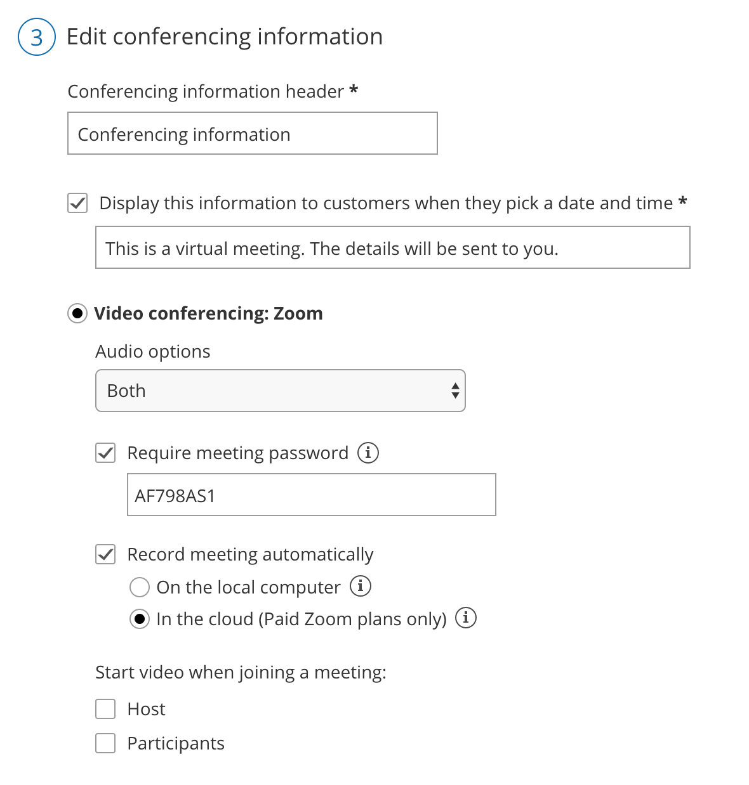

import { Aside } from "@astrojs/starlight/components";
import YouTubeEmbed from "~/components/YouTubeEmbed.astro";

In the **Conferencing / Location** section of your [Booking page](/scheduleonce/event-types-booking-pages/booking-pages/introduction-to-booking-pages "Introduction to Booking pages"), you can decide whether or not to use a meeting channel.

In this article, you'll learn about setting up the **Conferencing / Location** section.

<YouTubeEmbed id="yseG7v5H-DQ" title="Booking pages: Location settings" />

## Accessing the Conferencing / Location section

To access this section, go to **Booking pages** in the bar on the left. Select the relevant **Booking page** **→ Conferencing / Location** (Figure 1).

Figure 1: Conferencing / Location section

## Conferencing / Location options

If you decide to set a meeting channel, the Booking page **Conferencing / Location** settings allow you to specify four types of locations for the meeting. The four different options are explained in the sections below.

## Virtual location provided by you

In this case, the meeting is virtual and conducted over the phone or via audio or video conferencing. In the **Edit conferencing information** step, you should enter the details that the Customer needs in order to connect to the conference (Figure 2).

Figure 2: Edit conferencing information

You can provide your own video conferencing details, or integrate your account with one of our native video conferencing integrations: [Zoom](/user-integrations/basics-user-integrations/connect-your-video-conferencing-app "The ScheduleOnce connector for Zoom"), [Google Meet](/user-integrations/basics-user-integrations/connect-your-video-conferencing-app), [Microsoft Teams](/user-integrations/basics-user-integrations/connect-your-video-conferencing-app), GoToMeeting, or Webex Meetings.

When the Customer makes a booking, they will be notified that this is a virtual meeting (Figure 3), and they will receive all connection details in the scheduling confirmation email and calendar invite.

Figure 3: Conferencing information when a virtual location provided by you

## Virtual location provided by the Customer

In this case, the meeting is virtual and conducted over the phone or via audio or video conferencing. However, conferencing information for the meeting is provided by the Customer and not by you.

When the Customer makes a booking, they will be notified that this is a virtual meeting and they will be providing the conferencing information (Figure 4).

The information that the Customer provides will then be available in the scheduling confirmation email and calendar invite.

Figure 4: Conferencing information when virtual location provided by the Customer

### Information displayed to Customers when they select a date and time

This setting allows you to control the text that displays in the **Pick a date and time** step when Customers select a time on your Booking form. This information is important, as the meeting location may impact the Customer's time selection. For example, if the Customer knows that this is a virtual meeting, they may want to have it sooner rather than later. They'll also know that they don't need to plan for travel time.

Figure 5: Date and time information

## Physical location set by you

In this case, the location is a physical address. You can choose to show the Customer the location with a link to a map in the **Pick a date and time** step of the Booking form (Figure 6). The Customer will be able to take this information into account when they select a booking time.

Figure 6: Location details when the physical location set by you

To display the location information on the Booking form, check the box marked **Show the header and address when customers select a date and time** (Figure 7).

Figure 7: Entering the physical meeting information

When the Customer makes a booking, the location details will be available in the scheduling confirmation email and calendar invite.

## Physical location set by the Customer

In this case, the location is an input field that the Customer must provide information for. You can choose to tell the Customer in the **Pick a date and time** step that they need to provide a location (Figure 8). They will be able to take this information into account when selecting a time.

Figure 8: Location details when the physical location is set by the Customer

To display the location information on the Booking form, check the box marked **Display this information to customers when they select a date and time** (Figure 9).

Figure 9: Location information when the Customer provides the location

The location the Customer provides will then be available in the scheduling confirmation email and calendar invite.

### The Meeting location header

The Meeting location header is used to name the location field. The header will be available in all places where the location is displayed, including communication emails and calendar events.
