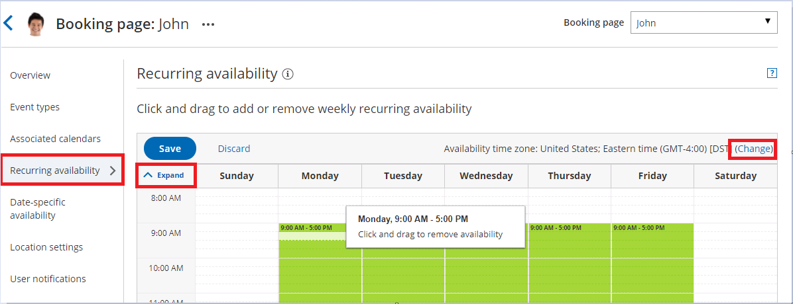
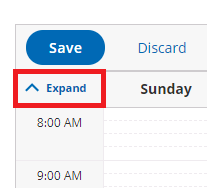
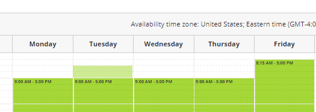

import { Aside } from "@astrojs/starlight/components";

Availability is always managed per Booking page. Availability settings on one Booking page are separate from the availability settings on another Booking page. OnceHub uses two types of availability: Recurring availability and [Date-specific availability](/scheduleonce/event-types-booking-pages/booking-pages/booking-pages-date-specific-availability "Booking page: Date-specific availability section").

You can use Recurring only, Date-specific only, or both. Recurring availability is defined on a weekly basis, allowing you to create a pattern that repeats every week.

You do not need an assigned product license to access and update the Recurring availability section, though you do need the right [Booking page access permissions](/scheduleonce/event-types-booking-pages/booking-pages/booking-page-access-permissions). This means an assistant or other collaborator can update your availability on your behalf, without paying for an extra license.

In this article, you'll learn about using the Recurring availability section.

## When to use Recurring availability

Recurring availability is best to use if your availability is consistent from week to week. This is especially true if you have connected your calendar and you use busy times to block out your availability.

If you have exceptions to your Recurring availability, you can use [Date-specific availability](/scheduleonce/event-types-booking-pages/booking-pages/booking-pages-date-specific-availability "Booking page: Date-specific availability section") to edit your availability without changing your weekly pattern. Date-specific availability overrides Recurring availability, and can be used to reduce or increase your availability.

## Requirements

To edit the **Recurring availability** section, you must be an Owner or Editor of the Booking page with the permission enabled in your Profile.

## Editing the Recurring availability section

1. Go to **Booking pages** in the bar on the left.
2. Select the relevant Booking page.
3. Click on the **Recurring availability** section of the Booking page (Figure 1). The default weekly recurring availability is set between 9 AM and 5 PM based on the Booking page time zone. Note that only a weekly pattern without dates is displayed. Busy time from your connected calendar is not shown. 

   Figure 1: Recurring availability section

4. To update the time zone for this entire Booking page, click the time zone **Change** link (Figure 2). Note that your connected calendar must be set to the same time zone. 

   Figure 2: Change time zone

5. To modify the hours displayed in the grid, click **Expand** and define your preferences (Figure 3). 

   Figure 3: Expand hours

6. To add availability, click and drag over white (unavailable) slots, to mark them green (Figure 4). This will increase your availability for all weeks. 

   Figure 4: Adding availability

7. To remove availability, click and drag over green (available) slots, to mark them white (Figure 5). This will reduce your availability for all weeks. 

   Figure 5: Removing availability

8. Click **Save**.
