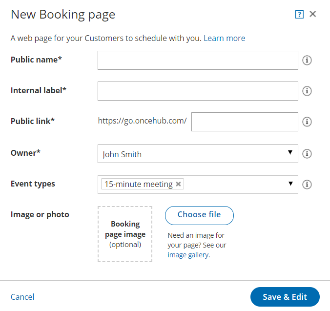

import { Aside } from "@astrojs/starlight/components";

Booking pages are powerful and versatile pages through which bookings are made. Booking pages can be used with or without [Event types](/scheduleonce/event-types-booking-pages/event-types/introduction-to-event-types "Introduction to Event types"), depending on your specific scheduling scenario.

OnceHub creates a new Booking page for every User you add. However, you may wish to add more pages to support your organization's needs. In this article, you'll learn how to create a new Booking page.

## Requirements

To create Booking pages, you must be either a [OnceHub Administrator](/account-administration/user-management/user-roles-overview "Differences between Administrator and Member") or a Member with the permission enabled in your Profile.

You do not need an assigned product license to create a Booking page. [Learn more](/account-administration/user-management/user-management-and-seats)

## Creating a new Booking page

1. Go to **Booking pages** in the bar on the left.

2. Click the Plus button  in the **Booking pages** pane. If you already have another Booking page similar to the one you're creating, it may be quicker to [duplicate the existing Booking page](/scheduleonce/event-types-booking-pages/booking-pages/duplicating-booking-page "How to duplicate a Booking page").

3. The **New Booking page** pop-up appears (Figure 1).Figure 1: New Booking page pop-up

4. Define the properties for your Booking page.

   - **Public name -** The Public name is visible to Customers as the page title. It can be changed later in the [Public content section](/scheduleonce/event-types-booking-pages/event-types/public-content).
   - **Internal label -** The Internal label is only visible internally and is not visible to your Customers. We recommend using a recognizable label because the Booking page will be identified with this label throughout our system. It can be changed later in the [Overview section](/scheduleonce/event-types-booking-pages/booking-pages/booking-pages-overview "Booking page: Overview section").
   - **Public link -** This is the link used by Customers to access the page. The Public link must be unique and include at least four characters. It can be changed later in the Overview section. The unique link extension you define can be added to any of our domains in order to share the link.
   - **Owner -** The Owner is the User who receives the bookings. Booking page ownership can be changed later in the Overview section or the Profile of the target User.
   - **Editors (optional) -** Editors are Users who can edit/view the page and receive User notifications. This feature is available in multi-User accounts only.
   - **Event types -** [Event types](/scheduleonce/event-types-booking-pages/event-types/introduction-to-event-types "Introduction to Event types") are the meeting types offered to the Customer. We recommend associating your Booking page with at least one Event type. The association can be changed later in the Event types section of the Booking page.
   - **Image or photo (optional) -** You may add a photo or image to your page, which will be visible to Customers. It can be changed later in the [Public content section](/scheduleonce/event-types-booking-pages/event-types/public-content "Event type: Public content section").

5. Click **Save & Edit**. You will be redirected to the Booking page Overview section to continue editing your settings.
