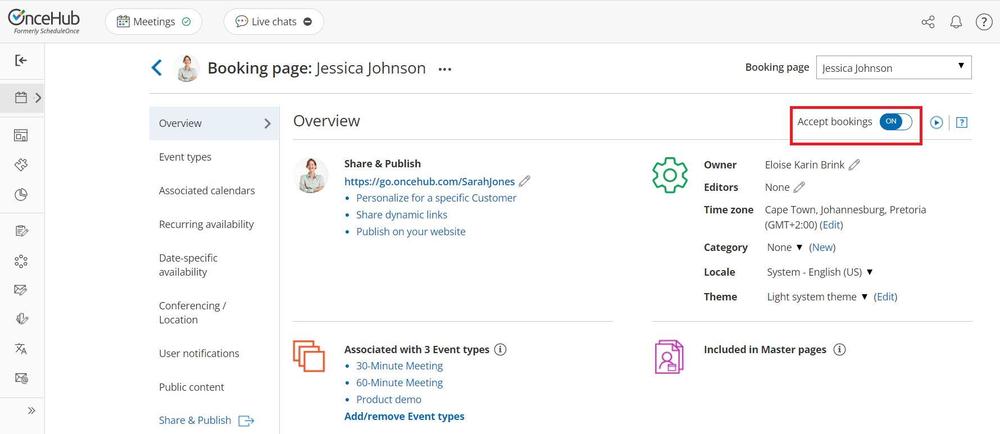

import { Aside } from "@astrojs/starlight/components";

To disable a [Booking page](/scheduleonce/event-types-booking-pages/booking-pages/introduction-to-booking-pages "Introduction to Booking pages"), go to the Booking page's [Overview section](/scheduleonce/event-types-booking-pages/booking-pages/booking-pages-overview "Booking page: Overview section") and toggle the On/Off switch in the top right corner (Figure 1).

Figure 1: Booking page Enable/Disable toggle

Alternatively, you can completely delete the Booking page by going to **Booking pages** in the bar on the left, clicking the action menu  of the relevant Booking page, and selecting **Delete** (Figure 2). In the **Delete Booking page** popup that opens, click **Yes**.

Figure 2: Deleting a Booking page

## Effects of disabling your Booking page

- Customers will not be able to make new bookings.
- Customer will not be able to cancel existing bookings.
- Customer will not be able to reschedule existing bookings on that same page.
  - If an existing booking was booked through [a chatbot](/ai-front-office-workers/website-assistant/chatbots/introduction-to-chatbots), and the disabled page is an [additional team member](/scheduleonce/master-pages-resource-pools/panel-meetings/additional-team-members) in a panel, they can reschedule the meeting if there are others available. However, the existing calendar event, notifications, and any other data will not be updated.
- The [Public content section](/scheduleonce/event-types-booking-pages/booking-pages/booking-pages-public-content "Booking Page: Public Content section") is still visible to your Customers whether your page is enabled or disabled. Consider changing your personal message if you're thinking about disabling your Booking page.
- On the Booking page's Overview section, the **Accept bookings** toggle switch is in the **Off** position, and an alert message is displayed under the Booking page name with a link to enable the page (Figure 3). To facilitate accurate setup, the status of disabled pages is indicated in most Booking page lists within the app. Figure 3: Booking page Enable link
- The Booking page will also be labelled as **\[Disabled]** in the **Booking page scheduling** **setup** page (Figure 4). Figure 4: Disabled Booking page
- A **No times are currently available** message will show on your Booking page when Customers try to book with you (Figure 5).Figure 5: No times are currently available message

You do not need an assigned license to disable or enable Booking pages. [Learn more](/account-administration/user-management/user-management-and-seats)
