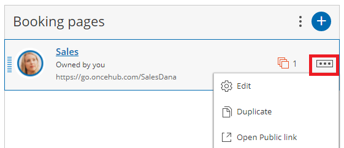
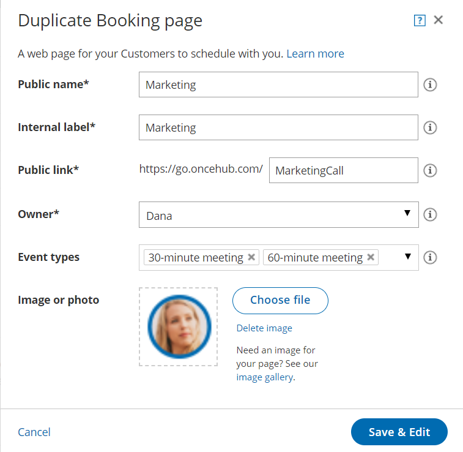

import { Aside } from "@astrojs/starlight/components";

Duplicating [Booking pages](/scheduleonce/event-types-booking-pages/booking-pages/introduction-to-booking-pages "Introduction to Booking pages") or [Event types](/scheduleonce/event-types-booking-pages/event-types/introduction-to-event-types "Introduction to Event types") can save precious time for you when you're setting up and maintaining your OnceHub app. Duplication will instantly clone all your Booking page settings, associations with Event types and even images.

In this article, you'll learn how to duplicate Booking pages.

## Duplicating Booking pages

To duplicate a Booking page, follow these steps:

1. Go to **Booking pages** in the bar on the left and click the action menu (3 dots) of the relevant Booking page (Figure 1). 

   Figure 1: Individual Booking page action menu

2. Select **Duplicate**.
3. In the **Duplicate Booking page** popup window (Figure 2), enter the details for the new Booking page such as the **Public name**, the **Public link** and the Booking page Owner. You can also add an image if desired. Figure 2: Duplicate Booking page popup
4. Once you click the **Save & Edit** button, you're brought to the settings of the newly duplicated Booking page.

## Duplication rules

- Duplication of Booking pages follows the same rules as [creation of new Booking pages](/scheduleonce/event-types-booking-pages/booking-pages/creating-booking-page). Members with the permission to create new Booking pages can also duplicate a Booking page.
- The User duplicating the Booking page is the default Owner, but they choose the Owner of the duplicated Booking page, as well as any Editors. On-screen messages will indicate if the [ownership change has impact on page functionality](/scheduleonce/event-types-booking-pages/booking-pages/booking-page-ownership).
- The new Booking page duplicates all the settings from the source Booking page, including associations with Event types.
- Inclusion in Master pages is **not** duplicated.
- [Booking page access permissions](/scheduleonce/event-types-booking-pages/booking-pages/booking-page-access-permissions) are **not** duplicated in a multi-user account.
