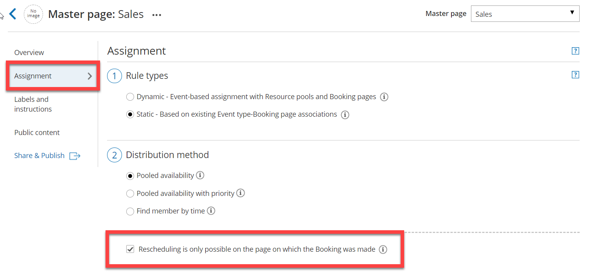
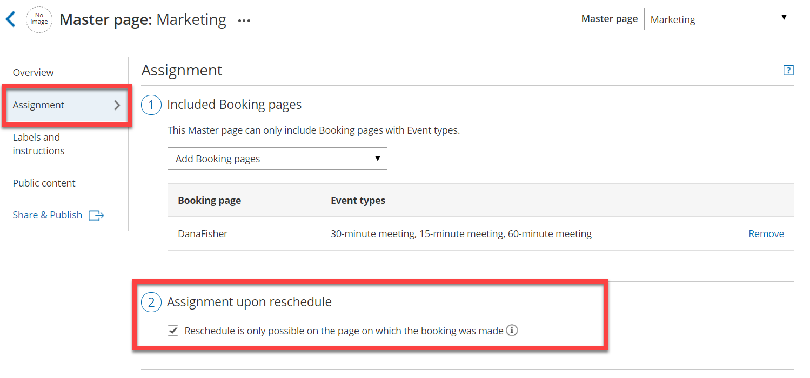
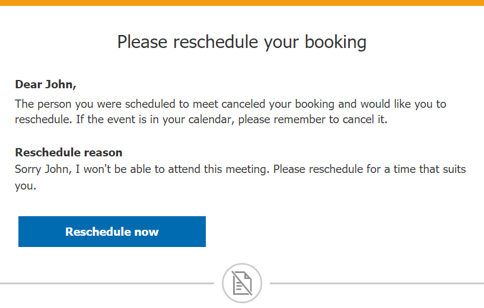

import { Aside } from "@astrojs/starlight/components";

If your Master page includes multiple Booking pages and associated Event types, you can define how bookings will be assigned during the scheduling process. You can decide whether or not a rescheduled booking is assigned to the same Team member originally assigned to it.

If you enable this option, the same Team member is responsible for the service provided to the Customer during the entire booking lifecycle, resulting in a smooth Customer experience.

In this article, you will learn how to ensure that Customers reschedule with the same Booking page.

## Requirements

To enable this rescheduling option:

- You must be a OnceHub Administrator
- You must be working with [Event types](/scheduleonce/event-types-booking-pages/event-types/introduction-to-event-types "Introduction to Event types")
- The [Master page scenario](/scheduleonce/master-pages-resource-pools/master-pages/master-page-scenarios "Master page scenarios") must be [Event types first](/scheduleonce/master-pages-resource-pools/master-pages/event-types-first-booking-pages-second "Event types first (Booking pages second)"), [Booking pages first](/scheduleonce/master-pages-resource-pools/master-pages/booking-pages-first-event-types-second "Booking pages first (Event types second)"), or [Booking pages only](/scheduleonce/master-pages-resource-pools/master-pages/booking-pages-only-without-event-types "Rule-Based Assignment: Static Rules")

## How to enable restricted rescheduling

During the rescheduling process, you have the option to limit rescheduling to the same Booking page that the Customer made the original booking with. To enable this restricted rescheduling option, use the following steps:

1. Go to **Booking pages** in the bar on the left.

2. Select the relevant Master page.

3. Select the **Assignment** section.

4. If your Master pages uses Rule based assignment with Static rules: in the **Distribution method** section, check the box marked **Rescheduling is only possible on the page on which the booking was made** (Figure 1). 

   Figure 1: Limiting rescheduling on a Master page which uses Static rules

   <Aside type="note">

   **Note**

   If a Master page is using Dynamic rules or Resource pools, then a Customer can only reschedule with the original Booking page.

   </Aside>

5. If your Master pages uses [Event types first](/scheduleonce/master-pages-resource-pools/master-pages/event-types-first-booking-pages-second "Event types first (Booking pages second)") or [Booking pages first](/scheduleonce/master-pages-resource-pools/master-pages/booking-pages-first-event-types-second "Booking pages first (Event types second)"): in **Assignment upon reschedule** section, check the box marked **Reschedule is only possible on the page on which the booking was made** (Figure 2). 

   Figure 2: Limiting rescheduling on a Master page using Event types first or Booking pages first

6. Click **Save**.

## Scheduling scenarios

When the Customer reschedules a booking while restricted rescheduling is enabled, they will be presented with the same Booking page that the original booking was made on. The reschedule option is available whether you work with [Automatic mode or Booking with approval](/scheduleonce/event-types-booking-pages/scheduling-options/automatic-booking-or-booking-with-approval "Automatic booking or Booking with approval").

<Aside type="note">

If the Booking page ownership has been changed, the Customer will see the updated Booking page, rather than the original one.

</Aside>

The reschedule option is applied to the following scheduling scenarios:

### Customer reschedules a booking

The Customer clicks the Cancel/reschedule link from the booking confirmation notification and reschedules the booking.

- **If the Booking owner and Booking page owner are the same:** In the Activity stream, the original event is simply updated with the new time and moved in the calendar as a Rescheduled activity. There is no canceled activity and one calendar event is used for the entire booking lifecycle, keeping your records more consistent and efficient.
- **If the Booking owner and Booking page owner are different:** In the Activity stream, the original activity is canceled and a new activity is created. [Learn more about Booking reassignment](/scheduleonce/managing-bookings/reassign/introduction-to-booking-reassignment "Introduction to Booking reassignment")

[Learn more about rescheduling by a Customer](/scheduleonce/managing-bookings/cancel-reschedule/customer-action-reschedule-single-booking "Customer Action: Reschedule a single booking")

### User sends a request to reschedule for the same Event type

In this case, the Customer clicks the **Reschedule now** button in the reschedule request email notification (Figure 3) and reschedules the booking. In the Activity stream, the original activity is canceled and a new activity is created when the Customer reschedules. [Learn more about rescheduling by User with Event types](/scheduleonce/managing-bookings/cancel-reschedule/effects-of-rescheduling "Effect of rescheduling")

Figure 3: Reschedule request email notification to Customer

<Aside type="caution">

&#x20;If the Booking page cannot accept bookings, the Customer will not be able to reschedule.

</Aside>
