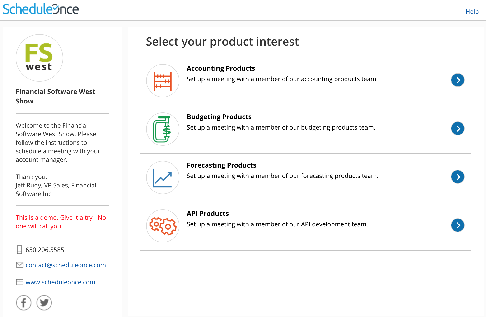

import { Aside } from "@astrojs/starlight/components";

You can use [categories](/scheduleonce/event-types-booking-pages/categories/introduction-to-categories "Introduction to categories") to organize [Event types](/scheduleonce/event-types-booking-pages/event-types/introduction-to-event-types "Introduction to Event types") and [Booking pages](/scheduleonce/event-types-booking-pages/booking-pages/introduction-to-booking-pages "Introduction to Booking pages") into intuitive and functional groups. If Event type categories or Booking page categories are [visible to Customers](/scheduleonce/event-types-booking-pages/categories/creating-categories-for-booking-pages-or-event-types "Creating categories for Booking pages or Event types"), they will show up on your Master page as a separate step. Categories in Master pages help Customers to better understand the options available to them, ensuring that they make the correct selection.

## Scheduling flow of Master pages with categorized Booking pages

[Click this link for an interactive demo](https://go.oncehub.com/show)

1. **Category selection:** Customers are presented with a list of Booking page categories to choose from.

   - By default, the selection instruction is "Select a category." You can [edit the instruction](/scheduleonce/event-types-booking-pages/categories/creating-categories-for-booking-pages-or-event-types "Creating categories for Booking pages or Event types") based on what your categories represent.
   - In the example shown below, categories are used to model different product types offered by the Financial services company. The selection instructions are "Select your product interest."Figure 1: Category selection step

2. **Booking page selection:** Once the Customer has selected a category, they'll be presented with a list of all Booking pages in the selected category. In this example, the Customer sees Booking pages for Team members that specialize in the chosen product category. Figure 2: Booking page selection step

   <Aside type="note">

   **Note** Booking pages that are not within a category will also be displayed in this step, regardless of which category the Customer selected.

   </Aside>

3. **Event type selection:** Next, the Customer will choose an Event type.

4. Finally, the Customer will pick a date and time for the meeting and fill out and submit the [Booking form](/scheduleonce/event-types-booking-pages/booking-forms-redirect/introduction-to-booking-form-and-redirect "Introduction to the Booking form and redirect section").

The category name will always appear in [User notifications](/scheduleonce/event-types-booking-pages/user-notifications/communicating-with-users-and-stakeholders "Communicating with Users and stakeholders"). The category name will only appear in [Customer notifications](/scheduleonce/event-types-booking-pages/customer-notifications/introduction-to-customer-notifications "The Customer Notifications section") if the Customer went through a category selection step during their booking process.

## Scheduling flow of Master pages with categorized Event types

[Click this link for an interactive demo](https://go.oncehub.com/Tutoring)

1. **Category selection:** Customers are presented with a list of Event type categories.

   - By default, the selection instruction is "Select a category." You can edit the instructions based on what your categories represent.
   - In the example shown below, categories are used for different languages that are taught at the school. The selection instructions are "Select a language."Figure 3: Category selection step

2. **Event type selection:** Once the Customer has selected a category, they'll be presented with a list of all the Event types in the selected category. In this example, the Customer sees all courses offered in the selected language.Figure 4: Event type selection step

   <Aside type="note">

   **Note**Event types that are not within a category will also be displayed in this step, regardless of which category the Customer selected.

   </Aside>

3. Once the Customer has selected an Event type, they'll continue the scheduling process. In this example, the Customer picks a tutor, selects a time, and fills out the Booking form.

The Category will always appear in [User notifications](/scheduleonce/event-types-booking-pages/user-notifications/communicating-with-users-and-stakeholders "Communicating with Users and stakeholders"). The category will only appear in [Customer notifications](/scheduleonce/event-types-booking-pages/customer-notifications/introduction-to-customer-notifications "The Customer Notifications section") if the Customer went through a Category selection step during their booking process.

## Scheduling flow of Master pages with categorized Booking pages and Event types

Master pages with categorized Event types and Booking pages will have two separate category selection steps: one for Booking page categories and one for Event type categories. The order in which the category selection steps is displayed depends on the [Master page scenario](/scheduleonce/master-pages-resource-pools/master-pages/master-page-scenarios "Master page scenarios").

Let's take a look at an example where the chosen scenario is **Event types first**.

1. **Event type category selection:** First, the Customer is presented with a list of Event type categories. After they select an Event type category, they'll be presented with a list of all the Event types in that category.

2. **Event type selection**: The Customer selects an Event type in that category.

   <Aside type="note">

   **Note**Event types that are not within a category will also be displayed in this step, regardless of which category the Customer selected.

   </Aside>

3. **Booking page category selection:** After selecting an Event type, the Customer is presented with a list of Booking page categories. After they select a Booking page category, they'll be presented with a list of all the Booking pages in that category.

4. **Booking page selection:** The Customer selects a Booking page in that category.

   <Aside type="note">

   **Note**Booking pages that are not within a category will also be displayed in this step, regardless of which category the Customer selected.

   </Aside>

5. Finally, they'll select a date and time, and fill out a Booking form.
