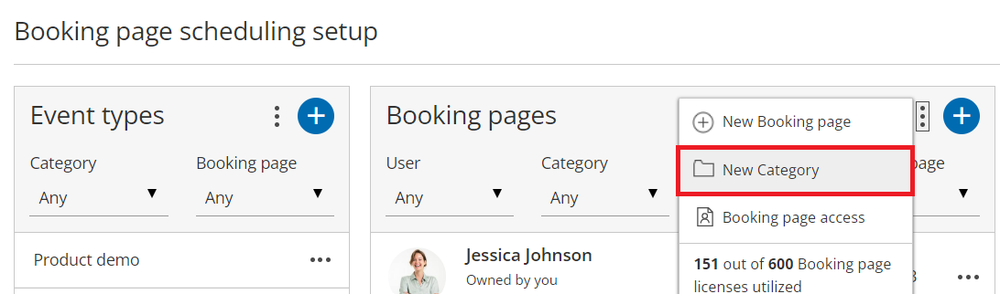
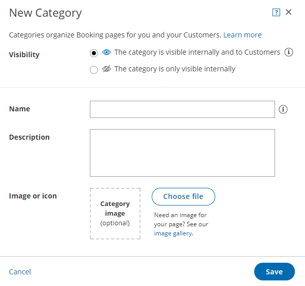
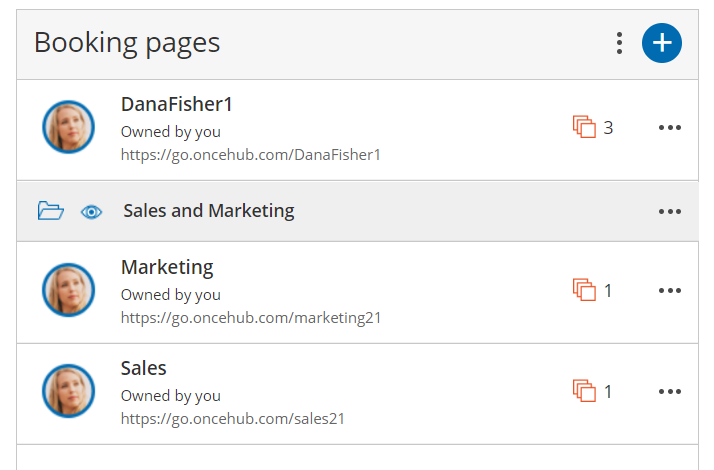

import { Aside } from "@astrojs/starlight/components";

You can create categories to organize [Event types](/scheduleonce/event-types-booking-pages/event-types/introduction-to-event-types "Introduction to Event types") and [Booking pages](/scheduleonce/event-types-booking-pages/booking-pages/introduction-to-booking-pages "Introduction to Booking pages") for you and your Customers. Using categories, you can group your Booking pages and Event types according to your specific scheduling scenarios.

You can choose to use categories exclusively within the Admin interface, in which case they'll be invisible to Customers. Alternatively, you can make categories visible to Customers, in which case they'll appear on your Booking pages and [Master pages](/scheduleonce/master-pages-resource-pools/master-pages/introduction-to-master-pages "Introduction to Master pages").

- When you use categories to organize the Admin interface, you can organize your Event types and Booking pages in a structure that makes it easier to manage department or cross-department roles and ownership in your organization.
- When visible to Customers, categories enable you to model specific scheduling scenarios. You can use categories to organize information so that the Customer experiences a simple decision process.

## Creating a new category

1. Go to **Booking pages** in the bar on the left.

2. Click on the Action menu (three dots) at the top of the Event types or Booking pages column. Select **New Category** (Figure 1). Alternatively, navigate to the [Overview section of an Event type](/scheduleonce/event-types-booking-pages/event-types/event-types-overview "Event type: Overview section") or a [Booking page](/scheduleonce/event-types-booking-pages/booking-pages/booking-pages-overview "Booking page: Overview section") and click **New** next to the **Category** field.

   Figure 1: Booking page scheduling setup

3. In the **New Category** pop-up that appears, select the **Visibility** that you want the category to have. You can choose to make the category visible internally and to your Customers, or visible internally only (Figure 2).
   - When you create categories that will be visible on the Customer side, consider which scheduling process you want to implement and how it will impact the Customer experience. Learn more about [Categorized items in Master pages](/scheduleonce/event-types-booking-pages/categories/categorized-items-in-master-pages "The Customer experience of categorized items in Master pages") and [Categorized Event types in Booking pages](/scheduleonce/event-types-booking-pages/categories/categorized-event-types-in-booking-pages "The Customer experience of categorized Event types in Booking pages") 

     Figure 2: New Category pop-up

4. Enter a **Name** and a **Description** (optional)**.** If you choose to make the category visible to Customers, this is what your Customers will see during the category selection step in the booking process.

   - The **Name** is limited to 45 characters.
   - The **Description** is limited to 2,000 characters.

5. Add an **Image** (optional). This image will be displayed for Customers to see during the category selection step in the booking process.

   - The recommended size is 70x70 pixels and supported formats are JPG, JPEG, PNG, or GIF.
   - The maximum size is 200KB.

6. Click **Save**. The new category is now added to the list.

7. To add Booking pages or Event types to your category, drag and drop Booking pages or Event types into the category (Figure 3). Alternatively, you define the category for each Booking page or Event type in their [Overview section](/scheduleonce/event-types-booking-pages/event-types/event-types-overview "Event type: Overview section"). Figure 3: Drag and drop Booking pages into a category

<Aside type="note">

When a Master page includes Event type categories or Booking page categories that are visible to Customers, you can define labels and selection instructions in the [Labels and instructions section](/scheduleonce/master-pages-resource-pools/master-pages/master-pages-labels-and-instructions "Master Page: Labels and Instructions section") of the Master page.

</Aside>
