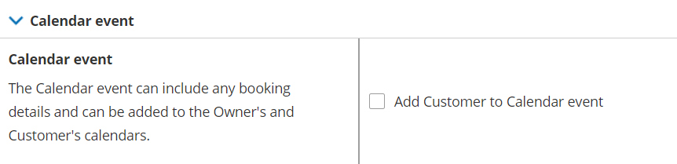

import { Aside } from "@astrojs/starlight/components";

Adding a booking to a Customer's calendar is a critical part in the scheduling process. When the booking is in the Customer's calendar, it's more likely that the Customer will attend the meeting.

In this article, you'll learn about Customer calendar event options.

## Calendar event details

By default, the calendar event created by OnceHub includes all the details that were collected during the booking process, including [location information](/scheduleonce/event-types-booking-pages/booking-pages/booking-pages-location-settings "Booking page: Location settings section"), [video conferencing information](/scheduleonce/event-types-booking-pages/booking-pages/booking-pages-location-settings "Booking page: Location settings section"), and all data collected from the Customer via the [Booking form](/scheduleonce/event-types-booking-pages/booking-forms-redirect/collecting-customer-data-with-booking-forms "Introduction to Booking forms").

<Aside type="note">

The Owner and Customer always see the same calendar event. It is not possible to have different calendar event content for the Owner and Customer. In addition, the Owner’s connected calendar event and the ICS file will always have identical content.

If you want to add content that is only seen by the Owner, you should add it to the [User notifications](/scheduleonce/event-types-booking-pages/user-notifications/introduction-to-user-notifications "Introduction to User notifications section"). If you want to add content that is only seen by the Customer, add it to the [Customer notifications](/scheduleonce/event-types-booking-pages/customer-notifications/introduction-to-customer-notifications "The Customer notifications section").

</Aside>

## Calendar event scenarios

The calendar event experience for your Customers is determined by your calendar connection and whether you choose to [add the Customer to the calendar event](/scheduleonce/event-types-booking-pages/customer-notifications/customer-notification-scenarios "Customer notification scenarios").

|                                          | **Owner connected to calendar**                                                                           | **Owner not connected to calendar**                                     |
| ---------------------------------------- | --------------------------------------------------------------------------------------------------------- | ----------------------------------------------------------------------- |
| **Add Customer to calendar event**       | The calendar event from the Owner’s connected calendar is automatically added to the Customer’s calendar. | The ICS file includes the Customer’s email as a guest/attendee.         |
| **Don’t add Customer to calendar event** | The calendar event from the Owner’s connected calendar is not added to the Customer’s calendar.           | The ICS file does not include the Customer’s email as a guest/attendee. |

## Calendar events in the Owner's calendar

Below are examples of the calendar events that are automatically created in the Owner’s connected calendar when a booking is made.

### With the Customer added

When you add the Customer to the calendar event, the calendar event created in your connected calendar will include the Customer as a guest/attendee. This will prompt your connected calendar to send a calendar invite to your Customer. The invite will automatically add the event to their calendar, whether it's a [Google Calendar](/user-integrations/google-calendar-connection/connect-oncehub-to-your-google-workspace "Introduction to Google Calendar connection"), [Office 365 Calendar](/user-integrations/ms-office365-calendar-connection/connect-oncehub-to-your-microsoft-office-365 "Introduction to Office 365 Calendar connection"), [Exchange/Outlook Calendar](/user-integrations/exchange-outlook-calendar-connection/connect-oncehub-to-your-exchangeoutlook-calendar "Introduction to Exchange Calendar connection") , or [iCloud Calendar](/user-integrations/icloud-calendar-connection/connect-oncehub-to-your-icloud-calendar "Introduction to iCloud Calendar connection").

### Without the Customer added

When you choose not to add the Customer to the calendar event, the calendar event created in your connected calendar will not include the Customer as a guest/attendee. A calendar invite will not be sent to the Customer. This ensures that your calendar event will not be added to the Customer’s calendar under any circumstances.

## The ICS file

If the Owner is not connected to a calendar, or if the booking is made for a non-OnceHub User, ICS files will be sent to the Owner in the default scheduling confirmation email.

### With the Customer added

When you add the Customer to the calendar event, the ICS calendar file will include the Customer as a guest/attendee. When you open the ICS file and save it to your calendar, your calendar will ask you if you would like to send a Calendar invite to the Customer. This Calendar invite will add the event to the Customer’s calendar, whether it's a [Google Calendar](/user-integrations/google-calendar-connection/connect-oncehub-to-your-google-workspace "Introduction to Google Calendar connection"), [Office 365 Calendar](/user-integrations/ms-office365-calendar-connection/connect-oncehub-to-your-microsoft-office-365 "Introduction to Office 365 Calendar connection"), [Exchange/Outlook Calendar](/user-integrations/exchange-outlook-calendar-connection/connect-oncehub-to-your-exchangeoutlook-calendar "Introduction to Exchange Calendar connection") , or [iCloud Calendar](/user-integrations/icloud-calendar-connection/connect-oncehub-to-your-icloud-calendar "Introduction to iCloud Calendar connection").

### Without the Customer added

When you choose not to add the Customer to the calendar event, the ICS calendar file will not include the Customer as a guest/attendee. This ensures that your calendar event will not be added to the Customer’s calendar under any circumstances.

## Time displayed in the calendar invite sent to your Customer

The calendar event generated by your connected calendar or your ICS file will adjust its time to the Customer's calendar time zone. If your Customers are not professional calendar users, and they have not properly set the time zone in their calendar, the calendar event they receive might have the wrong time.

If this becomes a frequent occurrence, you should not add your Customers to the calendar event. This can be adjusted in the [Customer notifications section](/scheduleonce/event-types-booking-pages/customer-notifications/introduction-to-customer-notifications "The Customer notifications section") by unchecking the box marked **Add Customer to calendar event** (Figure 1).

Figure 1: Calendar event option in the Customer notifications section

When you choose not to add the Customer to the calendar event, the Customer still has a good solution available to them. They can simply add the calendar event on their own from the Scheduling confirmation page or the default scheduling confirmation email that is sent to them. This calendar event for the Customer is set to an absolute time and will always have the correct time regardless of the time zone in the Customer’s calendar.
