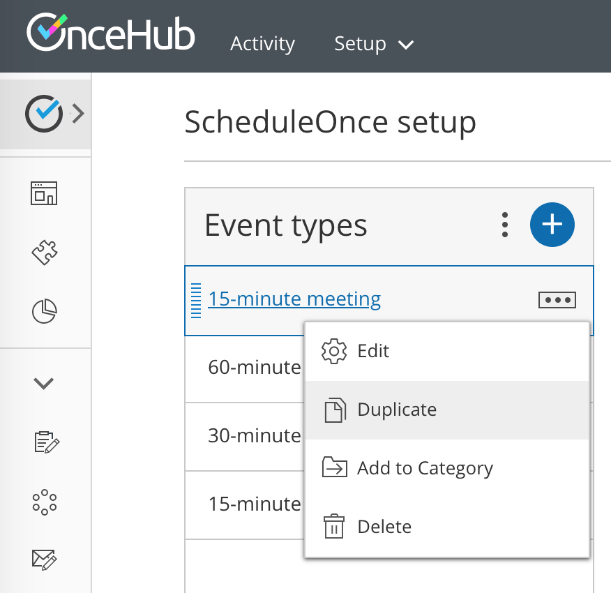

import { Aside } from "@astrojs/starlight/components";

Duplicating [Booking pages](/scheduleonce/event-types-booking-pages/booking-pages/introduction-to-booking-pages "Introduction to Booking pages") or [Event types](/scheduleonce/event-types-booking-pages/event-types/introduction-to-event-types "Introduction to Event types") can save precious time for you when you're setting up and maintaining your OnceHub app. Duplication instantly clones all the settings associated with Event types, including images.

In this article, you'll learn how to duplicate an Event type.

## Duplicating Event types

To duplicate an Event type, follow these steps:

1. Go to **Booking pages** in the bar on the left.
2. &#x20;Click the action menu (3 dots) of the relevant Event type (Figure 1). 

   Figure 1: Individual Event type action menu

3. Select **Duplicate**.
4. In the new window, enter a **Public name** and add an image if desired.
5. Once you click the **Save** button, you're brought to the duplicated Event type settings.

## Duplication rules

- Only Administrators have the permission to create or duplicate Event types.
- A new Event type inherits all settings from the source Event type.
- Association of Event types with Booking pages is **not** duplicated.
- Inclusion in Master pages is **not** duplicated.
- A new Event type appears just above its source Event type on the **Booking page scheduling** **setup** page, and under the same category.
