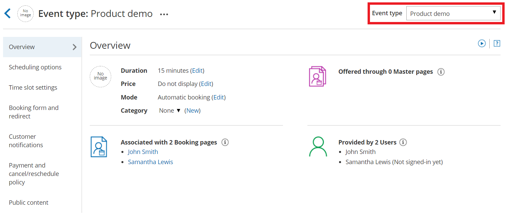
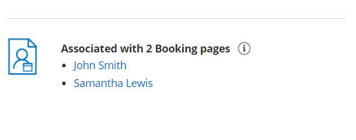
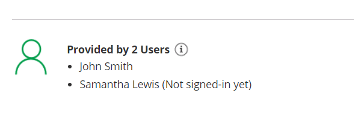
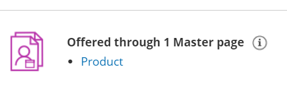

import { Aside } from "@astrojs/starlight/components";

The Event type Overview section summarizes the main properties of a specific [Event type.](/scheduleonce/event-types-booking-pages/event-types/introduction-to-event-types "Introduction to Event types") It includes the main settings, associated [Booking pages](/scheduleonce/event-types-booking-pages/booking-pages/introduction-to-booking-pages "Introduction to Booking pages"), Users who provide the Event type, and [Master pages](/scheduleonce/master-pages-resource-pools/master-pages/introduction-to-master-pages "Introduction to Master Pages") it is offered through.

To switch between **Overview** sections of different Event types without returning to **Booking pages setup**, use the shortcut dropdown in the top right corner (Figure 1).

Figure 1: Event type Overview section

## Main settings

- **Duration:** The duration of the slot allocated for each booking. [Learn more about Time slot display](/scheduleonce/event-types-booking-pages/timeslot-settings/time-slot-display "Time slot display")
- **Price:** Each Event type may show a price. Users can [collect payment via OnceHub](/scheduleonce/account-integrations/payment-collection/paypal/payment-integration-throughout-booking-lifecycle "Payment integration throughout the booking lifecycle"), show a price only, or show no price.
- **Mode:** Select from between Automatic booking mode and Booking with approval mode. [Learn more about Scheduling options](/scheduleonce/event-types-booking-pages/scheduling-options/introduction-to-scheduling-options "Introduction to the Scheduling Options Section")
- **Category:** Categories organize Event types for you and your Customers. [Learn more about Categories](/scheduleonce/event-types-booking-pages/categories/introduction-to-categories "Introduction to Categories")

## Associated Booking pages

Use this list to review [Booking pages associated with this Event type](/scheduleonce/event-types-booking-pages/booking-pages/adding-event-types-to-booking-pages "Adding Event types to Booking pages") (Figure 2). Click on the Booking pages here to navigate to any that you would like to edit.

Figure 2: Associated Booking pages

[Event types](/scheduleonce/event-types-booking-pages/event-types/introduction-to-event-types "Introduction to Event types") are a powerful tool to standardize the meeting types that will be offered on different [Booking pages](/scheduleonce/event-types-booking-pages/booking-pages/introduction-to-booking-pages "Introduction to Booking pages"). [Create one or more Event types](/scheduleonce/event-types-booking-pages/event-types/creating-an-event-type "Creating an Event type") with specific meeting requirements, then associate them with one or more Booking pages by going to the [Event types section of the Booking page](/scheduleonce/event-types-booking-pages/booking-pages/adding-event-types-to-booking-pages "Adding Event types to Booking pages").

## Users that provide the Event type

Use this list to review [Users](/account-administration/user-management/user-management-and-seats "Introduction to User management") that provide this Event type (Figure 3). Event types are indirectly related to Users through Booking pages. As mentioned above, Event types can be associated with Booking pages. In turn, each [Booking page has an Owner](/scheduleonce/event-types-booking-pages/booking-pages/booking-page-ownership "Booking page ownership") who is the User who will be accepting the bookings. When the [Booking page](/scheduleonce/event-types-booking-pages/booking-pages/introduction-to-booking-pages "Introduction to Booking pages") is associated with one or more Event types, the User who owns the Booking page will be providing these Event types.

Figure 3: Users that provide the Event type

To set up this relationship, you need to do the following steps:

1. Associate Event types with a Booking page in the [Event types section of the Booking page](/scheduleonce/event-types-booking-pages/booking-pages/adding-event-types-to-booking-pages "Adding Event types to Booking pages").
2. Set that Booking page to be owned by the User in the [Overview section of the Booking page](/scheduleonce/event-types-booking-pages/booking-pages/booking-pages-overview "Booking page: Overview section").

## Master pages that offer the Event type

Use this list to review Master pages that offer this Event type (Figure 4). Navigate to any of them that you would like to edit. [Master pages](/scheduleonce/master-pages-resource-pools/master-pages/introduction-to-master-pages "Introduction to Master Pages") provide a single point of access to several Booking pages, and may offer different [Event types](/scheduleonce/event-types-booking-pages/event-types/introduction-to-event-types "Introduction to Event types").

Figure 4: Master pages that offer the Event type

Event types can be directly or indirectly linked to a Master page, depending on the [Master page's scenario](/scheduleonce/master-pages-resource-pools/master-pages/master-page-scenarios "Master page scenarios"). If you're using a [Rule-based assignment](/scheduleonce/master-pages-resource-pools/master-pages/master-page-scenario-team-or-panel-page "Rule-Based Assignment") Master page with [Dynamic rules](/scheduleonce/master-pages-resource-pools/master-pages/assignment-with-team-or-panel-pages "Rule-Based Assignment: Dynamic Rules"), the relationship is direct. You can select Event types to associate with your Master page.

In all other scenarios, the relationship is indirect. Which Event types are offered in your Master page is determined by the Booking pages included in your Master page. The Event types associated with those Booking pages will be offered in your Master page.

### To set up this relationship using Rule-based assignment with [Booking pages only](/scheduleonce/master-pages-resource-pools/master-pages/booking-pages-only-without-event-types "Rule-Based Assignment: Static Rules"), [Event types first](/scheduleonce/master-pages-resource-pools/master-pages/event-types-first-booking-pages-second "Event types first (Booking pages second)"), or [Booking pages first](/scheduleonce/master-pages-resource-pools/master-pages/booking-pages-first-event-types-second "Booking pages first (Event types second)")

1. In the Event types section of each Booking page, choose Event types to associate with the Booking page.
2. Set up your Master page with one of the following scenarios: [Event types first](/scheduleonce/master-pages-resource-pools/master-pages/event-types-first-booking-pages-second "Event types first (Booking pages second)"), [Booking pages first](/scheduleonce/master-pages-resource-pools/master-pages/booking-pages-first-event-types-second "Booking pages first (Event types second)"), or [Rule-based assignment](/scheduleonce/master-pages-resource-pools/master-pages/master-page-scenario-team-or-panel-page "Rule-Based Assignment").
3. In the [Assignment section of your Master page](/scheduleonce/master-pages-resource-pools/master-pages/master-pages-event-types-and-assignment "Master Page: Assignment section"), include these Booking pages in the Master page.

### To set up this relationship using Rule-based assignment with [Dynamic rules](/scheduleonce/master-pages-resource-pools/master-pages/assignment-with-team-or-panel-pages "Rule-Based Assignment: Dynamic Rules")

1. Set up your Master page with Rule-based assignment.
2. In the [Assignment section of the Master page](/scheduleonce/master-pages-resource-pools/master-pages/master-pages-event-types-and-assignment "Master Page: Assignment section"), in the **Rule types** step select **Dynamic rules**.
3. In the **Event-based rules** step, add rules with the Event types you would like to offer in your Master page.

<Aside type="tip">

If you would like to [generate one-time links](/scheduleonce/sharing-publishing/general-one-time-links/using-one-time-links "Using one-time links with your Master page") which are good for one booking only, you should use a Master page using [Rule-based assignment](/scheduleonce/master-pages-resource-pools/master-pages/master-page-scenario-team-or-panel-page "Master page scenario: Rule-based assignment") with [Dynamic rules](/scheduleonce/master-pages-resource-pools/master-pages/assignment-with-team-or-panel-pages "Rule-based assignment: Dynamic rules").

One-time links eliminate any chance of unwanted repeat bookings. A Customer who receives the link will only be able to use it for the intended booking and will not have access to your underlying [Booking page](/scheduleonce/event-types-booking-pages/booking-pages/introduction-to-booking-pages "Introduction to Booking pages"). One-time links [can be personalized](/scheduleonce/sharing-publishing/personalized-links/using-personalized-links "Using Personalized links"), allowing the Customer to pick a time and schedule without having to fill out the [Booking form](/scheduleonce/event-types-booking-pages/booking-forms-redirect/collecting-customer-data-with-booking-forms "Collecting Customer data with Booking forms"). [Learn more about one-time links](/scheduleonce/sharing-publishing/general-one-time-links/using-one-time-links "Using one-time links with your Master page")

</Aside>
