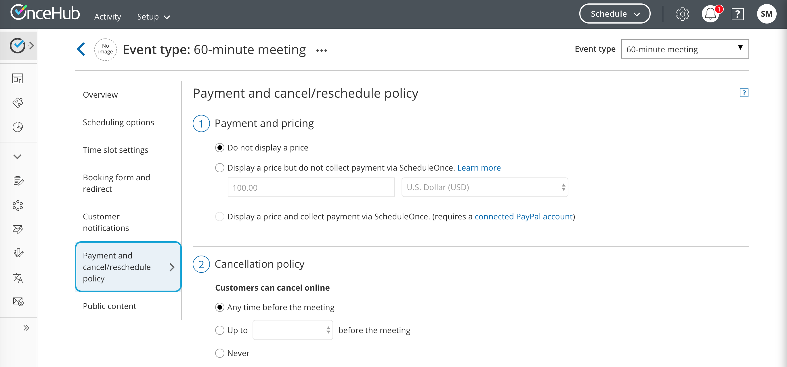
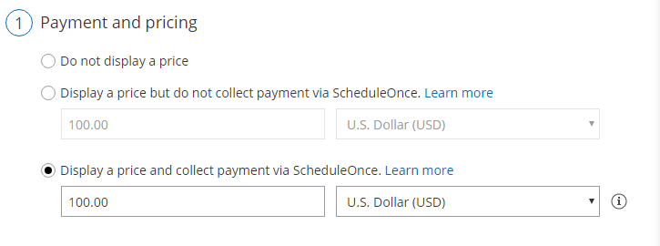
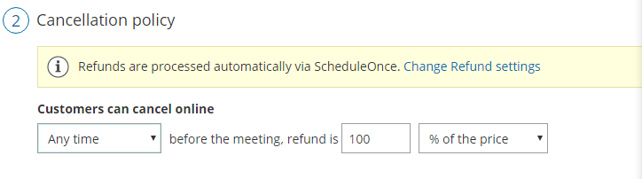
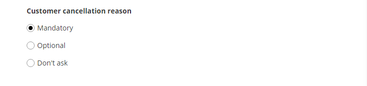
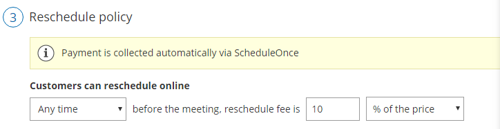
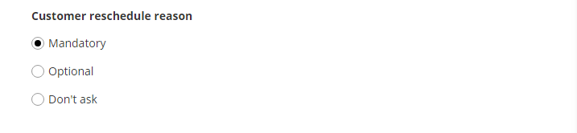

import { Aside } from "@astrojs/starlight/components";

When you display a price for your [Event type](/scheduleonce/event-types-booking-pages/event-types/introduction-to-event-types "Introduction to Event types") and [collect payment via OnceHub](/scheduleonce/account-integrations/payment-collection/paypal/oncehub-connector-for-paypal "The ScheduleOnce connector for PayPal"), your OnceHub app is [connected to PayPal](/scheduleonce/account-integrations/payment-collection/paypal/connecting-oncehub-to-paypal "Connecting ScheduleOnce to PayPal") and payments are collected automatically when Customers schedule or reschedule a booking.

Depending on your [Refund settings](/scheduleonce/account-integrations/payment-collection/paypal/customizing-refund-settings "Customizing refund settings"), you can also enable OnceHub to automatically process refunds when Customers cancel a booking. This allows you to streamline your payment and refund processes and provide a seamless Customer experience.

In the **Payment and cancel/reschedule policy** section, you can automate the payment and refund processes that occur on the Customer Cancel/reschedule page. You can define the price the Customer pays for a booking and the refund amount that the Customer will receive if they cancel. You can also define the reschedule fee they will be charged if they reschedule.

In this article, you'll learn how to configure the Customer Cancel/reschedule policy when you display a price for your Event types and collect payment via OnceHub.

## Customer Cancel/reschedule policy rules

The following rules apply to the Customer Cancel/reschedule policy:

- The Cancel/reschedule policy only affects your Customers. Users are not subject to the policy and they can cancel or reschedule at any time from the [Activity stream](/scheduleonce/managing-bookings/analytics/activity-stream-viewing-activities "Introduction to the Activity Stream").
- The Customer can always access the Customer cancel/reschedule link in [Default email and calendar invite templates](/scheduleonce/customization-branding/notification-templates-editor/should-i-use-default-or-custom-template "Should I use a Default or Custom Template?"), regardless of the Cancel/reschedule policy. The policy will be reflected on the [Customer Cancel/reschedule page](/scheduleonce/managing-bookings/cancel-reschedule/customer-cancelreschedule-page "The Customer Cancel/Reschedule page") that the Customer accesses via the Cancel/reschedule link. The policy will always reflect the settings that were saved at the time of the initial booking.
- When you use [Payment integration](/scheduleonce/account-integrations/payment-collection/paypal/oncehub-connector-for-paypal "The ScheduleOnce connector for PayPal"), [Booking with approval](/scheduleonce/event-types-booking-pages/scheduling-options/automatic-booking-or-booking-with-approval "Automatic booking or Booking with approval") mode is not possible. You must work in [Automatic booking mode](/scheduleonce/event-types-booking-pages/scheduling-options/automatic-booking-or-booking-with-approval "Automatic booking or Booking with approval")[. Learn more about conflicting settings when using Payment integration](/scheduleonce/account-integrations/payment-collection/paypal/conflicting-settings "Conflicting settings when using Payment integration")

## Requirements

To configure the Customer Cancel/reschedule policy for your Event types, you must:

- Be a [OnceHub Administrator](/account-administration/user-management/user-roles-overview "Differences between Administrator and Member").
- Have [an active connection to your PayPal account](/scheduleonce/account-integrations/payment-collection/paypal/connecting-oncehub-to-paypal "Connecting ScheduleOnce to PayPal").
- Work in [Automatic booking mode](/scheduleonce/event-types-booking-pages/scheduling-options/automatic-booking-or-booking-with-approval "Automatic booking or Booking with approval").

## Configuring the Customer Cancellation and Reschedule policy

<Aside type="note">

When you work with [Session packages](/scheduleonce/event-types-booking-pages/scheduling-options/session-packages "Session packages"), Customers can cancel each session independently and each session is subject to the Cancellation policy. In the **Payment and cancel/reschedule policy** section, you set the package price and the refund amount that Customers will receive if they cancel each session independently.

</Aside>

1. Go to **Booking pages** in the bar on the left.

2. In the **Event types** section, click on the Event type you want to edit.

3. Click the **Payment and cancel/reschedule policy** section (Figure 1). 

   Figure 1: Payment and cancel/reschedule policy

4. In the **Payment and pricing** step, select **Display a price and collect payment via OnceHub** (Figure 2). 

   Figure 2: Payment and pricing step

5. In the **Cancellation policy** step (Figure 3), select your preferred option using the drop-down menu. Figure 2: Cancellation policy

   - **Any time before the meeting**: This means that Customers can cancel right before the scheduled meeting time. This can be a matter of minutes before the meeting. You can set the refund amount that the Customer will receive if they cancel the booking. Note that you can process refunds automatically via OnceHub if you set your [Refund settings](/scheduleonce/account-integrations/payment-collection/paypal/customizing-refund-settings "Customizing refund settings") to **Automatic Enable manual and automatic processing of refunds via OnceHub**.
   - **Up to a certain time before the meeting**: In this case, you can select how long before the scheduled meeting time that the Customer can cancel. The possible values range from 15 minutes to 14 days. You can set the refund amount that the Customer will receive if they cancel the booking before and after the milestone. Note that you can process refunds automatically via OnceHub if you set your [Refund settings](/scheduleonce/account-integrations/payment-collection/paypal/customizing-refund-settings "Customizing refund settings") to **Automatic Enable manual and automatic processing of refunds via OnceHub**.
   - **Never**: In this case, the Customer will never be able to cancel the booking.

6. In the **Cancellation policy** step, you can also define the **Policy description** that is visible to Customers on the [Customer Cancel/reschedule page](/scheduleonce/managing-bookings/cancel-reschedule/customer-cancelreschedule-page "The Customer Cancel/Reschedule page"). By default, OnceHub generates an automatic text based on your selection. You can decide to use your own custom text instead if you want to customize the cancellation policy description.

7. Finally, in the **Cancellation policy** step you can also choose to ask your Customers to give you a **cancellation reason** (see Figure 4). This question will be displayed on the [Customer Cancel/reschedule page](/scheduleonce/managing-bookings/cancel-reschedule/customer-cancelreschedule-page "The Customer Cancel/Reschedule page"). You can choose to make the cancellation reason **Mandatory**, **Optional**, or choose not to display the field at all by selecting **Don't ask**. Figure 4: Customer cancellation reason

8. In the **Reschedule policy** step (Figure 5), you can select the following options using the drop-down menu. Figure 5: Reschedule policy

   - **Any time before the meeting**: This means that Customers can reschedule right before the scheduled meeting time. This can be a matter of minutes before the meeting. You can set the Reschedule fee that you will collect automatically if the Customer reschedules the booking.

   - **Up to a certain time before the meeting**: In this case, you can select how long before the scheduled meeting time the Customer can reschedule. Values range from 15 minutes to 14 days. You can set the Reschedule fee that you will collect automatically if the Customer reschedules the booking before or after the milestone.

   - **Never**: In this case, the Customer will never be able to reschedule the booking.

     <Aside type="note">

     **Note**When you work with [Session packages](/scheduleonce/event-types-booking-pages/scheduling-options/session-packages "Session packages"), Customers can reschedule each session independently and each session is subject to the Reschedule policy. In the **Payment and cancel/reschedule policy** section, you set the package price and the reschedule fee that Customers will be required to pay if they reschedule each session independently.

     </Aside>

9. In the **Reschedule policy** step, you can also define the **Reschedule policy description** that is visible to Customers on the [Customer Cancel/reschedule page](/scheduleonce/managing-bookings/cancel-reschedule/customer-cancelreschedule-page "The Customer Cancel/Reschedule page"). By default, OnceHub generates an automatic text based on your selection. You can decide to use your own custom text instead if you want to customize the Customer reschedule policy description.

10. Finally, in the **Reschedule policy** step (Figure 6) you can also choose to ask your Customers to give you a **reschedule reason**. This question will be displayed on the [Customer Cancel/reschedule page](/scheduleonce/managing-bookings/cancel-reschedule/customer-cancelreschedule-page "The Customer Cancel/Reschedule page"). You can choose to make the cancellation reason **Mandatory**, **Optional**, or choose not to display the field at all by selecting **Don't ask**. 

    Figure 6: Customer reschedule reason

Congratulations! You've now set the Customer cancellation and Reschedule policy that is displayed on the Cancel/reschedule page for your Event type when you display a price and collect payment via OnceHub.
