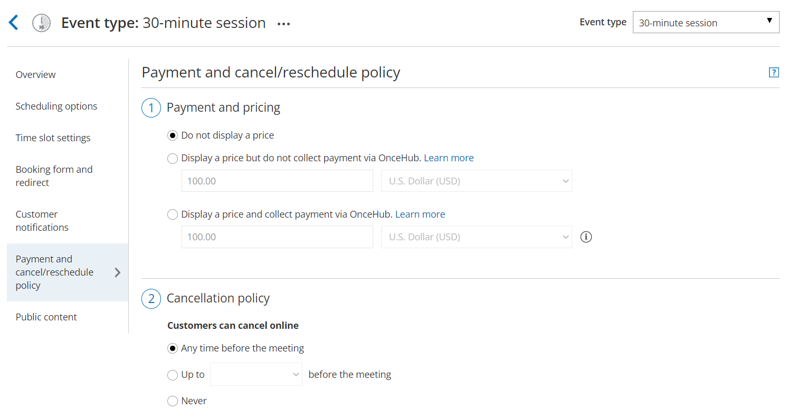
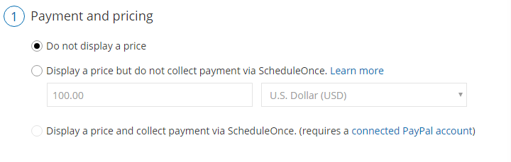
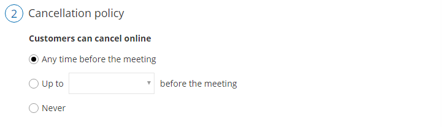
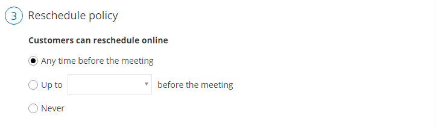

import { Aside } from "@astrojs/starlight/components";

You can specify when your Customers can cancel or reschedule a booking.

In this article, you'll learn how to configure the Customer Cancellation policy and Reschedule policy when you do not display a price for your Event type.

## Customer Cancel/reschedule policy rules

The following rules apply to the Customer Cancel/reschedule policy:

- The Cancellation and Reschedule policy only affects your Customers. Users are not subject to the policy and they can cancel or reschedule at any time from the [Activity stream](/scheduleonce/managing-bookings/analytics/activity-stream-viewing-activities "Introduction to the Activity Stream").
- The Customer can always access the Customer cancel/reschedule link in [Default email and calendar invite templates](/scheduleonce/customization-branding/notification-templates-editor/should-i-use-default-or-custom-template "Should I use a Default or Custom Template?"), regardless of the Cancel/reschedule policy. The policy will be reflected on the [Customer Cancel/reschedule page](/scheduleonce/managing-bookings/cancel-reschedule/customer-cancelreschedule-page "The Customer Cancel/Reschedule page") that the Customer accesses via the Cancel/reschedule link. The policy will always reflect the settings that were saved at the time of the initial booking.
- If you're working in [Booking with approval](/scheduleonce/event-types-booking-pages/scheduling-options/automatic-booking-or-booking-with-approval "Automatic booking or Booking with approval") mode, the Customer Cancel/reschedule policy does not apply to booking requests. However, it will apply to scheduled or rescheduled bookings.

## Configuring the Customer Cancel/reschedule policy

1. Go to **Booking pages** in the bar on the left. .

2. In the **Event types** section, click on the Event type you want to edit.

3. Click the **Payment and cancel/reschedule policy** section (Figure 1). 

   Figure 1: Payment and cancel/reschedule policy

4. In the **Payment and pricing** step, select **Do not display a price** (Figure 2). 

   Figure 2: Payment and pricing step

5. In the **Cancellation policy** step (Figure 3), select your preferred option. Figure 3: Cancellation policy

   - **Any time before the meeting**: This means that Customers can cancel right before the scheduled meeting time. This can be a matter of minutes before the meeting.

   - **Up to a certain time before the meeting**: In this case, you can select how long before the scheduled meeting time that the Customer can cancel. The possible values range from 15 minutes to 14 days.

   - **Never**: In this case, the Customer will never be able to cancel the booking.

     <Aside type="note">

     **Note**When you work with [Session packages](/scheduleonce/event-types-booking-pages/scheduling-options/session-packages "Session packages"), Customers can cancel each session independently and each session is subject to the Cancellation policy.

     </Aside>

6. In the **Cancellation policy** step, you can also define the **Policy description** that is visible to Customers on the [Customer Cancel/reschedule page](/scheduleonce/managing-bookings/cancel-reschedule/customer-cancelreschedule-page "The Customer Cancel/Reschedule page"). By default, OnceHub generates an automatic text based on your selection. You can decide to use your own custom text instead if you want to customize the cancellation policy description.

7. Finally, in the **Cancellation policy** step you can also choose to ask your Customers to give you a **cancellation reason** (see Figure 4). This question will be displayed on the [Customer Cancel/reschedule page](/scheduleonce/managing-bookings/cancel-reschedule/customer-cancelreschedule-page "The Customer Cancel/Reschedule page"). You can choose to make the cancellation reason **Mandatory**, **Optional**, or choose not to display the field at all by selecting **Don't ask**. Figure 4: Customer cancellation reason

8. In the **Reschedule policy** step (Figure 5), you can select the following options. Figure 5: Reschedule policy

   - **Any time before the meeting**: This means that Customers can reschedule right before the scheduled meeting time. This can be a matter of minutes before the meeting.

   - **Up to a certain time before the meeting**: In this case, you can select how long before the scheduled meeting time that the Customer can reschedule. The possible values range from 15 minutes to 14 days.

   - **Never**: In this case, the Customer will never be able to reschedule the booking.

     <Aside type="note">

     **Note**When working with [Session packages](/scheduleonce/event-types-booking-pages/scheduling-options/session-packages "Session packages"), Customers can reschedule each session independently and each session is subject to the Reschedule policy.

     </Aside>

9. In the **Reschedule policy** step, you can also define the **Reschedule policy description** that is visible to Customers on the [Customer Cancel/reschedule page](/scheduleonce/managing-bookings/cancel-reschedule/customer-cancelreschedule-page "The Customer Cancel/Reschedule page"). By default, OnceHub generates an automatic text based on your selection. You can decide to use a custom text instead if you want to customize the Customer reschedule policy description.

10. Finally, in the **Reschedule policy** step (Figure 6) you can also choose to ask your Customers to give you a **reschedule reason**. This question will be displayed on the [Customer Cancel/reschedule page](/scheduleonce/managing-bookings/cancel-reschedule/customer-cancelreschedule-page "The Customer Cancel/Reschedule page"). You can choose to make the cancellation reason **Mandatory**, **Optional**, or choose not to display the field at all by selecting **Don't ask**. Figure 6: Customer reschedule reason

Congratulations! You've now set the Customer Cancel/reschedule policy that is displayed on the Cancel/reschedule page for your Event type.
