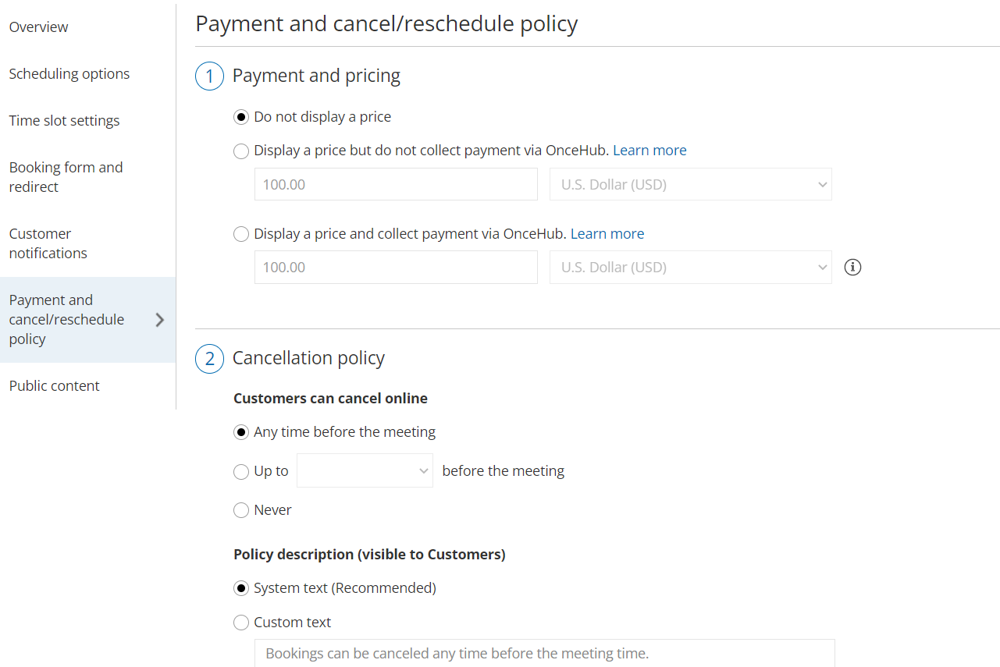

import { Aside } from "@astrojs/starlight/components";

OnceHub enables you to specify when your Customers can cancel or reschedule a booking. The cancel/reschedule policy only affects your Customers. They can cancel or reschedule on the [Customer Cancel/reschedule page](/scheduleonce/managing-bookings/cancel-reschedule/customer-cancelreschedule-page "The Customer Cancel/Reschedule page"). Users are not subject to the Cancel/reschedule policy and they can cancel or reschedule at any time from the [Activity stream](/scheduleonce/managing-bookings/analytics/activity-stream-viewing-activities "Introduction to the Activity Stream").

When you use [Payment integration](/scheduleonce/account-integrations/payment-collection/paypal/oncehub-connector-for-paypal "The ScheduleOnce connector for PayPal"), you can charge a reschedule fee or automatically process refunds when Customers reschedule or cancel bookings. The policy settings will vary based on the payment option that you choose.

## Location of the Payment and cancel/reschedule policy section

To edit the Payment and cancel/reschedule policy for your Event type, go to **Booking pages →** select the relevant Event type → **Payment and cancel/reschedule policy** (Figure 1).

Figure 1: Payment and cancel/reschedule policy section

## Payment collection options

### Do not display a price

When you choose not to display a price, you define the timeframe during which Customers are permitted to cancel or reschedule a booking. You can also customize the policy description visible to Customers on the Cancel/reschedule page. [Learn more about the Cancel/reschedule policy when not displaying a price](/scheduleonce/event-types-booking-pages/event-types/payment-and-rescheduling-price-is-not-displayed "Event type: Payment and cancel/reschedule policy when a price is not displayed")

### Display a price but do not collect payment via OnceHub

When you choose to display a price but do not collect payment via OnceHub, you set the price for your Event type but collect payment and process refunds manually (not via OnceHub).

You can customize the policy description to include the refund amount your Customers will receive if they cancel, or the reschedule fee they'll be charged if they reschedule. All payment transactions will be handled manually and not via OnceHub. [Learn more about displaying a price and not collecting payment via OnceHub](/scheduleonce/event-types-booking-pages/event-types/payment-and-rescheduling-price-is-displayed "Event type: Payment and cancel/reschedule policy when a price is displayed")

### Display a price and collect payment via OnceHub

In order to display a price and collect payment via OnceHub, your OnceHub account must be [connected to PayPal](/scheduleonce/account-integrations/payment-collection/paypal/payment-integration-throughout-booking-lifecycle "Payment integration throughout the booking lifecycle"). When you choose this option, payments are collected automatically when Customers schedule or reschedule a booking.

Depending on your [Refund settings](/scheduleonce/account-integrations/payment-collection/paypal/customizing-refund-settings "Customizing refund settings"), you can also enable OnceHub to automatically process refunds when Customers cancel a booking. This allows you to streamline your payment and refund processes and provide a seamless customer experience. [Learn more about displaying a price and collecting payment via OnceHub](/scheduleonce/event-types-booking-pages/event-types/payment-and-rescheduling-payment-is-collected "Event type: Payment and cancel/reschedule policy when payment is collected via OnceHub")
