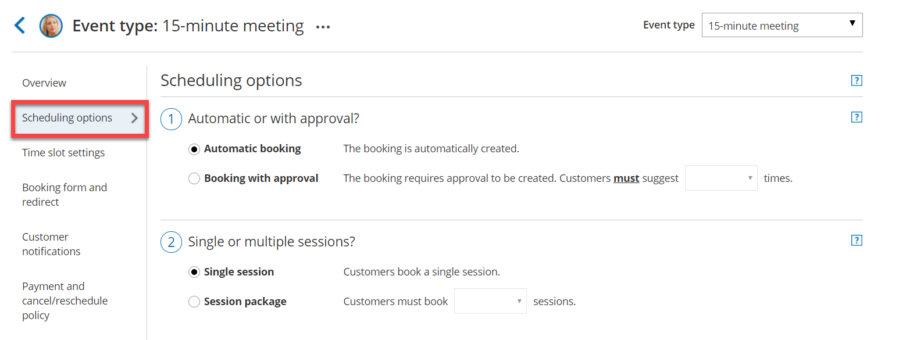
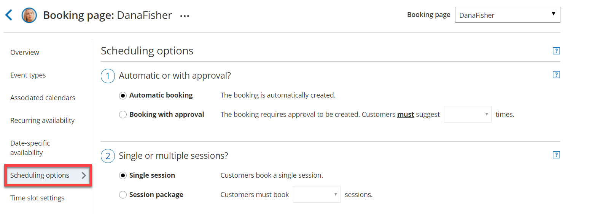

import { Aside } from "@astrojs/starlight/components";

Scheduling options are located on the [Booking page](/scheduleonce/event-types-booking-pages/booking-pages/introduction-to-booking-pages "Introduction to Booking pages") by default. If you associate [Event types](/scheduleonce/event-types-booking-pages/event-types/introduction-to-event-types "Introduction to Event types") with your Booking page, the **Scheduling options** section is located on the Event type. This allows you to standardize the settings for your scheduling scenarios. [Learn more about associating Event types with Booking pages](/scheduleonce/event-types-booking-pages/booking-pages/adding-event-types-to-booking-pages "Adding Event types to Booking pages")

## Booking pages associated with Event types

For Booking pages **associated** with Event types (recommended), go to **Booking pages** in the bar on the left, select the relevant **Event type**, and go to the **Scheduling options** section (Figure 1).

Figure 2: Scheduling options section when your Booking page is not associated with Event types

## Booking pages not associated with Event types

For Booking pages **not associated** with Event types, go to **Booking pages** in the bar on the left, select the relevant **Booking page**, and go to the **Scheduling options** section (Figure 2).

Figure 1: Scheduling options section when your Booking page has associated Event types
