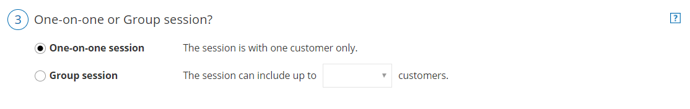

import { Aside } from "@astrojs/starlight/components";

<iframe
  src="https://www.youtube.com/embed/_mJKgtGTRnI?wmode=opaque&rel=0"
  width="100%"
  height="400"
  frameborder="0"
  allowfullscreen
></iframe>
OnceHub gives you three options to control the number of bookings per time slot.
You can allow for only a single booking per time slot, multiple bookings per
time slot, or unlimited bookings per time slot.

In this article, you'll learn how to set up One-on-one or Group sessions and how the rules that apply depending on whether or not you have a connected calendar.

## Location of the One-on-one or Group session setting

To set up One-on-one or Group sessions, navigate to the [Scheduling options](/scheduleonce/event-types-booking-pages/scheduling-options/introduction-to-scheduling-options "Introduction to the Scheduling options section") section of the [Booking page](/scheduleonce/event-types-booking-pages/booking-pages/introduction-to-booking-pages "Introduction to Booking pages") or [Event type](/scheduleonce/event-types-booking-pages/event-types/introduction-to-event-types "Introduction to Event types") (Figure 1). The location of the **Scheduling options section** depends on whether or not your Booking page has any Event types associated with it. [Learn more about the location of the Time slot setting section](/scheduleonce/event-types-booking-pages/timeslot-settings/location-of-time-slot-settings "Location of the Time slot settings section")

- If your Booking page is not linked to an Event type, the Scheduling options will be on the Booking page.
- If you have linked your Booking page to at least one Event type, the Scheduling options will be on the Event type.

Figure 1: Scheduling options section

## One-on-one session

With One-on-one sessions, time slots becomes unavailable as soon as a single booking is made. This is the default setting.

The following rules apply for One-on-one sessions.

### When using OnceHub with a connected calendar

- Busy time from any selected calendar closes the slot, regardless of whether it was added via the Booking page or directly to the calendar.
- Calendar events with a status of "Free" or "Available" will not block the slot.
- Each booking can be [canceled or rescheduled](/reschedule "Cancel or Reschedule") by the Customer or the Owner. This will automatically free up the slot so that a new booking can be made.

### When using OnceHub without a connected calendar

- Only bookings made directly on the Booking page will close the slot.
- Each booking can be [canceled or rescheduled](/reschedule "Cancel or Reschedule") by the Customer or the Owner. This will free up the slot so that a new booking can be made. If the event is in the User’s calendar, they should remember to remove it manually.

## Group session - multiple bookings per slot

With Group sessions you can specify the number of bookings that can be made before the slot becomes unavailable. This mode is used to accept bookings for activities or events where more than one Customer signs up for the same time. Examples of this type of booking are classes, tours, and lectures.

The following rules apply for Group sessions with multiple bookings per slot.

### When using OnceHub with a connected calendar

- Multiple bookings per slot applies to the main booking calendar only. Any busy time that is retrieved from additional calendars will block the slot regardless of the slot's capacity.
- Each busy time in the main booking calendar will be counted as one booking towards the capacity defined in the Booking page or Event type regardless of whether it was added via the Booking page or directly to the calendar. For example, if a Booking page is set to accept two bookings per slot, the slot would close if one booking was created via the Booking page and another booking was created directly in the main booking calendar.
- **All-day** busy time events in the main booking calendar will always block out the day's slots regardless of their capacity.
- Calendar events that have a status of "Free" or "Available" will not be counted towards the defined capacity.
- Each booking creates its own calendar event in the main booking calendar. For example, if there are three bookings per slot, the calendar events will be created next to each other on the calendar grid.
- Each booking can be [canceled or rescheduled](/reschedule "Cancel or Reschedule") by the Customer or the Owner. This will automatically free up the slot so that a new booking can be made.

### When using OnceHub without a connected calendar

- Only bookings made directly on the Booking page will close the slot.
- Each booking will be counted as one booking towards the capacity defined in the Booking page or Event type. For example, if a Booking page is set to accept two bookings per slot, both bookings must be created via the Booking page to block availability.
- A scheduling confirmation email is sent for each booking. The User can manually add each booking to the calendar by clicking the calendar event in the scheduling confirmation email.
- Each booking can be [canceled or rescheduled](/reschedule "Cancel or Reschedule") by the Customer or the User. This will free up the slot so that a new booking can be made. If the event is in the User’s calendar, he should remember to remove it manually.

## Group session - unlimited bookings per slot

In this mode, there is no limit on the number of bookings per slot. This mode will never block availability. Unlimited bookings per slot is [used for webinars](/scheduleonce/recommended-configuration/multiple-attendee-scenarios/using-oncehub-to-schedule-bookings-for-webinars "Using ScheduleOnce to schedule bookings for webinars") and online classes where there is no physical limitation on capacity.

The following rules apply for Group sessions with unlimited bookings per slot.

### When using OnceHub with a connected calendar

- Unlimited bookings per slot applies to the main booking calendar only. Busy time that is taken from additional calendars will close the slot, regardless of its unlimited capacity.
- **All-day** busy time events in the main booking calendar will always block out the day's slots.
- Each booking creates its own calendar event in the main booking calendar. For example, if there are three bookings per slot, the calendar events will be created next to each other on the calendar grid.
- Each booking can be [canceled or rescheduled](/reschedule "Cancel or Reschedule") by the Customer or the User. This will not affect the slot's capacity, as it is unlimited.

### When using OnceHub without a connected calendar

- Unlimited bookings per slot will not block availability on your Booking page.
- A scheduling confirmation email is sent for each booking. The User can manually add each booking to the calendar by clicking the calendar event in the scheduling confirmation email.
- Each booking can be [canceled or rescheduled](/reschedule "Cancel or Reschedule") by the Customer or the Owner. This will not affect the slot's capacity, as it is unlimited. If the event is in the User’s calendar, they should remember to remove it manually.
