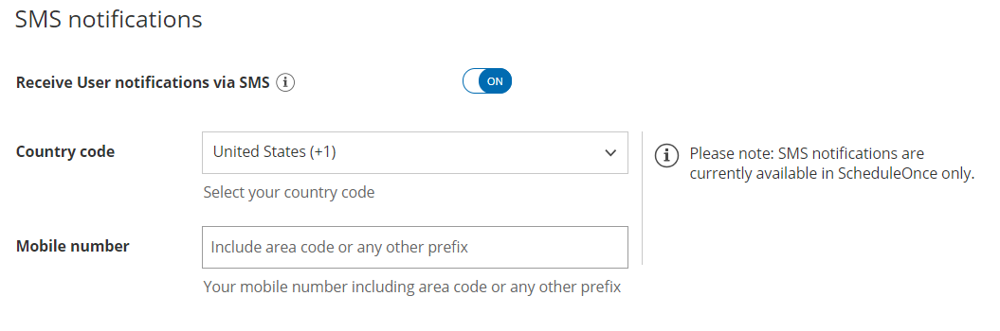
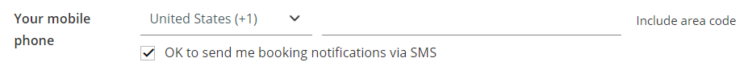

import { Aside } from "@astrojs/starlight/components";

Mobile phone numbers provided by your Customers and Team members are held in strict confidence and will only be used for sending scheduling notifications, based on settings that you define. However, sometimes Customers or Users will want to stop receiving SMS notifications.

OnceHub maintains an SMS opt-out list. This is a list of mobile numbers that have opted out of receiving SMS notifications from the OnceHub system. The opt-out list is maintained to ensure OnceHub Users comply with applicable laws and regulations.

You do not need an assigned product license to subscribe to booking notifications. [Learn more](/account-administration/user-management/user-management-and-seats)

## User action: Opt in

To opt in, go to **My profile** (your profile image or initials in the top right corner) → **Profile settings →** [**SMS Notifications**](/profile-management/managing-your-profile-in-oncehub#notifications "Profile: SMS notifications section") section. Enter your mobile phone number and toggle the **Receive User notifications via SMS** option to **ON**. [Learn more about sending SMS notifications to Users](/scheduleonce/event-types-booking-pages/sms-notifications/sending-sms-notifications-to-users "Sending SMS notifications to Users")

Figure 1: SMS notifications section

## User action: Opt out

To opt out from receiving scheduling notifications via SMS, go to **My profile** (your profile image or initials in the top right corner) → **Profile settings →** [**SMS Notifications**](/profile-management/managing-your-profile-in-oncehub#notifications "Profile: SMS notifications section") section. Toggle the **Receive User notifications via SMS** option to **OFF**.

If you have a US phone number, you can also opt out by replying to any SMS you receive with STOP, END, QUIT, CANCEL or UNSUBSCRIBE.

## Customer action: Opt in

To opt in, Customers must provide their mobile phone number on the Booking form and check the box that enables sending of SMS booking notifications (Figure 2). [Learn more about sending SMS notifications to Customers](/scheduleonce/event-types-booking-pages/sms-notifications/sending-sms-notifications-to-customers "Sending SMS notifications to Customers")

Figure 2: Booking form

## Customer action: Opt out

To opt out from receiving scheduling notifications via SMS, Customers with a US phone number can reply to any SMS they receive with STOP, END, QUIT, CANCEL, UNSUBSCRIBE. Customers with a non-US phone number should [contact us](/contact-us) to opt out.

If a Customer opts out and changes their mind, they may reply to any SMS they receive with UNSTOP. This will allow them to receive any future planned notifications.
