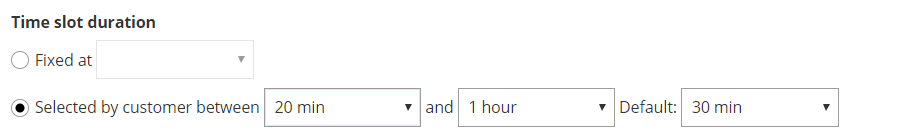
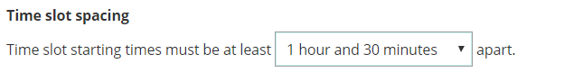

import { Aside } from "@astrojs/starlight/components";

The time settings available in the **Time slot display** section allow you to model a wide range of meeting scenarios. In this article, you'll learn how to set the duration of bookings and how to control when time slots are offered to Customers.

## Location of the Time slot display section

You can find the **Time slot display** under **Time slot settings**. The location of the **Time slot settings** depends on whether or not your Booking page has any Event types associated with it. [Learn more about the location of the Time slot setting section](/scheduleonce/event-types-booking-pages/timeslot-settings/location-of-time-slot-settings "Location of the Time slot settings section")

- For Booking pages **associated** with Event types (recommended), go to **Booking pages** in the bar on the left → select the relevant **Event type →** **Time slot settings**.
- For Booking pages **not associated** with Event types, go to **Booking pages** in the bar on the left → select the relevant **Booking page →** **Time slot settings.**

## Time slot duration

You can set a fixed time slot duration or you can allow the Customer to select a duration within a range set by you.

If you want to allow Customers to select the meeting duration, simply define the selection range and set the default value that you want to use.

Figure 1: Time slot duration

<Aside type="caution">

Variable duration (when the Customer chooses the meeting duration) is not available when your Event type is associated with a Booking page.

</Aside>

## Starting times

You can control the time at which time slots can start. For example, on the hour (0), on the half hour (30), or any other time in 5 minute increments.

Figure 2: Starting times

## Time slot spacing

You can use the drop-down to set the minimum gap between time slot starting times. For example, time slot starting times must be at least 15 minutes/ 45 minutes/ 2 hours apart.

Figure 3: Time slot spacing
