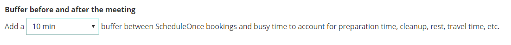

import { Aside } from "@astrojs/starlight/components";

In this article, you'll learn about using Workload rules to control your daily and weekly workload.

## Location of the Workload rules section

You can find **Workload rules** under **Time slot settings**. The location of the **Time slot settings** depends on whether or not your Booking page has any Event types associated with it. [Learn more about the location of the Time slot settings section](/scheduleonce/event-types-booking-pages/timeslot-settings/location-of-time-slot-settings "Location of the Time slot settings section")

- For Booking pages **associated** with Event types (recommended), go to **Booking pages** in the bar on the left → select the relevant **Event type →** **Time slot settings**.
- For Booking pages **not associated** with Event types, go to go to **Booking pages** in the bar on the left → select the relevant **Booking page →** **Time slot settings.**

## Buffer before and after the meeting

The booking buffer automatically creates gaps between time slots and busy time on your calendar. These gaps can be used to account for travel time, cleanup time, rest time and more. If you don't want the buffer to affect you, simply leave it on its default, at zero.

Figure 1: Buffer before and after the meeting

The buffer only creates gaps between busy time in your calendar. It does not create gaps between the available time slots that you have on your booking calendar. If you want to control the gaps between your available time slots, you can use the **[Time slot spacing](/scheduleonce/event-types-booking-pages/timeslot-settings/time-slot-display "Time slot display")** setting or create custom gaps in the [Recurring availability section](/scheduleonce/event-types-booking-pages/booking-pages/booking-pages-recurring-availability "Booking page: Recurring availability section") or [Date-specific availability section](/scheduleonce/event-types-booking-pages/booking-pages/booking-pages-date-specific-availability "Booking page: Date-specific availability section").

## Number of bookings per day

This setting allows you to set a cap on the number of bookings that can be scheduled per day. When the cap is reached, the entire day will become unavailable and no more bookings will be accepted. [Learn more about limiting the number of bookings per day](/scheduleonce/event-types-booking-pages/timeslot-settings/limiting-number-of-bookings "Limiting the number of bookings per day or per week")

Figure 2: Number of bookings per day

## Number of bookings per week

This setting allows you to set a cap on the number of bookings that can be scheduled per week. When the cap is reached, the entire week will become unavailable and no more bookings will be accepted. [Learn more about limiting the number of bookings per week](/scheduleonce/event-types-booking-pages/timeslot-settings/limiting-number-of-bookings "Limiting the number of bookings per day or per week")

Figure 3: Number of bookings per week

<Aside type="caution">

Both the **number of bookings per day** and **number of bookings per week** settings can be used concurrently. In this case, the setting with the strongest restriction overrides the other setting. For example, if the **number of bookings per day** is set to 1 and the **number of bookings per week** is set to 3, the entire week will be blocked after 3 bookings are made at any time during the week.

</Aside>
