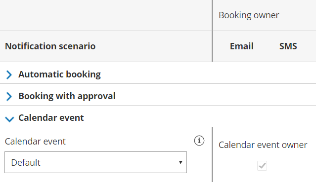
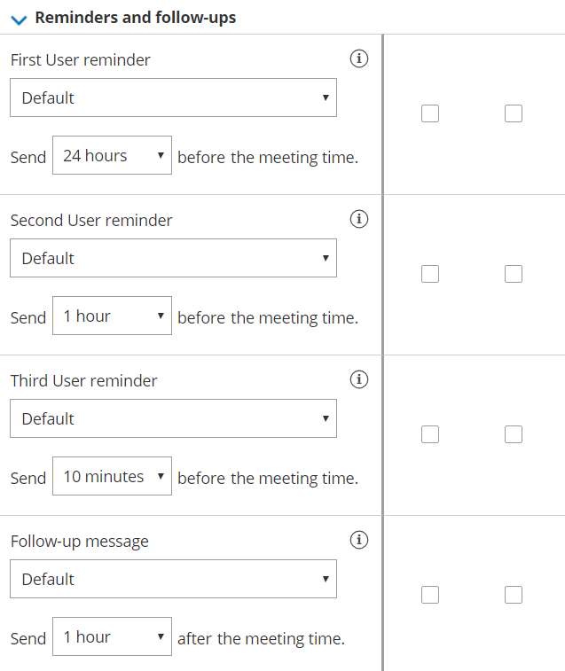
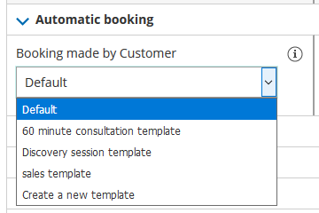
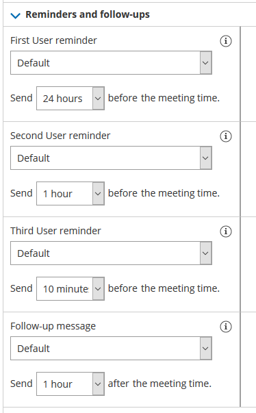

import { Aside } from "@astrojs/starlight/components";

The User notifications section is where you set which notification scenarios will trigger email notifications and [SMS notifications](/scheduleonce/insights-operations/profile-management/introduction-to-sms-notifications "Introduction to SMS notifications") to be sent to you or to other Users. Examples of [notification scenarios](/scheduleonce/event-types-booking-pages/user-notifications/user-notification-scenarios "User notification scenarios") include: scheduling confirmations, event reminders, event follow-ups, [cancellations](/scheduleonce/managing-bookings/cancel-reschedule/introduction-to-canceling-and-rescheduling "Introduction to canceling and rescheduling"), and [rescheduled bookings](/scheduleonce/managing-bookings/cancel-reschedule/introduction-to-canceling-and-rescheduling "Introduction to canceling and rescheduling"). This section is also where you can customize the text of the notifications sent to Users.

You do not need an assigned product license to subscribe to booking notifications. [Learn more](/account-administration/user-management/user-management-and-seats)

## Location of the User notifications section

The User notifications section is located if you go to **Booking pages** in the bar on the left → select your Booking page **→ User notifications**.

Figure 1: User notifications section

Email and SMS notifications to Users are independent of the [notifications sent to your Customers](/scheduleonce/event-types-booking-pages/customer-notifications/introduction-to-customer-notifications "Introduction to the Customer notifications section"). This means that you can send notifications to Customers that contain different content and have different timing than your own notifications.

## Configuring notifications

Notification scenarios are booking events that will trigger an email or SMS notification to be sent to the User. [Learn more about the different User notification scenarios and when they apply](/scheduleonce/event-types-booking-pages/user-notifications/user-notification-scenarios "User notification scenarios")

<Aside type="note">

Not all scenarios apply for every situation. For example, the scenario **Booking request made by Customer** triggers a notification when the Customer makes a Booking request. However, this scenario only takes place on Booking pages that use [Booking with approval mode](/scheduleonce/event-types-booking-pages/scheduling-options/automatic-booking-or-booking-with-approval "Automatic booking or Booking with approval").

</Aside>

## Selecting a delivery method: Email or SMS

You can send an email or [SMS notification](/scheduleonce/insights-operations/profile-management/introduction-to-sms-notifications "Introduction to SMS notifications") for each Notification scenario, such as the **Automatic booking** scenario (Figure 2).

Figure 2: Automatic booking scenario

The exception is the [Calendar event](/scheduleonce/event-types-booking-pages/customer-notifications/customer-calendar-event-options "Customer Calendar Event options") scenario, which has no SMS notification option (Figure 4).

Figure 3: Calendar event scenario

## Reminders and follow-ups

You can send up to three User reminders before a meeting and a follow-up message after the meeting. You can choose to send a reminder from between 5 minutes to 30 days before the meeting time (Figure 5). You can choose to send a follow-up message from between 5 minutes to 30 days after a booking.

By default, email and SMS notifications are unchecked for all three User reminders (Figure 4). No notifications will be sent unless you select them.

Figure 4: Reminder and Follow-up message scenarios

For other subscribed Users, all notification alerts are unchecked by default.

<Aside type="note">

We recommend sending SMS notifications in addition to email notifications. SMS messages are usually short, whereas the notification emails contain all of the important booking information that a User will need.

You can create [Custom SMS templates](/scheduleonce/event-types-booking-pages/sms-notifications/sending-sms-notifications-to-users "Sending SMS notifications to Users") that include more information, but the messages will be longer. [Learn more about sending SMS notifications to Users](/scheduleonce/event-types-booking-pages/sms-notifications/sending-sms-notifications-to-users "Sending SMS notifications to Users")

</Aside>

## Customizing your notifications further

If you need further customization of your email notifications and SMS notifications, you can create Custom templates in the [Notification templates editor](/scheduleonce/customization-branding/notification-templates-editor/introduction-to-notification-templates-editor "Introduction to the Notification Templates Editor"). Custom templates give you the utmost flexibility over the content, allowing you to insert images, use any text you wish, and add hyperlinks.

The templates you create are available as choices in each scenario (Figure 5).

Figure 5: Notification templates drop-down

## Setting the time for reminder and follow-up notifications

You can send up to three reminders prior to a meeting and a follow-up message after the meeting is over. Reminders can be sent up to 30 days in advance and the follow-up message can be sent up to 30 days after your meeting is over. You can choose the timing of the reminders and follow-ups by using the drop-down menus (Figure 6).

Figure 6: Timing option menus

It's important to think about your schedule and when and how you would like yourself and other subscribed Users to receive reminders. Keep in mind that the User reminders are independent from [Customer reminders](/scheduleonce/event-types-booking-pages/customer-notifications/introduction-to-customer-notifications "Introduction to the Customer notifications section") and can be sent at different times and use different templates than the Customer reminders.
