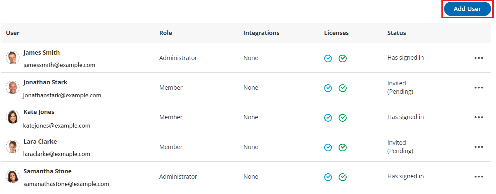

import { Aside } from "@astrojs/starlight/components";

Any User can [subscribe to User notifications](/scheduleonce/event-types-booking-pages/user-notifications/introduction-to-user-notifications "Introduction to User notifications section") for specific [Booking pages](/scheduleonce/event-types-booking-pages/booking-pages/introduction-to-booking-pages "Introduction to Booking pages") in their organization’s OnceHub app. User notifications can be sent via email or SMS.

In order to receive User notifications for a Booking page, the User must have an [Editor access role](/scheduleonce/event-types-booking-pages/booking-pages/booking-page-access-permissions "Booking page access permissions") on that Booking page. This can be assigned by a [OnceHub Administrator](/account-administration/user-management/user-roles-overview "Differences between Administrator and Member"). You can customize further notification settings for that User in the relevant Booking page’s [User notifications](/scheduleonce/event-types-booking-pages/user-notifications/introduction-to-user-notifications "Introduction to User notifications section") section.

If the User has not been created in the system, they can be added by clicking on your profile image or initials in the top right corner, selecting **Users** from the drop-down menu and clicking the **Add User** button (Figure 1). [Learn more about adding Users](/account-administration/user-management/user-management-and-seats "Adding Users")

You do not need an assigned product license to be an Editor on a Booking page and subscribe to booking notifications. [Learn more](/account-administration/user-management/user-management-and-seats)

Figure 1: Users lobby

The User will receive [an invitation to sign up for a OnceHub account](/getting-started/introduction-oncehub/joining-your-organizations-oncehub-account "Joining your organization's OnceHub account"). If the User only needs to receive notifications, they don't need to complete the sign up process—their email address is already in the system. As long as they have an Editor role on the relevant Booking page(s), they can receive notifications.

There is no limit to the number of Users who can subscribe to User notifications on a Booking page.

<Aside type="note">

If you change the Owner of a Booking page, any [User notifications](/scheduleonce/event-types-booking-pages/user-notifications/introduction-to-user-notifications "Introduction to User notifications section") settings you have previously customized for the Owner will be returned to the default settings for the new Booking page Owner.

</Aside>
