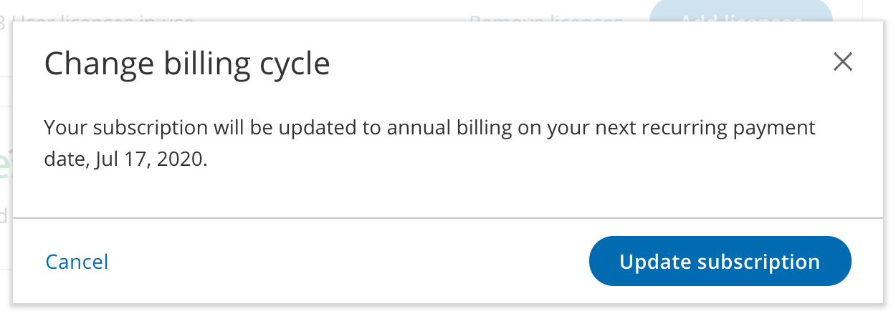
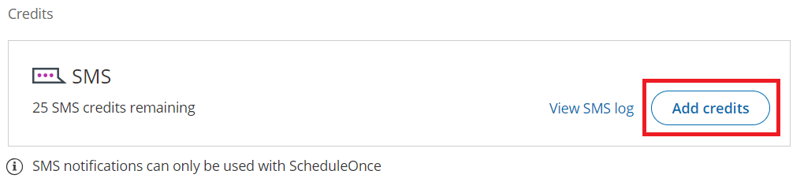
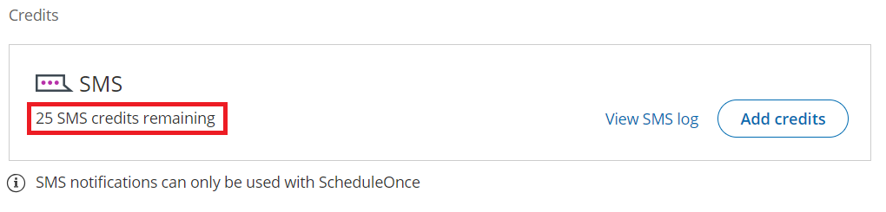
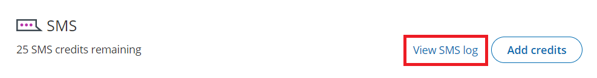

import { Aside } from "@astrojs/starlight/components";

OnceHub seats can be purchased with a monthly or annual subscription, which is always billed in advance.

Seats are used to grant users access to varying functions within OnceHub. You can purchase seats for scheduled meetings or live engagements.

Read on to learn more about how billing for your OnceHub seats work.

## Adding and managing seats

### Accessing the Billing section

In the top navigation menu, select the gear icon → **Billing**. You must be an administrator to initiate any OnceHub transactions.

OnceHub seats can be purchased with a monthly or annual subscription. When you purchase a seat for the first time, you are immediately billed in advance for the first billing cycle.

- **Monthly subscription:** On each monthly billing date, you'll be charged for the upcoming month's subscription, based on the exact number of user seats in your account.
- **Annual subscription:** On each annual billing date, you'll be charged for the upcoming year's subscription, based on the exact number of user seats in your account.

### Adding seats

You can add seats for scheduled meetings or live engagements (live chat, instant calls) at any time. When you add seats, you can determine which users should be assigned seats in your account.

When you add seats during your billing cycle, you'll pay a prorated adjustment for them.

### Adding seats to a Monthly subscription

When you add seats to a monthly subscription, you'll only pay for them on your next billing date.

On your next billing date, you'll pay:

- A prorated adjustment for the seats added during the current billing cycle.
- The full amount for the total number of seats in your account for the upcoming month.

### Adding seats to an annual subscription

When you add seats to an annual subscription, you'll immediately pay a prorated adjustment for them. On the next billing date, you'll pay:

- The full amount for the total number of seats in your account for the upcoming year.

### Removing seats and pausing your subscription

You can remove seats at any time. When you remove seats, they are still available for use in the application until the end of your current billing cycle. This is because you've already paid for all of your seats in advance at the beginning of the current billing cycle.

If you remove all of your seats, you will pause your subscription. This will limit your access to OnceHub functionality. You can resume your subscription and access at any times by adding seats.

## Purchasing your first OnceHub product

OnceHub seats can be purchased with a monthly or annual subscription.

To purchase a OnceHub seat, you must be a OnceHub Administrator.

#### Purchasing a monthly or annual subscription

You can purchase OnceHub seats in your OnceHub account by selecting the gear icon in the top navigation menu → **Billing** → **Seats**.

When you purchase seats for the first time, you are immediately billed in advance for the first billing cycle and an invoice is sent to you. All future recurring payments are charged to your primary payment method.

If your primary payment method doesn't work on your billing date, your secondary payment method will be charged instead. We recommend always having a secondary payment method, to prevent loss of account functionality.

Monthly billing will be selected as the **default subscription**. You can change to an **annual subscription** if you prefer.

### Monthly subscription

- On each monthly billing date, you'll be billed in advance for the upcoming month.
- You can add or remove seats at any time.
- When you add seats, you'll pay a prorated adjustment for them on the next billing date.

### Annual subscription

- On each annual billing date, you'll be billed in advance for the upcoming year.
- You can add or remove seats at any time.
- When you add seats, you'll immediately be charged a prorated adjustment for them.

<Aside type="note">

The billing date and time for your recurring payment cycle is the exact date and time that you purchase your subscription on. All billing dates and times are based on UTC (Coordinated Universal Time).

</Aside>

For example, if you purchase a monthly subscription at 10:00 am UTC on September 2, your first payment will be made that same day. After that, your monthly recurring payments will be billed on the 2nd day of every month at 10:00 am UTC.

#### How to purchase a OnceHub seats for the first time

1\. Click the **Purchase now** button next to the product you'd like to purchase.

2\. In the **Secure checkout** page, add as many seats as your organization requires.

3\. The **Order summary** will be updated based on the number of user seats you purchase.

4\. The default billing cycle is **Monthly**. If you want to use an annual billing cycle, in the **Order summary** section click **Switch to annual** (Figure 4).

5\. Click **Proceed to** [**payment**](/scheduleonce/insights-operations/billing-subscription-management/payment-and-billing).

6\. On the **Secure payment** page, select your **Payment method**. You can pay using a credit card or a PayPal account.

- [**Credit card**](/scheduleonce/insights-operations/billing-subscription-management/payment-and-billing)**:** Enter your payment details and click **Submit payment** to complete the purchase.
- [**PayPal**](/scheduleonce/insights-operations/billing-subscription-management/payment-and-billing)**:** Click the **Pay with PayPal** button. You'll be prompted to log in to your PayPal account and choose a way to pay. Click **Agree & Continue** to create a Billing Agreement and complete the purchase.

Once your purchase is complete:

- You'll immediately be able to assign the seats you have just purchased.
- You'll receive an Order confirmation email with your invoice attached.
- The date and time of your purchase will be the billing date and time for your recurring billing cycle.
- The transaction will be recorded in the **Billing →** **Transactions** tab.
- The payment method you used to make the purchase will be stored as your primary payment method. This payment method will be used for all future recurring payments. You can change the primary payment method at any time.
- We always recommend you add a secondary payment method, which is charged automatically if your primary payment method doesn't work on your billing date. This ensures your account stays active, without a pause in services.

In order for a user to enjoy full functionality of OnceHub, they must be assigned a seat. For instance, a seat is required to receive scheduled meetings.

Please note they can still use all other functionality in OnceHub and within all products without a seat.

You can add seats or remove seats during your billing cycle on an as-needed basis.

#### Tax-exempt status

If your organization is tax-exempt, please reach out to us at **tax\@oncehub.com**, including:

1. The email associated with your OnceHub account
2. Your tax-exempt certificate

#### Buyer details on invoice

You can edit the buyer details that will appear on invoices before you make your first purchase. To edit the buyer details on invoices, in the left navigation bar select **Billing → Transactions**. Then, click the action menu (three dots) next to the **Transactions** heading. Then, select **Buyer details on invoice**.

## How to change your billing cycle

All OnceHub payments are recurring.

Your account can be billed on a monthly basis or annually. When you purchase OnceHub for the first time, you will choose your preferred billing cycle. When the annual billing cycle is selected, you get a 10% discount.

#### How to change your billing cycle

1. Select the gear icon in the top navigation menu → **Billing**.
2. On the right hand side, next to your billing cycle, select to switch your cycle.
3. You will see a popup. Follow the directions to apply the changes to your account. _Figure 1: Change billing cycle popup - This example changes the cycle from monthly to annual_

#### How does it work?

### 1. Changing monthly to annual billing

- When you change to an annual billing cycle, the annual cycle will start only when the current monthly cycle ends and will renew on a yearly basis thereafter. Your account will be charged for the next annual cycle on your next scheduled billing date.
- For example, let’s assume that you currently pay $36 for three seats on a monthly basis. You pay on the 1st of each month and your next scheduled billing date is October 1. Today is September 15 and you decide to change your billing cycle to annual billing. You can change your billing cycle to annual billing today in your account and you are not charged. On October 1, your next scheduled billing date, you will be charged $324 for three seats on an annual basis (10% off for annual commitment). Subsequently, you will be charged $324 on October 1 of each year.
- You can revert back to the original billing cycle any time before the new billing cycle is processed on your next scheduled billing date (in the above example, any time between September 15 - October 1).
- If you add seats to your subscription **after** changing your billing cycle but **before**your next scheduled billing date:
  - The prorated cost, based on your **current billing cycle,** will be added to your next invoice and charged on the scheduled billing date (in the above example, on October 1).

### 2. Changing annual to monthly billing

- When you change to a monthly billing cycle, the monthly cycle will start only when the current annual cycle ends and will renew on a monthly basis thereafter. Your account will be charged for the next monthly cycle on your next scheduled billing date.
- For example, let’s assume that you currently pay $324 for three seats on an annual basis (twelve months plus 10% off for annual commitment). You pay on December 1 of each year. Today is September 15 and you decide to change your billing cycle to monthly billing. You change your billing cycle to monthly billing today in your account and you are not charged. On December 1, your next scheduled billing date, you will be charged $36 for three seats on a monthly basis. Subsequently, you will be charged $36 on the 1st of each month.
- You can revert back to the original billing cycle any time before the new billing cycle is processed on your next scheduled billing date (in the above example, any time between September 15 - December 1).
- If you add seats to your subscription **after** changing your billing cycle but **before**your next scheduled billing date:
  - The prorated cost will be charged on the day you add the seats (in the above example, on September 15). The charge is based on the **current** **annual** **billing** **cycle**, and **not** the monthly billing cycle starting on your next scheduled billing date.

## Purchasing and managing SMS credits

SMS notifications are purchased in packages of credits. You can purchase SMS credits in your OnceHub Account in the **Billing**→ **Seats** section. Once you've purchased SMS credits, they are immediately available for use by every user with a user seat. SMS credits are deducted per SMS notification sent.

#### How do SMS credits work?

- SMS credits can be purchased at any time. You pay for SMS credits as you purchase them.
- Once you've purchased SMS credits, they are immediately available for use by every user with a user seat.
- SMS credits are deducted per SMS notification sent.
- SMS pricing is the same for every mobile number globally. We do not charge different prices or deduct more credits based on the destination.
- When you start a OnceHub account, you'll receive 25 free SMS credits to test out this feature. If you run out of credits, you can purchase additional SMS credits in the **Billing**→ **Seats** section..

#### SMS Pricing

SMS credits are purchased in packages. Every standard SMS sent requires one SMS credit. A standard SMS is one that is 160 characters or less in length.

| **SMS credits** | **Cost**  | **Cost per SMS credit** |
| --------------- | --------- | ----------------------- |
| 100             | USD 15.00 | USD 0.15                |
| 200             | USD 25.00 | USD 0.125               |
| 500             | USD 50.00 | USD 0.10                |
| 1000            | USD 90.00 | USD 0.09                |
| 2000 or more    | TBD       | USD 0.08                |

#### Purchasing SMS credits

1. Select the gear icon in the top navigation menu → **Billing**→ **Seats**.

2. Click the **Add credits** button (Figure 1)._Figure 1: Add SMS credits_

3. In the **Secure checkout** page, select the quantity of SMS credits you would like to purchase.

4. Click **Proceed to payment**.

5. Select a payment method. You can choose from payment methods that are already on file or click **use a new payment method** to add and pay with a new payment method. By default, the payment is charged to your primary payment method.

6. Click **Submit payment**.

   - Your SMS credits are immediately available for use by any user in your account with a user seat.
   - The transaction is recorded in the **Billing →** **Transactions** tab.
   - You will receive an Order confirmation email with your invoice attached.

#### Understanding the SMS balance

To view your SMS balance, select the gear icon in the top navigation menu → **Billing**→ **Seats**. Your SMS balance is displayed in the SMS box (Figure 2).

_Figure 2: SMS credits remaining_

- Every standard SMS sent deducts one SMS credit from the SMS balance. A standard SMS is one that is 160 characters or less in length. SMS notifications that are longer require additional SMS credits.
- SMS credits are charged per SMS notifications sent, not delivered. OnceHub uses a robust stable network with a very high delivery success rate.
- OnceHub Administrators will receive an alert via the Notification center and via email when the SMS balance reaches 25% of the last SMS credits purchase and when the balance reaches zero.

For more information on how to monitor your account’s SMS usage, see our SMS log data article.

#### Tracking SMS usage

The **SMS log** section is where you track SMS notifications sent through your account. Data is recorded for all SMS notifications sent in the following scenarios:

- Customer notifications
- User notifications

You can filter the records by date range or phone number. You can also export them to a spreadsheet.

#### Accessing your SMS log

1. Select the gear icon in the top navigation menu → **Billing**→ **Seats** .
2. Then, click **View SMS log** (Figure 1). Figure 1: View SMS log

#### SMS log

The records in the SMS log contain the following information:

**Date:** The day the SMS was sent.

**Booking page:** The [Booking page](/scheduleonce/event-types-booking-pages/booking-pages/introduction-to-booking-pages "Introduction to Booking pages") associated with the SMS. Test SMS notifications do not have Booking pages associated with them.

**To:** The number that the SMS was sent to.

**Recipient:** The name of the Customer or User that the SMS was sent to.

**Template:** The name of the template that was used to send the SMS.

**Characters:** The number of characters used in the SMS, including spaces.

**SMS credits:** The number of SMS credits used.

**Status:** One of the following delivery statuses will be displayed.

- **Delivered**: The SMS was sent and arrival was confirmed via delivery receipt.
- **Sent:** SMS was sent but a delivery receipt was not received.
- **Rejected:** The phone number was found to be invalid prior to sending.
- **Failed:** The SMS failed to send.
