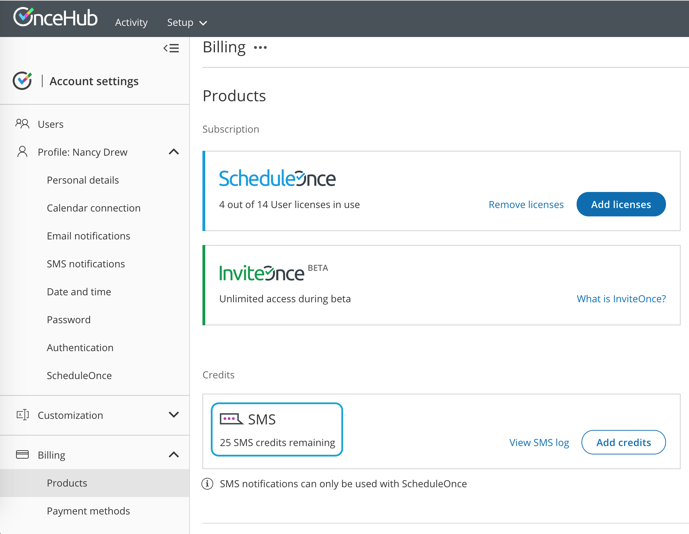
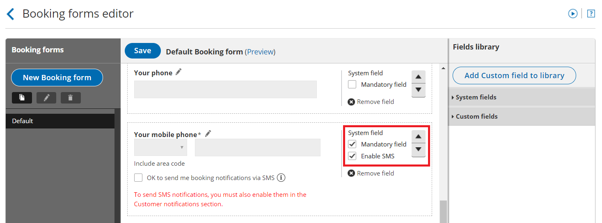

import { Aside } from "@astrojs/starlight/components";

There can be a number of reasons why your Customer is not receiving [SMS notifications](/scheduleonce/event-types-booking-pages/sms-notifications/sending-sms-notifications-to-customers "Sending SMS notifications to Customers"). We recommend reviewing the following settings in your account to ensure Customers receive SMS notifications.

## Check the SMS log

1. In the top navigation menu, select the gear icon → **Billing** → **Licenses** → **SMS** → **View SMS log**. [Learn more about SMS delivery statuses](/billing/sms-delivery-statuses-troubleshooting-and-regional-guidelines "Understanding SMS delivery statuses")

2. Check the status of the SMS.

   - If the SMS shows a status of **Delivered** but the User did not receive it, [check that the User's mobile number is correct](#make-sure-that-the-customers-mobile-number-is-correct).
   - If the SMS was not delivered or not sent, review the settings below.

[Learn more about the SMS log](/scheduleonce/insights-operations/billing-subscription-management/introduction-to-billing "Tracking SMS usage")

## Make sure your account has SMS credits available

1. Go to your OnceHub Account.
2. In the top navigation menu, select the gear icon → **Billing** → **Licenses**. You can see the number of remaining SMS credits in the **SMS** box (Figure 1).Figure 1: SMS Credits

If your SMS credit balance is zero, click the **Add credits** button to purchase more SMS credits.

[Learn more about SMS pricing and purchasing SMS credits](/scheduleonce/insights-operations/billing-subscription-management/introduction-to-billing "SMS pricing and purchasing SMS credits")

## Check the Customer notification settings

You need to enable SMS notifications for each [Notification scenario](/scheduleonce/event-types-booking-pages/customer-notifications/customer-notification-scenarios "Customer notification scenarios") that the Customer should receive SMS notifications for.

1. Hover over the lefthand menu and go to the Booking pages icon → Event types → your Event type → [Customer notifications](/scheduleonce/event-types-booking-pages/customer-notifications/introduction-to-customer-notifications "Introduction to the Customer notifications section")**.** If your [Booking pages are associated with Event types](/scheduleonce/event-types-booking-pages/booking-pages/adding-event-types-to-booking-pages "Adding Event types to Booking pages"), Customer notifications will be related to the Event type. Go to the relevant Event type → **Customer notifications**.
2. Enable SMS notifications for each [Notification scenario](/scheduleonce/event-types-booking-pages/customer-notifications/customer-notification-scenarios "Customer notification scenarios") you want to send SMS notifications to Customers for (Figure 2). Figure 2: Customer notifications section

[Learn more about the Customer notifications section](/scheduleonce/event-types-booking-pages/customer-notifications/introduction-to-customer-notifications "Introduction to the Customer notifications section")

## Make sure your Booking form includes the mobile phone field with SMS enabled

1. Hover over the lefthand menu and go to the Booking pages icon → hover over the left sidebar → **Tools →** [Booking forms editor](/scheduleonce/customization-branding/booking-forms-editor/introduction-to-booking-forms-editor "Introduction to the Booking forms editor").

2. Ensure that the Booking form you are using includes the field **Your mobile phone** field. You will need to check this whether you're using default Booking form or a Custom Booking form that you have modified.

3. On the right side of the **Your mobile phone** field, ensure the **Enable SMS** checkbox is checked (Figure 3).Figure 3: Booking forms editor

   <Aside type="note">

   **Note**You can also make the **Your** **mobile phone** field mandatory.

   </Aside>

[Learn more about the Booking forms editor](/scheduleonce/customization-branding/booking-forms-editor/introduction-to-booking-forms-editor "Introduction to the Booking forms editor")

## Make sure that the Customer’s mobile number is correct

1. Ask the Customer for the meeting’s Booking ID or Package ID. This can be found in the booking confirmation email that the Customer received.
2. Look up the meeting in the [Activity stream](/scheduleonce/managing-bookings/analytics/activity-stream-viewing-activities "Introduction to the ScheduleOnce Activity stream") using the Tracking ID.
3. The Customer’s details as they were entered in the Booking form will be there. [Learn more about filtering the Activity stream](/scheduleonce/managing-bookings/analytics/activity-stream-viewing-activities "Filtering the Activity stream")
4. Check that phone number is correct. You should also make sure that it is **not** a landline number.

The Customer’s phone number can also be checked via the confirmation email you received when the Customer made the booking.

<Aside type="note">

If you have gone through the above steps and have not resolved your issue, please [contact us](/contact-us).

</Aside>
