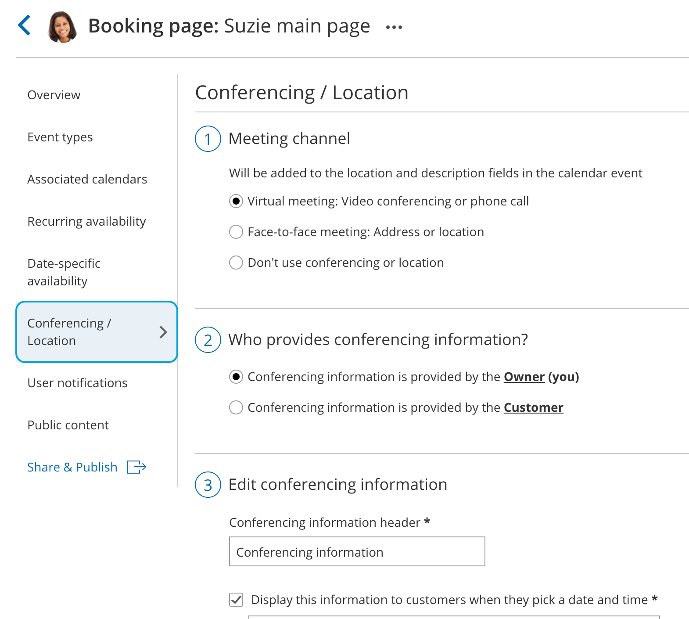
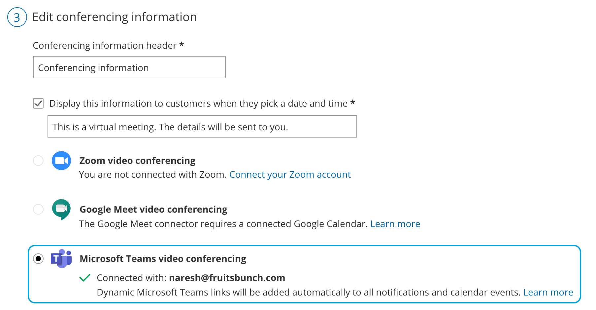

import { Aside } from "@astrojs/starlight/components";

In this article, you will learn how to configure your booking pages for use with your video conferencing app.

Our integration with video conferencing apps automatically creates meetings in your third-party app. Customers receive a single OnceHub confirmation, including all meeting details in their local time zone. You can configure your [Booking pages](/scheduleonce/event-types-booking-pages/booking-pages/introduction-to-booking-pages "Introduction to Booking pages") to use the video call app by editing the [**Conferencing / Location**](/scheduleonce/event-types-booking-pages/booking-pages/booking-pages-location-settings "Booking page: Conferencing / Location section") section of the Booking page.

[Connect OnceHub to your third-party video conferencing app first](/user-integrations/basics-user-integrations/connect-your-video-conferencing-app), and then follow these steps:

1. Hover over the left hand menu and go to the Booking pages icon → Booking pages → relevant Booking page → [**Conferencing / Location**](/scheduleonce/event-types-booking-pages/booking-pages/booking-pages-location-settings "Booking page: Conferencing / Location section") (Figure 1). Figure 1: Conferencing / Location section
2. In the **Meeting channel** step, select **Virtual meeting: Video conferencing or phone call**.
3. For **Who provides conferencing information?** step, select **Conferencing information is provided by the Host (you)**.
4. To **Edit conferencing information** step, select the third-party video conferencing app you wish to use. (Figure 2). Figure 2: Available video conferencing apps with Microsoft Teams video conferencing selected.
5. Click **Save**.

### Using Session packages with video conferencing

When you use [Session packages](/scheduleonce/event-types-booking-pages/scheduling-options/session-packages "Session packages"), each session includes its unique video conferencing details.

- Schedule and reschedule notification emails that are sent to a Customer include a Conferencing info link next to each selected time.
- When the Customer clicks on the link, the scheduling confirmation page opens as if a single booking was made, displaying the full booking details including the video conferencing information for the session.
- Every reminder that the Customer receives includes the full booking details including the video conferencing information, as if a single booking was made.
- All calendar events for the Host and Customer include the complete video conferencing information for each session.

<Aside type="note">

OnceHub recommends working with a connected calendar. [Learn more about the differences between working with a connected calendar vs. working without a connected calendar](/user-integrations/basics-user-integrations/connecting-your-productivity-suite-and-standalone-integrations "Calendar integrations overview")

</Aside>

## Setting the number of participants for a video conferencing session

1. [Connect OnceHub to your video conferencing app.](/user-integrations/basics-user-integrations/connect-your-video-conferencing-app)

2. Select your video conferencing app in the [**Conferencing / Location**](/scheduleonce/introduction-to-booking-pages/using-booking-pages-with-your-video-conferencing-app "Configuring your Booking pages to use Zoom") section for your [Booking page](/scheduleonce/event-types-booking-pages/booking-pages/introduction-to-booking-pages "Introduction to Booking pages").

3. Go to the [Scheduling options](/scheduleonce/event-types-booking-pages/scheduling-options/introduction-to-scheduling-options "Introduction to the Scheduling options section") settings of your Booking page or [Event type](/scheduleonce/event-types-booking-pages/event-types/introduction-to-event-types "Introduction to Event types").

   - If you have [associated your Booking page with at least one Event type](/scheduleonce/event-types-booking-pages/booking-pages/booking-pages-associated-calendars "Booking page: Associated calendars section"), the Scheduling options are found by going to the relevant **Event type → Scheduling options.**
   - If you have **not** associated your Booking page with at least one Event type, the Scheduling options are found by going to the relevant **Booking page → Scheduling options.**

4. In the **One-on-one** **or** **Group session?** field, select [Group session](/scheduleonce/recommended-configuration/multiple-attendee-scenarios/using-group-sessions-with-connected-calendar "Group sessions (number of bookings per slot)").

5. Use the drop-down menu to select the number of Customers you want to allow to attend.

6. Click **Save**.

<Aside type="note">

The number of bookings per time slot set in OnceHub should not exceed your video conferencing app plan's meeting capacity.

</Aside>

You're all set! When a booking is made, the session details for your selected video conferencing app are integrated with all OnceHub notifications and the appropriate session will be automatically created. A video call will be automatically created based on the settings you selected. When multiple Customers sign up for the same session, such as a webinar, each booking receives the same video call details.

[Learn more about using OnceHub to schedule webinars and classes](/scheduleonce/recommended-configuration/multiple-attendee-scenarios/using-oncehub-to-schedule-bookings-for-webinars "Using ScheduleOnce to schedule bookings for webinars & classes")
