import { Aside } from "@astrojs/starlight/components";

The activity stream is the central hub where you can manage all of your booking and payment activity. The activity stream provides advanced filtering options to give you quick access to the information you require. When you view a specific activity, you'll be able to view related activities, such as payments, rescheduled bookings, and cancellations.

You can access the activity stream by clicking on the icon in the left-hand-side toolbar (Figure 1).

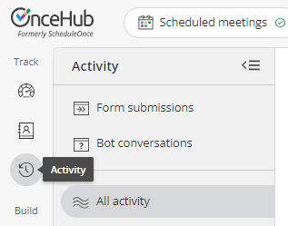Figure 1: The activity stream icon

Read on to learn about the activity stream.

## How can I view related activities?

To view related activities, select an activity from the Activity stream. Then, in the **Details** pane for that activity, select **View related activities** from the action menu (Figure 1).

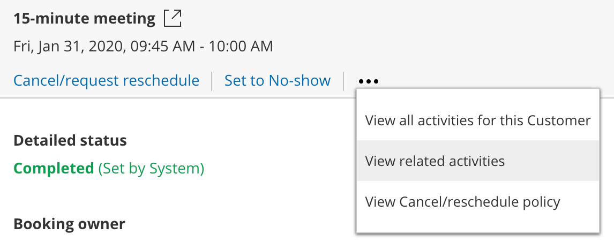_Figure 1: View related activities_

### What related activities can I see?

When a booking is made, it can be related to a session package, a transaction, or another booking. Related activities are relevant in the following scenarios.

#### Booking request: New times requested by user

A booking request is made and the user cancels and requests new times. When the booking request is resubmitted by the customer, both the canceled booking request and resubmitted booking request are related.

#### Booking rescheduled by user

The booking is canceled by the user and a request to reschedule is sent. When the booking is rescheduled by the customer, the canceled booking and rescheduled booking will be related.

#### Booking rescheduled on different booking page by customer

The booking is rescheduled by the customer with a different booking page. Both the canceled booking and rescheduled booking will be related.

#### Session package scheduled

When a Session package is scheduled. Sessions that are part of the package and the Session package itself are related.

#### Payment integration used

When payment integration is used, all paid and refunded transactions are related to the booking or Session package.

## Understanding scheduling activity statuses

All bookings follow a lifecycle. Depending on which phase of the lifecycle a booking is in, its scheduling status changes, as do the scheduling actions available to you.

In the Activity stream, bookings are given a status. In the **Details** pane for a given activity, you'll see a **Detailed status** which provides additional information about the activity.

### Booking status and Detailed status

The table below shows the different lifecycle phases, their associated statuses, and the respective actions that are available in the Activity stream.

| **Scenario**                              | **Status**        | **Detailed status**                                                 | **Menu actions**                                                                                                                                                                                                                                                                                                                                                                                                                                                         |
| ----------------------------------------- | ----------------- | ------------------------------------------------------------------- | ------------------------------------------------------------------------------------------------------------------------------------------------------------------------------------------------------------------------------------------------------------------------------------------------------------------------------------------------------------------------------------------------------------------------------------------------------------------------ |
| Customer schedules a booking              | Scheduled         | Scheduled (By customer)                                             | [Cancel/request reschedule](/scheduleonce/managing-bookings/cancel-reschedule/user-action-cancelreschedule-for-booking-pages-with-event-types "User action: Cancel/request to reschedule with event types")[Reassign booking](/scheduleonce/managing-bookings/reassign/user-action-reassign-booking "User Action: Reassign a booking") [Set to No-show](/scheduleonce/managing-bookings/analytics/activity-stream-managing-activities "Tracking and Reporting No-Shows") |
| Customer submits a booking request        | Requested         | Requested (By customer)                                             | [Schedule booking request](/scheduleonce/managing-bookings/responding-to-booking-requests/responding-to-booking-requests/scheduling-and-responding-to-booking-requests "Scheduling and Responding to Booking Requests")[Cancel/request new times](/scheduleonce/managing-bookings/responding-to-booking-requests/responding-to-booking-requests/user-action-cancelling-booking-request "User action: Cancel a booking request and request new times")                    |
| Customer cancels and submits new requests | CanceledRequested | Canceled (By customer)Requested (By customer)                       | [Schedule booking request](/scheduleonce/managing-bookings/responding-to-booking-requests/responding-to-booking-requests/scheduling-and-responding-to-booking-requests "Scheduling and Responding to Booking Requests")[Cancel/request new times](/scheduleonce/managing-bookings/responding-to-booking-requests/responding-to-booking-requests/user-action-cancelling-booking-request "User action: Cancel a booking request and request new times")                    |
| User cancels and requests new times       | CanceledRequested | Canceled (New times requested by user)Requested (Initiated by user) | [Schedule booking request](/scheduleonce/managing-bookings/responding-to-booking-requests/responding-to-booking-requests/scheduling-and-responding-to-booking-requests "Scheduling and Responding to Booking Requests")[Cancel/request new times](/scheduleonce/managing-bookings/responding-to-booking-requests/responding-to-booking-requests/user-action-cancelling-booking-request "User action: Cancel a booking request and request new times")                    |
| Customer reschedules a booking.           | Rescheduled       | Rescheduled (By customer)                                           | [Cancel/request reschedule](/scheduleonce/managing-bookings/cancel-reschedule/user-action-cancelreschedule-for-booking-pages-with-event-types "User action: Cancel/request to reschedule with event types")[Reassign booking](/scheduleonce/managing-bookings/reassign/user-action-reassign-booking "User Action: Reassign a booking") [Set to No-show](/scheduleonce/managing-bookings/analytics/activity-stream-managing-activities "Tracking and Reporting No-Shows") |
| Customer cancels a booking                | Canceled          | Canceled (By customer)                                              |                                                                                                                                                                                                                                                                                                                                                                                                                                                                          |
| User cancels a booking or booking request | Canceled          | Canceled (By user)                                                  |                                                                                                                                                                                                                                                                                                                                                                                                                                                                          |
| User sets the booking to No-show          | No-show           | No-show (Set by user)                                               | [Cancel/request reschedule](/scheduleonce/managing-bookings/cancel-reschedule/user-action-cancelreschedule-for-booking-pages-with-event-types "User action: Cancel/request to reschedule with event types")                                                                                                                                                                                                                                                              |
| Booking is complete                       | Completed         | Completed (Set by System)                                           | [Cancel/request reschedule](/scheduleonce/managing-bookings/cancel-reschedule/user-action-cancelreschedule-for-booking-pages-with-event-types "User action: Cancel/request to reschedule with event types")[Set to No-show](/scheduleonce/managing-bookings/analytics/activity-stream-managing-activities "Tracking and Reporting No-Shows")                                                                                                                             |
| User reassigns a scheduled booking        | Scheduled         | Scheduled (Reassigned by user)                                      | [Cancel/request reschedule](/scheduleonce/managing-bookings/cancel-reschedule/user-action-cancelreschedule-for-booking-pages-with-event-types "User action: Cancel/request to reschedule with event types")[Reassign booking](/scheduleonce/managing-bookings/reassign/user-action-reassign-booking "User Action: Reassign a booking")[Set to No-show](/scheduleonce/managing-bookings/analytics/activity-stream-managing-activities "Tracking and Reporting No-Shows")  |
| User reassigns a rescheduled booking      | Rescheduled       | Rescheduled (Reassigned by user)                                    | [Cancel/request reschedule](/scheduleonce/managing-bookings/cancel-reschedule/user-action-cancelreschedule-for-booking-pages-with-event-types "User action: Cancel/request to reschedule with event types")[Reassign booking](/scheduleonce/managing-bookings/reassign/user-action-reassign-booking "User Action: Reassign a booking")[Set to No-show](/scheduleonce/managing-bookings/analytics/activity-stream-managing-activities "Tracking and Reporting No-Shows")  |

## Managing bookings from the Activity stream

The Activity stream is the central hub where you can manage all of your booking and payment activities. The Activity stream provides advanced filtering options to give you quick access to the information you require. When you view a specific activity, you'll be able to view related activities, such as payments, rescheduled bookings, and cancellations. You can also perform actions such as reassigning a booking or requesting to reschedule.

You do not need an assigned product license to access the Activity stream.

Read on to learn about the actions that you can perform from the Activity stream.

### Actions on your bookings from the Activity stream

All bookings follow a lifecycle. Depending on which phase of the lifecycle a booking is in, its scheduling status changes, as do the scheduling actions available to you.

In the following sections, the different action options that are available will be discussed.

### Canceling a booking

You can choose to cancel a booking if the booking has a status of **Scheduled**, **Rescheduled**, **Completed**, **No-show**, or **Canceled**.

To cancel a booking, follow these steps:

1. Select the activity in the Activity stream.
2. In the **Details** pane, select **Cancel** (Figure 3). 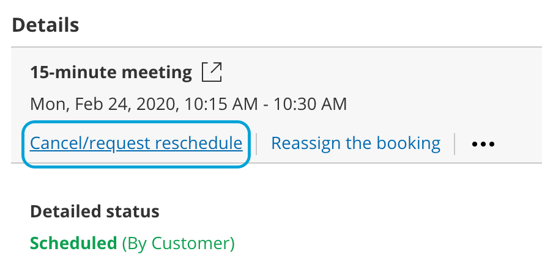_Figure 3: Cancel/request new times button_
3. The **Cancel/request reschedule** pop-up will appear.

### Reschedule a booking

If you or your customer is unable to make the original booking time, you can reschedule the booking yourself on your customer's behalf. This can be done even if the original meeting time has already passed.

To reschedule a meeting, follow these steps:

1. Find the booking in question in the activity stream.

2. Click **Reschedule**

3. A pop-up will appear, allowing you to choose between rescheduling the meeting yourself, or asking your customer to reschedule. Both of these options cancel the original meeting.

4. On selecting either option, you will be prompted to provide a reason for the rescheduling which will be shared with your customer.

   1. Selecting **Reschedule on behalf of the customer** will direct you to the relevant calendar, and display availability for rescheduling the meeting.
   2. Selecting **Ask the customer** will provide them with the relevant calendar, and allow them to choose a new time for the meeting.

5. Once you have selected a new time, click **Reschedule.** The confirmation will be shared with your customer.

<Aside type="note">

You can only reschedule a meeting if you are the host or owner of the meeting, or if you are an admin.

</Aside>

## Payment transaction types and statuses

OnceHub has partnered with PayPal to offer payment integration through all phases of the booking lifecycle. From the initial booking through to rescheduling and cancellations, you can increase sales, generate additional revenue streams, and reduce administrative overheads.

If you've set up [Payment integration](/scheduleonce/account-integrations/payment-collection/paypal/payment-integration-throughout-booking-lifecycle "Payment integration throughout the booking lifecycle"), transactions made via OnceHub will appear in the Activity stream with the relevant status and type (Figure 1). Transaction data is also available in the Revenue reports.

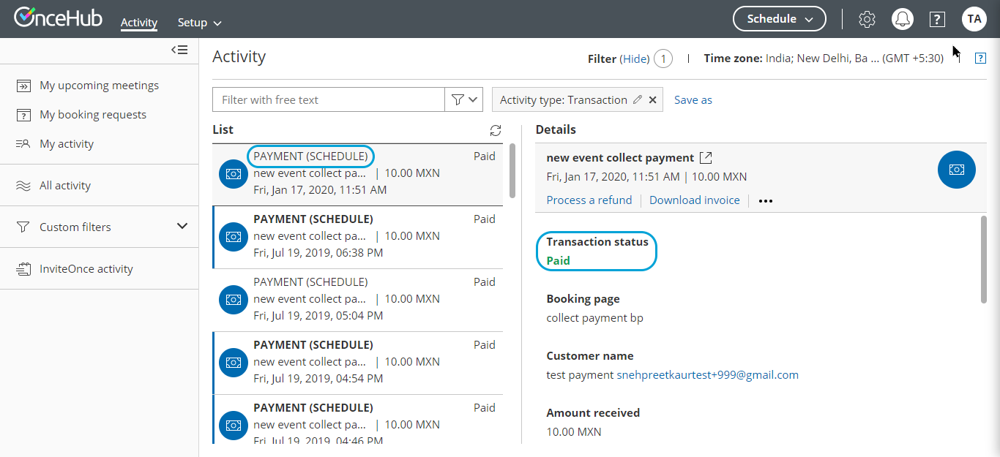_Figure 1: Transactions in the Activity stream_

Below is the mapping of the scenarios, Transaction statuses, and Transaction types which are displayed in the Activity stream.

| **Scenario**                                                                                                                                                                  | **Status**                              | **Transaction type** | **Menu actions**                                                                                                                                              |
| ----------------------------------------------------------------------------------------------------------------------------------------------------------------------------- | --------------------------------------- | -------------------- | ------------------------------------------------------------------------------------------------------------------------------------------------------------- |
| Customer schedules a booking and purchases the service                                                                                                                        | PAYMENT (SCHEDULE)                      | Paid                 | [Process a refund](/scheduleonce/managing-bookings/analytics/activity-stream-viewing-activities "Managing bookings from the Activity stream")Download invoice |
| Customer reschedules the booking and pays the reschedule fee.                                                                                                                 | PAYMENT (RESCHEDULE)                    | Paid                 | [Process a refund](/scheduleonce/managing-bookings/analytics/activity-stream-viewing-activities "Managing bookings from the Activity stream")Download invoice |
| Customer schedules a booking and purchases the service. The transaction is in a Pending status in PayPal.                                                                     | PAYMENT PENDING (SCHEDULE)              | Pending              | Download invoice                                                                                                                                              |
| Customer cancels the booking and automatically receives the refund for the service.                                                                                           | AUTOMATIC REFUND (CANCELLATION)         | Refunded             | Download invoice                                                                                                                                              |
| Customer cancels the booking and automatically receives the refund for the service. The transaction is in a Pending status in PayPal.                                         | AUTOMATIC REFUND PENDING (CANCELLATION) | Refund pending       | Download invoice                                                                                                                                              |
| The user processed a refund [directly via OnceHub](/scheduleonce/account-integrations/payment-collection/paypal/manual-refunds-via-oncehub "Manual refund via ScheduleOnce"). | MANUAL REFUND VIA ONCEHUB               | Refunded             | Download invoice                                                                                                                                              |
| The user refunded the customer via PayPal. The transaction is reflected in the Activity stream.                                                                               | MANUAL REFUND VIA PAYPAL                | Refunded             |                                                                                                                                                               |

## Activity IDs

Activity IDs are unique codes generated for each booking.

They are an invaluable tool for organizing and identifying individual activities. For example, say a customer calls you and wants to know specific information about their meeting or payment. Using the Activity ID, you can immediately pull up the information in the Activity stream and address your customer's request.

### Using Activity IDs

To find the Activity ID for an associated booking, panel booking, session package, or transaction, follow these steps:

1. Select the activity in the Activity stream.
2. In the **Details** pane, scroll all the way down to the bottom.
3. The Activity ID is listed in the footer, next to the **Created** and **Updated** dates (Figure 1). 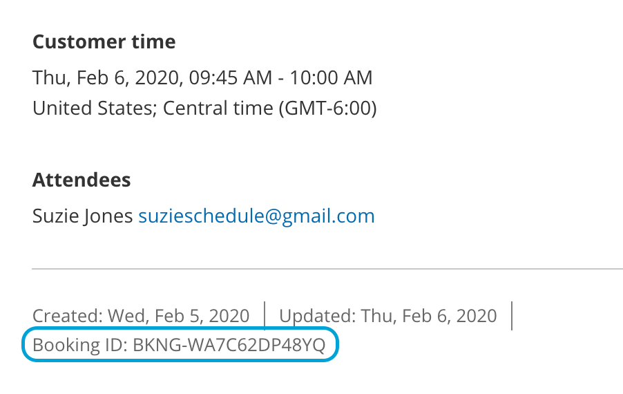 _Figure 1: Activity ID_
4. To search for a specific activity, enter the Activity ID in the Free text filter above the Activity stream (Figure 2).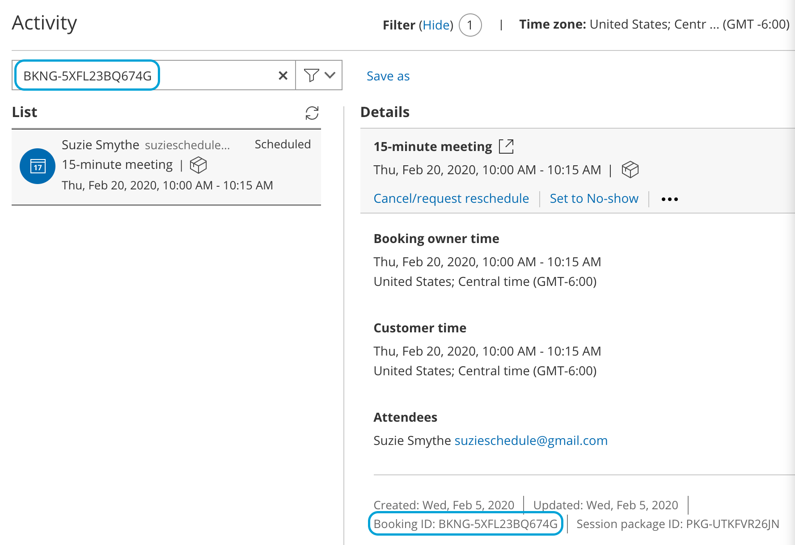_Figure 2: Free text filter with an Activity ID_
5. To search for more than one ID, you can use the search operators available with the Free text filter.

### Booking ID

All individual sessions booked via OnceHub have a Booking ID, a unique ID code that identifies every booked session; for example, Booking ID: BKNG-5XFL23BQ674G.

The Booking ID of individual bookings appears in a number of locations:

- On each activity’s **Details** pane in the Activity stream.
- On the Scheduling confirmation page.
- On calendar events.
- In all email notifications that use Default templates.

The Booking ID is also available as a dynamic field which can be added to OnceHub Detail reports, as well as to our custom notification templates.

Booking page users also have two additional Activity IDs:

- Session package ID
- Transaction ID

### Session package ID

Session packages have a unique Package ID. Unlike Booking IDs, which are used as unique identifiers of individual sessions, Session package IDs identify the entire package. Session package IDs can be differentiated from Booking IDs by the inclusion of the prefix “PKG” before every code rather than BKNG; for example, Session package ID: PKG-UTKFVR26JN

The Session package ID appears in a number of locations:

- In the footer of the **Details** pane in the Activity stream.
- On the Scheduling confirmation page.
- In all email notifications that use the Default templates.

The Session package ID is also available as a dynamic field which can be added to OnceHub detail reports as well as to our custom notification templates.

### Transaction ID

Transactions are identified by a unique Transaction ID with the TXN prefix; for example, Transaction ID: TXN-1234DF56

The Transaction ID can be found in the footer of the **Details** pane in the Activity stream. It's also available as a dynamic field that can be added to custom notification templates.

## Tracking and reporting No-shows

If your customer didn't show up to a meeting, you may want to keep track of this. This can be done by changing the booking status to **No-show**. Regardless of whether the booking status is **Scheduled**, **Rescheduled**, or **Completed**, you can change it to **No-show**.

The **No-show** status is included in all reports and is part of the activity lifecycle process.

### How to change the status to No-show

1. Select the activity in the Activity stream.
2. In the **Details** pane, select **Set to No-show** (Figure 1). 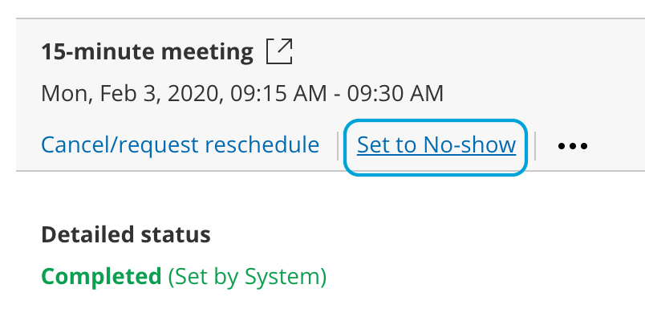Figure 1: Set to No-show
3. The **No-show status** pop-up will appear.
4. Click **Yes** to set the status to **No-show**.

<Aside type="note">

You cannot change the status back to **Completed**, so please be sure you want to mark it as **No-show** for your reports.

</Aside>

### Where do you track the No-show status?

You can track the **No-show** status of an activity in all OnceHub reports. The status is added to the summary and detail reports, making it possible to see the number of No-shows and their details according to all reporting dimensions.

### What happens when an activity status is set to No-show?

When you set up OnceHub to send a follow-up email to customers, you can define when they will receive the email notification. If you changed the status of the activity to **No-show** before the follow-up email event is triggered, the follow-up email will not be sent.

## Deleting activities from the Activity stream

Stay compliant with data privacy law by managing data deletion requests from your customers. When you delete selected activities in the Activity stream and move these activities to the Trash, they will be deleted permanently after 30 days.

You do not need an assigned product license to access the Activity stream and move activities to the Trash, but you do need to be an administrator. Learn more

Read on to learn about moving activities to Trash, restoring activities, deleting them permanently, and other related changes to your account after deleting activities.

<Aside type="note">

Deleting activities is a new feature being rolled out gradually. If you do not see this option in your Activity stream and it's necessary for your account management, please [contact us](/contact-feedback) and we'd be happy to turn it on for you.

</Aside>

### Move activities to Trash

If you'd like to move an activity to the Trash, select the relevant activity in the Activity stream. You will see a menu of three dots. Click on this and select **Move to Trash**. In the pop-up, confirm you want to move it to the Trash.

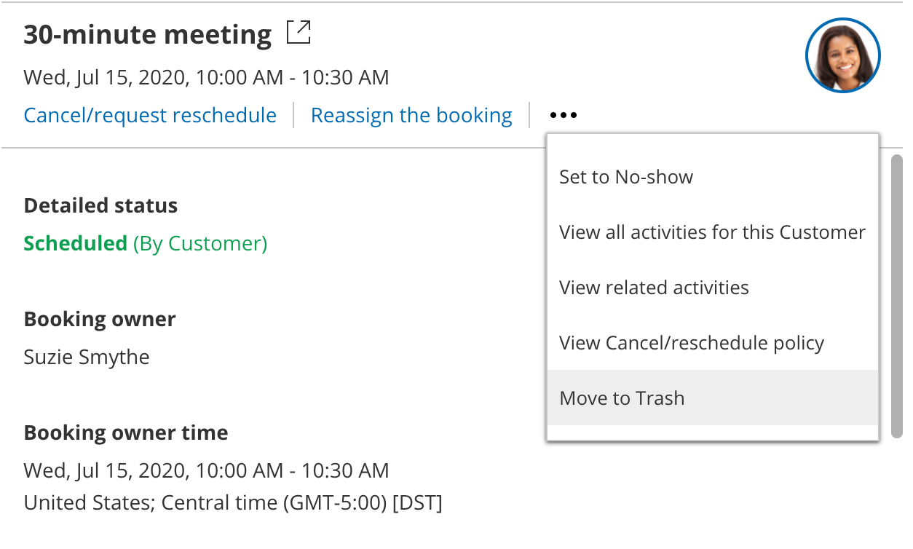_Figure 1: Move to Trash_

You will no longer see this activity in your Activity stream, either from default or custom filters. You can only access this activity from the Trash filter, for the next 30 days after moving it to the Trash.

Users **will not** be notified when their activities are deleted.

<Aside type="note">

Moving activities to the Trash for permanent deletion is a feature intended for data deletion, to comply with privacy laws.

</Aside>

It is **not intended** for booking cancellation. Deleting an activity does not cancel a future booking. If you move an activity to Trash and permanently delete it, **this does not update any related calendar event in your connected calendar, nor will that time be free for other meetings**.

If you'd like to cancel the meeting, you can do this through the standard cancellation process, which will both cancel the meeting and free that time slot for other meetings.

### Bulk deleting activities

You can delete up to 50 activities at one time by selecting each in the activity stream. Click on the Trash icon and you'll be able to delete them all at once, after confirming you want to delete that number of activities.

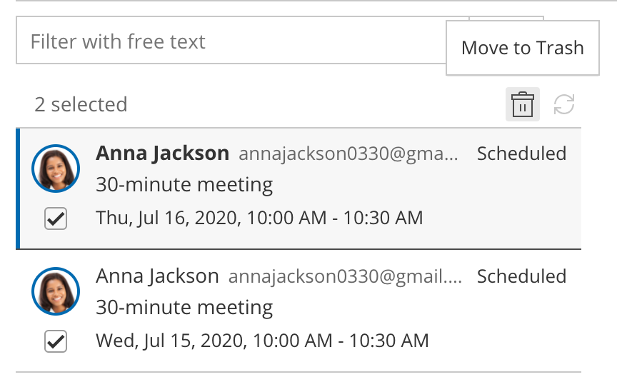 _Figure 2: Select multiple activities for moving to trash_

### The Trash

The Trash holds all deleted activities from the last 30 days.

Only admins can see the Trash. Member users will not be able to see the activities in the Trash.

#### Restoring activities from Trash

If you sent an activity to the Trash in error, you can restore this activity within 30 days of moving it to the Trash. Find and select that activity in the Trash. Hover over the menu of three dots and select **Restore activity**. The activity will now appear in your active Activity stream filters and will not be deleted permanently.

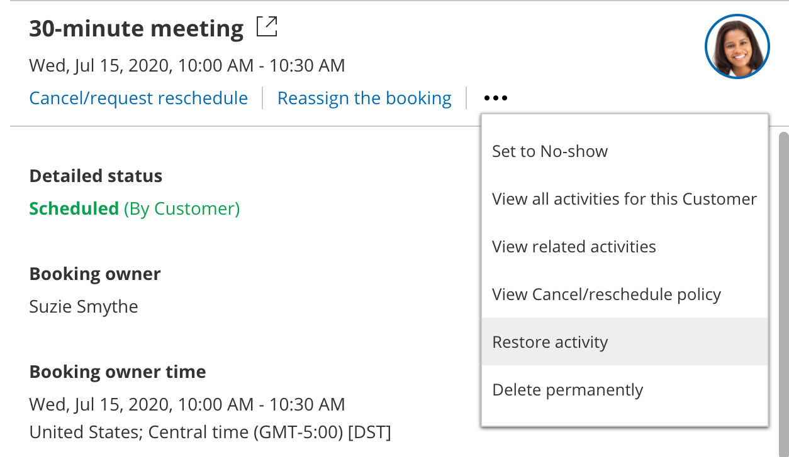_Figure 3: Restore activity_

#### Deleting activities permanently

All activities sent to the Trash delete permanently and automatically after 30 days.

If you wish to delete the activity permanently before 30 days, go to the menu of three dots and select Delete permanently.

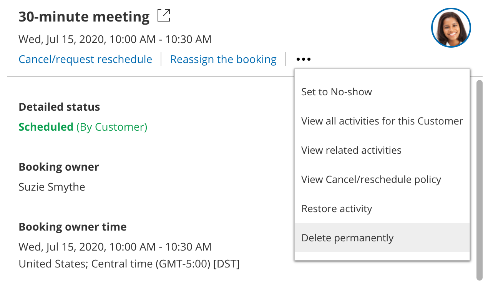_Figure 4: Delete permanently_

The permanently deleted data will also be removed from OnceHub's servers within 24 hours of permanent deletion in your account.

If you move something to the Trash on January 1 and don't choose to delete it permanently yourself from the Trash, it will be deleted permanently from your account on January 31. At this time, it will be flagged for deletion from the OnceHub database, which can take up to 24 hours. This data will be completely removed from OnceHub's servers by end of day on February 1. If you choose to delete it permanently from the Trash before 30 days are complete, it will be removed within 24 hours. This means if you move something to the Trash on January 1 and choose to delete it permanently on January 1, this data will be completely removed from OnceHub's servers by end of day on January 2.

If you'd like to delete all activities permanently, you can select **Empty trash now** in the banner at the top of Trash. This will permanently delete all activities in the Trash.

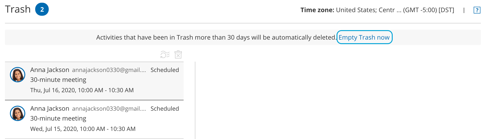_Figure 5: Empty trash now to remove all items in the Trash_

Permanently deleted activities **cannot** be restored by any account admin, nor by OnceHub database engineers. This keeps deleted activities compliant with privacy laws.

### Deleted activities in reports

Activities in the Trash remain active and will be included in reports until deleted. They will display as being **(In Trash)**.

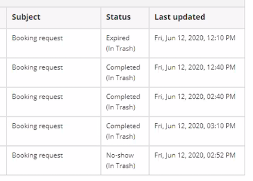 _Figure 6: Status displays that the activity is in the Trash_

After they are permanently deleted, any fields related to this deleted activity will not show up in reports.

For permanently deleted payment activities, the payment will still be listed as an item on your revenue reports but will not include any personal identifying information for that payment.

### Session packages

If you delete a single session in a session package, this deletes only that single session. The session package is otherwise not affected. The reverse is also true: If you delete a session package, the individual sessions in that package will remain active.

If you'd like all sessions in a session package to be deleted, you must delete each individually. We recommend using the bulk select and delete option (see above, **Bulk deleting activities**).

### Payment integration

When you delete a payment activity, the following will be removed from its related activity/activities in the Activity stream:

- Option to **Process a refund**
- Option to **Download invoice**
- The relevant booking page
- Ability to **View Cancel/reschedule policy** in the menu with three dots

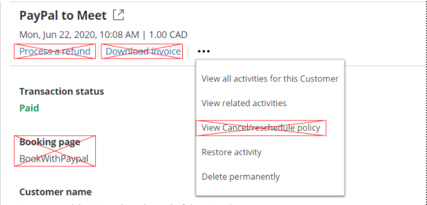 _Figure 7: Removed fields with deleted payment activity_

The payment will still be listed as an item on your revenue reports but will not include any personal identifying information for that payment.

### Third-party integrations

It's important to understand that data from the deleted activities will **only** be removed from OnceHub. Users will need to follow similar deletion protocols in each integrated application that may be connected to OnceHub. When you delete an activity, OnceHub will not remove data related to that deleted activity from your calendar, CRM, video conferencing app, or any other integrated system.
