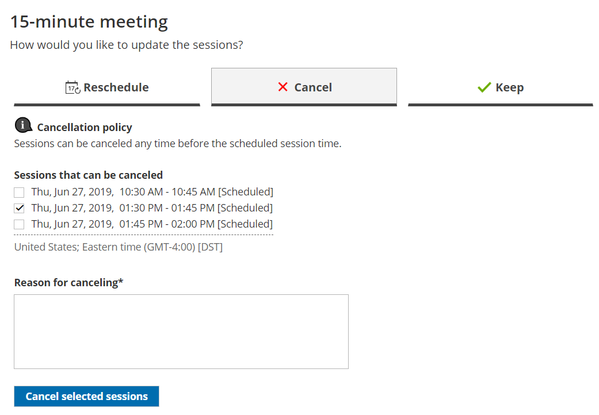

import { Aside } from "@astrojs/starlight/components";

Whether or not a Customer can cancel sessions in a package is subject to the [cancellation policy](/scheduleonce/managing-bookings/cancel-reschedule/customer-cancelreschedule-policy "The Customer Cancel/reschedule policy") you've set on your [Booking page](/scheduleonce/event-types-booking-pages/booking-pages/introduction-to-booking-pages "Introduction to Booking pages") or [Event type](/scheduleonce/event-types-booking-pages/event-types/introduction-to-event-types "Introduction to Event types"). The cancellation policy only applies to scheduled bookings.

In this article, you'll learn about the steps that a Customer takes to cancel sessions in a package.

## How Customers cancel sessions in a package

1. The Customer clicks the **Cancel/reschedule** link in the scheduling confirmation email (Figure 1) or the [calendar event](/scheduleonce/event-types-booking-pages/customer-notifications/customer-calendar-event-options "Customer calendar event options"). Figure 1: Booking confirmation email
2. The [Cancel/reschedule page](/scheduleonce/managing-bookings/cancel-reschedule/customer-cancelreschedule-page "The Customer Cancel/Reschedule page") will open.
3. In the **Cancel** tab, the Customer selects the sessions that they want to cancel (Figure 2). Depending on your [Cancel/reschedule policy](/scheduleonce/managing-bookings/cancel-reschedule/customer-cancelreschedule-policy "The Customer Cancel/Reschedule policy"), the Customer can be asked to provide a reason for canceling. Figure 2: Cancel tab
4. Once the sessions have been cancelled, a cancellation email notification is sent to the Customer, the Booking owner, and any [additional stakeholders](/scheduleonce/event-types-booking-pages/user-notifications/subscribing-to-booking-notifications "Access permissions for subscribing to Booking notifications").
5. If the Customer added these events to their calendar, they will have to remove them manually.

[Learn more about the effects of cancellation](/scheduleonce/managing-bookings/cancel-reschedule/effects-of-cancellation "Effect of cancellation")

<Aside type="note">

If you use [Payment integration](/scheduleonce/account-integrations/payment-collection/paypal/oncehub-connector-for-paypal "The ScheduleOnce connector for PayPal"), you can enable [automatic refunds](/scheduleonce/account-integrations/payment-collection/paypal/automatic-refunds-via-oncehub "Automatic refund via ScheduleOnce") when Customers cancel one or more sessions in a package. [Learn more about enabling automatic refunds](/scheduleonce/account-integrations/payment-collection/paypal/automatic-refunds-via-oncehub "Automatic refund via ScheduleOnce")

</Aside>
