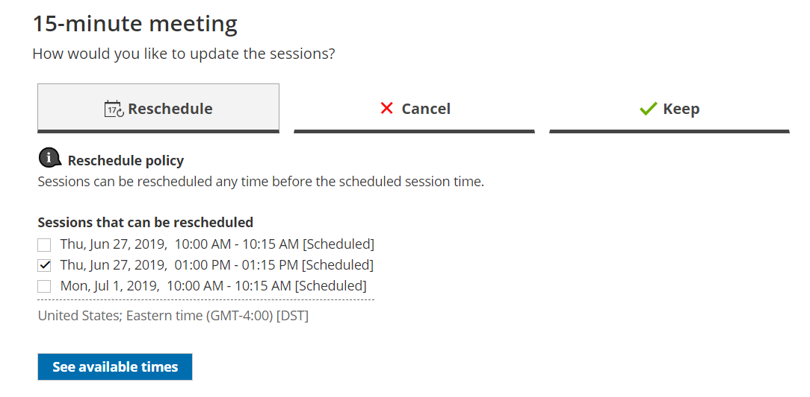

import { Aside } from "@astrojs/starlight/components";

Whether or not a Customer can reschedule sessions in a package is subject to the [Cancel/reschedule policy](/scheduleonce/managing-bookings/cancel-reschedule/customer-cancelreschedule-policy "The Customer Cancel/reschedule policy") you've set on your [Booking page](/scheduleonce/event-types-booking-pages/booking-pages/introduction-to-booking-pages "Introduction to Booking pages") or [Event type](/scheduleonce/event-types-booking-pages/event-types/payment-and-rescheduling "Event type: Payment and cancel/reschedule policy section"). The Reschedule policy only applies to scheduled bookings.

In this article, you'll learn about the steps that a Customer takes to reschedule sessions in a package.

## How Customers reschedule sessions in a package

1. The Customer clicks the **Cancel/Reschedule** link in the scheduling confirmation email (Figure 1) or in the [calendar event](/scheduleonce/event-types-booking-pages/customer-notifications/customer-calendar-event-options "Customer calendar event options"). Figure 1: Booking confirmation email
2. The [Cancel/reschedule page](/scheduleonce/managing-bookings/cancel-reschedule/customer-cancelreschedule-page "The Customer Cancel/Reschedule page") will open.
3. In the **Reschedule** tab, the Customer selects the sessions to be rescheduled (Figure 2). Figure 2: Rescheduling sessions in a package
4. The Customer clicks **See available times** and then selects new dates and times.
5. Depending on your [Cancel/reschedule policy](/scheduleonce/managing-bookings/cancel-reschedule/customer-cancelreschedule-policy "The Customer Cancel/Reschedule policy"), the Customer can be asked to provide a reason for rescheduling.
6. The [Booking form](/scheduleonce/event-types-booking-pages/booking-forms-redirect/introduction-to-booking-form-and-redirect "Introduction to the Booking form and redirect section") step is skipped since all the required information was already provided by the Customer when they made the booking.
7. Once the sessions have been rescheduled, an email notification is sent to the Customer, the [Booking page Owner](/scheduleonce/event-types-booking-pages/booking-pages/booking-page-access-permissions "Booking page access permissions"), and [any additional stakeholders](/scheduleonce/event-types-booking-pages/user-notifications/subscribing-to-booking-notifications "Access permissions for subscribing to Booking notifications").

[Learn more about the effect of rescheduling](/scheduleonce/managing-bookings/cancel-reschedule/effects-of-rescheduling "Effect of rescheduling")

<Aside type="note">

When using [Payment integration](/scheduleonce/account-integrations/payment-collection/paypal/oncehub-connector-for-paypal "The ScheduleOnce connector for PayPal"), you can charge Customers a reschedule fee when they reschedule one or more sessions in a package. This enables you to generate an additional revenue stream and reduces unnecessary rescheduling activity. The Reschedule fee amount is always relative to the number of sessions included in the Session package.

</Aside>
