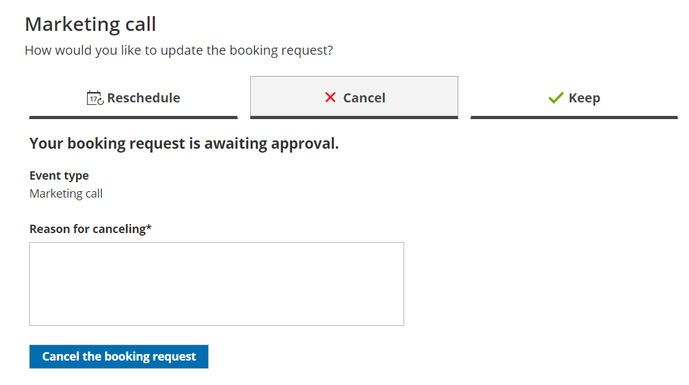

import { Aside } from "@astrojs/starlight/components";

The Cancel/reschedule page allows Customers to cancel and reschedule bookings subject to the [Cancel/reschedule policy](/scheduleonce/managing-bookings/cancel-reschedule/customer-cancelreschedule-policy "The Customer Cancel/reschedule policy") you set on your [Booking page](/scheduleonce/event-types-booking-pages/booking-pages/introduction-to-booking-pages "Introduction to Booking pages") or [Event type](/scheduleonce/event-types-booking-pages/event-types/introduction-to-event-types "Introduction to Event types"). Customers access the Cancel/reschedule page by clicking the **Cancel/reschedule** link in the [scheduling confirmation email](/scheduleonce/event-types-booking-pages/customer-notifications/introduction-to-customer-notifications "Introduction to the Customer notifications section") or the [calendar event](/scheduleonce/event-types-booking-pages/customer-notifications/customer-calendar-event-options "Customer calendar event options") for the booking.

## Customer action: Cancel or reschedule a booking

To [cancel a booking](/scheduleonce/managing-bookings/cancel-reschedule/customer-action-cancel-single-booking "Customer Action: Cancel a single booking") or [reschedule a booking](/scheduleonce/managing-bookings/cancel-reschedule/customer-action-reschedule-single-booking "Customer Action: Reschedule a single booking"), the Customer can click the **Cancel/Reschedule** link in the scheduling confirmation email or calendar event. This will take them to the same Booking page or [Master page](/scheduleonce/master-pages-resource-pools/master-pages/introduction-to-master-pages "Introduction to Master pages") where the Booking was previously made.

On the Cancel/reschedule page (Figure 1), the Customer has the option to keep the original time, reschedule the booking, cancel a single booking, or cancel one or more [sessions in a package](/scheduleonce/event-types-booking-pages/scheduling-options/session-packages "Session packages"). If the Customer clicks **See available times**, they will be prompted to select a new time and reschedule the meeting.

Figure 1: Canceling a booking

<Aside type="note">

If you're using [Payment integration](/scheduleonce/account-integrations/payment-collection/paypal/payment-integration-throughout-booking-lifecycle "Payment integration throughout the booking lifecycle"), you can charge the Customer a reschedule fee or automatically send refunds when they reschedule or cancel bookings. The policy settings will vary based on the [Payment and cancel/reschedule policy](/scheduleonce/event-types-booking-pages/event-types/payment-and-rescheduling "Event type: Payment and cancel/reschedule policy section") options that you choose.

</Aside>

## Customer action: Cancel or reschedule sessions in a package

To [cancel sessions](/scheduleonce/managing-bookings/cancel-reschedule/customer-action-cancel-sessions-in-package "Customer Action: Cancel sessions in a package") or [reschedule sessions](/scheduleonce/managing-bookings/cancel-reschedule/customer-action-reschedule-sessions-in-package "Customer Action: Reschedule sessions in a package") in a package, the Customer selects one or more sessions on the Cancel/Reschedule page and then cancels or reschedules the selected sessions (Figure 2).

Figure 2: Rescheduling sessions in a package

<Aside type="note">

If you are using [Payment integration](/scheduleonce/account-integrations/payment-collection/paypal/payment-integration-throughout-booking-lifecycle "Payment integration throughout the booking lifecycle"), you can charge the Customer a reschedule fee or automatically send refunds when they reschedule or cancel bookings. The reschedule fee or refund amount is always relative to the number of sessions included in the Session package.

</Aside>

## Customer action: Cancel/reschedule a booking request

[Booking requests](/scheduleonce/managing-bookings/responding-to-booking-requests/responding-to-booking-requests/scheduling-and-responding-to-booking-requests "Scheduling and responding to booking requests") that are not yet scheduled are not subject to the Customer Cancel/reschedule policy. The Customer can cancel or reschedule a booking request any time before it is approved.

To [cancel a booking request](/scheduleonce/managing-bookings/responding-to-booking-requests/responding-to-booking-requests/customer-action-cancelling-booking-request "Customer action: Cancel a booking request"), the Customer can click **Cancel the booking request** on the **Cancel** tab (Figure 3). To [request new times](/scheduleonce/managing-bookings/responding-to-booking-requests/responding-to-booking-requests/customer-action-resubmit-booking-request "Customer action: Resubmit a Booking request"), the Customer can click **See available times** on the **Reschedule** tab.

Figure 3: Cancel a booking request

