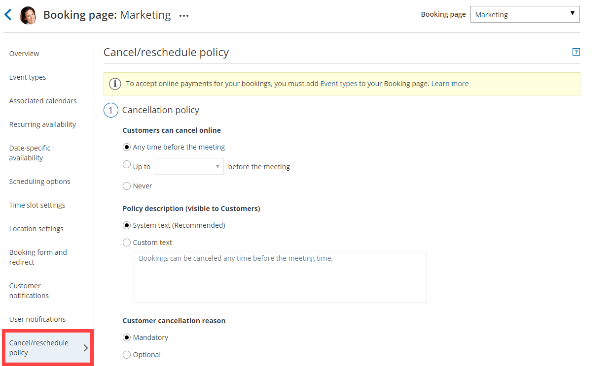
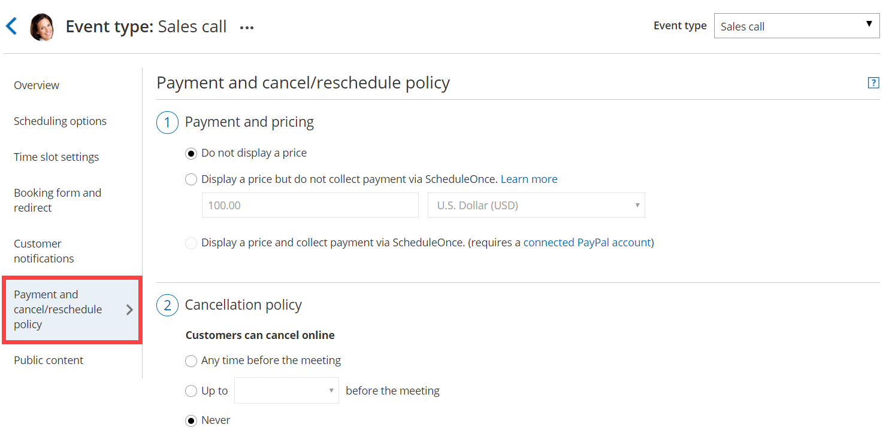

import { Aside } from "@astrojs/starlight/components";

OnceHub allows you to set up independent cancellation and reschedule policies that are fully configurable. The policies allow you to specify the exact rules for when Customers are allowed to [cancel](/scheduleonce/managing-bookings/cancel-reschedule/customer-action-cancel-single-booking "Customer Action: Cancel a single booking") or [reschedule](/scheduleonce/managing-bookings/cancel-reschedule/customer-action-reschedule-single-booking "Customer Action: Reschedule a single booking").

## Defining your cancellation and reschedule policy

On the [Cancel/reschedule policy page](/scheduleonce/managing-bookings/cancel-reschedule/customer-cancelreschedule-page "The Customer Cancel/reschedule page"), you can customize the policy description presented to your Customers and choose whether or not Customers will be requested to provide a reason when they cancel or reschedule. You can choose to make providing the reason **Mandatory**, **Optional**, or choose not to display the field at all by selecting **Don't ask**.

You can define different policies for different scheduling scenarios. The policies you define are displayed on the Customer Cancel/reschedule section. This allows your Customers to make an informed decision before they proceed with the cancel/reschedule action.

The three timeframe options available for when cancellations and reschedules can be made by your Customers are:

- **Any time before the meeting:** This means that Customers can cancel right before the scheduled meeting time. This can be a matter of minutes before the meeting.
- **Up to a certain time before the meeting:** In this case, you can select how long before the scheduled meeting time that the Customer can cancel. The possible values range from 15 minutes to 14 days.
- **Never:** In this case, the Customer will never be able to cancel the booking.

## Location of the Cancel/reschedule policy page

Depending on whether or not your [Booking pages are associated with Event types](/scheduleonce/event-types-booking-pages/booking-pages/adding-event-types-to-booking-pages "Adding Event types to Booking pages"), the location of the Cancel/reschedule policy page and the options available to you change.

## Booking pages not associated with Event types

When you use [Booking pages](/scheduleonce/event-types-booking-pages/booking-pages/introduction-to-booking-pages "Introduction to Booking pages") without [Event types](/scheduleonce/event-types-booking-pages/event-types/introduction-to-event-types "Introduction to Event types"), the cancellation and reschedule policies are set at the Booking page level under the **Cancel/reschedule policy** section (Figure 1). [Learn more about the Cancel/reschedule policy section](/scheduleonce/managing-bookings/cancel-reschedule/introduction-to-canceling-and-rescheduling "Introduction to canceling and rescheduling")

Figure 1: Cancel/reschedule policy on a Booking page not associated with Event types

## Booking pages associated with Event types

If you have [associated your Booking page with at least one Event type](/scheduleonce/event-types-booking-pages/booking-pages/adding-event-types-to-booking-pages "Adding Event types to Booking pages"), the cancellation and reschedule policies are set at the Event type level under the **Payment and Cancel/reschedule policy** section (Figure 2).

[Learn more about the payment and cancel/reschedule policy section](/scheduleonce/event-types-booking-pages/event-types/payment-and-rescheduling "Event type: Payment and cancel/reschedule policy section")

Figure 2: Payment and cancel/reschedule policy section

The cancellation/reschedule policies in Event types are configured together with payments. In addition to specifying the timeframe for canceling or rescheduling, you can also define the monetary penalties that Customers will face if they cancel or reschedule.

Depending on which **Payment and pricing** option you pick, the ability to set up policies with monetary penalties and automatically handle refunds and rescheduling fees changes.

### Do not display a price

This option only allows you to set the timeframe during which Customers can cancel or reschedule. This option does not allow you to set up monetary penalties within your cancellation and reschedule policies.

[Learn more about the cancel/reschedule policy when a price is not displayed](/scheduleonce/event-types-booking-pages/event-types/payment-and-rescheduling-price-is-not-displayed "Event type: Payment and cancel/reschedule policy when a price is not displayed")

### Display a price but do not collect payment via OnceHub

This option allows you to set the timeframe during which Customers can cancel or reschedule, as well as define the monetary penalties that Customers will face when cancelling or rescheduling.

However, because you are only displaying a price and are not collecting payments via OnceHub, refunds and rescheduling fees can only be defined in text in the description policy. These policies cannot be enforced in OnceHub. In other words, you remain in charge of processing the rescheduling fees and refunds.

[Learn more about the cancel/reschedule policy when a price is displayed](/scheduleonce/event-types-booking-pages/event-types/payment-and-rescheduling-price-is-displayed "Event type: Payment and cancel/reschedule policy when a price is displayed")

### Display a price and collect payment via OnceHub

This options allows you to set the timeframe during which Customers can cancel or reschedule, as well as define and enforce the monetary penalties that Customers will face when cancelling or rescheduling.

Since your OnceHub account is [connected to PayPal](/scheduleonce/account-integrations/payment-collection/paypal/oncehub-connector-for-paypal "The ScheduleOnce connector for PayPal") with this option, the handling of refunds and rescheduling fees can be completely automated. This allows you to streamline your payments throughout the booking lifecycle. If you prefer, you can still choose to [manually process refunds](/scheduleonce/account-integrations/payment-collection/paypal/manual-refunds-via-oncehub "Manual refund via ScheduleOnce").

[Learn more about the cancel/reschedule policy when collecting payment via OnceHub](/scheduleonce/event-types-booking-pages/event-types/payment-and-rescheduling-payment-is-collected "Event type: Payment and cancel/reschedule policy when payment is collected via OnceHub")
