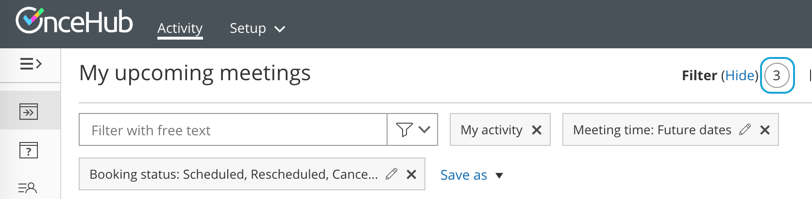

import { Aside } from "@astrojs/starlight/components";

In this article, you'll learn about the effects of rescheduling in different phases of the booking lifecycle. [Learn more about the different activity statuses](/scheduleonce/managing-bookings/analytics/activity-stream-managing-activities "Understanding activity statuses")

## Reschedule initiated by Customer

When a Customer submits a request to [reschedule a booking](/scheduleonce/managing-bookings/cancel-reschedule/customer-action-reschedule-single-booking "Customer action: Reschedule a single booking"), the following actions take place.

- **If the Customer reschedules using the same Booking page:** In the [Activity stream](/scheduleonce/managing-bookings/analytics/activity-stream-viewing-activities "Introduction to the ScheduleOnce Activity stream"), the original event is updated with the new time and a status of **Rescheduled (By Customer)**. In the calendar, the event is moved to the new date and time. There is no canceled activity and one calendar event is used for the entire booking lifecycle.

  <Aside type="note">

  **Note**This does not apply to Booking pages in [Group session](/scheduleonce/event-types-booking-pages/scheduling-options/one-on-one-or-group-sessions "One-on-One or Group session") mode integrated with [Zoom](/user-integrations/basics-user-integrations/connect-your-video-conferencing-app "How to connect ScheduleOnce to Zoom"), [Google Meet](/user-integrations/basics-user-integrations/connect-your-video-conferencing-app), [Microsoft Teams](/user-integrations/basics-user-integrations/connect-your-video-conferencing-app), [GoToMeeting](/user-integrations/basics-user-integrations/connect-your-video-conferencing-app "The ScheduleOnce connector for GoToMeeting"), or [Webex Meetings](/user-integrations/basics-user-integrations/connect-your-video-conferencing-app "The ScheduleOnce connector for Webex Meetings"). In this case, the original activity is updated with a status of **Canceled (By Customer)** and a new **Rescheduled** Activity is created.

  </Aside>

- **If the Customer reschedules using a different Booking page:** In the [Activity stream](/scheduleonce/managing-bookings/analytics/activity-stream-viewing-activities "Introduction to the ScheduleOnce Activity stream"), the original activity is updated with a status of **Canceled (By Customer)**, a new **Rescheduled** Activity is created, and the **Stream** activity counter is incremented (Figure 1). Figure 1: Stream activity counter

- An email notification with the new booking details is sent to the Customer, the User who the Customer made the booking with, and [any additional stakeholders](/scheduleonce/event-types-booking-pages/user-notifications/subscribing-to-booking-notifications "Subscribing to Booking notifications").

- The original User and [any additional stakeholders](/scheduleonce/event-types-booking-pages/user-notifications/subscribing-to-booking-notifications "Subscribing to Booking notifications") are notified of the canceled booking and are informed of who the Customer reschedules with.

- The previously booked time slot is made available.

### When using OnceHub with a connected calendar

- If the [Customer is added to the original calendar event](/scheduleonce/event-types-booking-pages/customer-notifications/customer-calendar-event-options "Customer Calendar Event options"), the Customer will receive an updated calendar invite email with **CANCELED** in the title. The status of the calendar event will be automatically changed to "Free".
- The original User's calendar event changes its status to "Free". This frees up the slot to accept new bookings.
- The original calendar event includes **CANCELED** in the title, so that it's easy to spot that this booking was canceled. However, the calendar event is not deleted.

### When using Payment integration

If you use [Payment integration](/scheduleonce/account-integrations/payment-collection/paypal/oncehub-connector-for-paypal "The ScheduleOnce connector for PayPal"), payment can be collected automatically via OnceHub and the Customer can be charged a reschedule fee when rescheduling the booking. In this case, a **PAYMENT (RESCHEDULE)** Transaction is added to the Activity stream.

## Reschedule initiated by User

A User can reschedule a booking using either of the following methods.

1. Send the Customer a reschedule request asking them to reschedule the booking themselves.
2. Reschedule on behalf of the Customer directly in your connected [Google Calendar](/scheduleonce/managing-bookings/cancel-reschedule/user-action-cancelreschedule-in-google-calendar "User action: Cancel or reschedule in Google Calendar") or [Exchange/Outlook Calendar](/scheduleonce/managing-bookings/cancel-reschedule/user-action-cancelreschedule-in-exchangeoutlook-calendar "User action: Cancel or reschedule in Exchange Calendar").

When a reschedule request is sent by the User to the Customer, the following actions take place.

- The previously booked time slot becomes available.
- The User, [any additional stakeholders](/scheduleonce/event-types-booking-pages/user-notifications/subscribing-to-booking-notifications "Subscribing to Booking notifications"), and the Customer receive an email notification with the reschedule request details.
- For [Booking pages associated with Event types](/scheduleonce/event-types-booking-pages/booking-pages/adding-event-types-to-booking-pages "Adding Event types to Booking pages"), the Customer will make a new booking for [the same Event type or any Event type](/scheduleonce/managing-bookings/cancel-reschedule/user-action-cancelreschedule-for-booking-pages-with-event-types "User action: Cancel/request to reschedule for Booking pages with Event types"), depending on what the User specified in the **Cancel/request reschedule** pop-up.
- In the Activity stream, the original activity is updated with a **Canceled (Reschedule requested by User)** status.

### When using OnceHub with a connected calendar

- The original calendar event includes **CANCELED** in the title, so that it's easy to spot that this booking was canceled. However, the calendar event is not deleted.
- The User's calendar event changes its status to "Free". This frees up the slot to accept new bookings.
- If the [Customer was added to the original calendar event](/scheduleonce/event-types-booking-pages/customer-notifications/customer-calendar-event-options "Customer Calendar Event options"), the Customer will receive an updated calendar invite email with **CANCELED** in the title. The status of the calendar event will be automatically changed to "Free".

### When using Payment integration

- When the User reschedules with the _same_ Event type, the Customer will not be asked to pay a reschedule fee when rescheduling the booking.
- When the User reschedules with _any_ Event type, payment can be collected automatically via OnceHub and the Customer can be charged for a reschedule fee when rescheduling the booking. In this case, a **PAYMENT (RESCHEDULE)** Transaction is added to the Activity stream.
