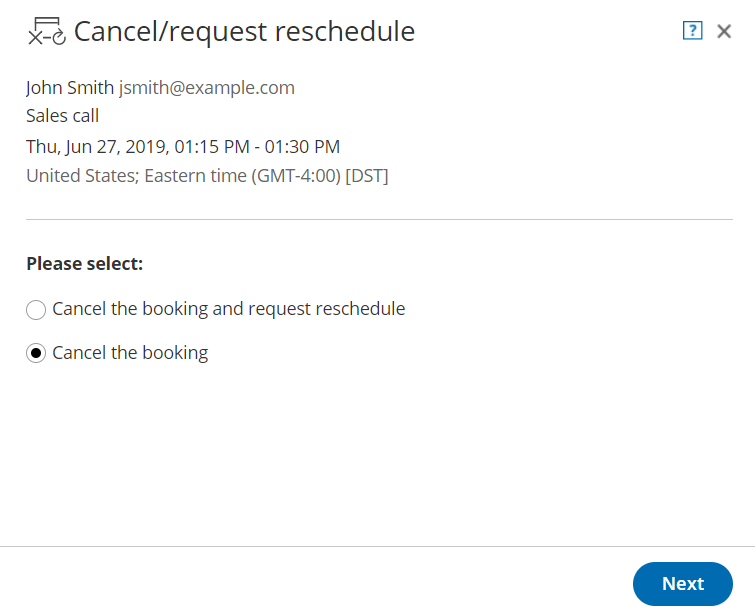

import { Aside } from "@astrojs/starlight/components";

<Aside type="tip">

We recommend using [Event types](/scheduleonce/event-types-booking-pages/event-types/introduction-to-event-types "Introduction to Event types") with your [Booking pages](/scheduleonce/event-types-booking-pages/booking-pages/introduction-to-booking-pages "Introduction to Booking pages"). Event types allow you to offer several meeting types with different durations, price, and other properties.

</Aside>

When the [activity status](/scheduleonce/managing-bookings/analytics/activity-stream-managing-activities "Understanding ScheduleOnce activity statuses") of a booking is **Scheduled**, **Rescheduled**, **No-show**, or **Completed**, the User can request to cancel or reschedule a booking directly from the [Activity stream](/scheduleonce/managing-bookings/analytics/activity-stream-viewing-activities "Introduction to the Activity Stream").

<Aside type="note">

You can cancel or reschedule directly from your calendar if you have connected your OnceHub Account to [Google Calendar](/scheduleonce/managing-bookings/cancel-reschedule/user-action-cancelreschedule-in-google-calendar "User action: Cancel or reschedule in Google Calendar") or [Exchange/Outlook Calendar](/scheduleonce/managing-bookings/cancel-reschedule/user-action-cancelreschedule-in-exchangeoutlook-calendar "User action: Cancel or reschedule in Exchange Calendar").

</Aside>

In this article, you'll learn how to cancel or request reschedule directly from the Activity stream when you use Booking pages which are not [associated with Event types](/scheduleonce/event-types-booking-pages/booking-pages/adding-event-types-to-booking-pages "Adding Event types to Booking pages").

## Effects of canceling or rescheduling

When you request to reschedule from the Activity stream, the booking is canceled and a reschedule request email notification is sent to both the User and the Customer. To reschedule, the Customer clicks the **Reschedule now** button directly from the email notification, or the **Customer's cancel/reschedule link** in the [calendar event](/scheduleonce/event-types-booking-pages/customer-notifications/customer-calendar-event-options "Customer calendar event options"). [Learn more about the effects of rescheduling](/scheduleonce/managing-bookings/cancel-reschedule/effects-of-rescheduling "Effect of rescheduling")

When you cancel a booking from the Activity stream, a cancellation email notification is sent to both the User and the Customer.

[Learn more about the effects of cancellation](/scheduleonce/managing-bookings/cancel-reschedule/effects-of-cancellation "Effect of cancellation")

## Requirements

To cancel a booking or request to reschedule from the Activity stream, you must be [the Owner, an Editor, or Viewer](/scheduleonce/event-types-booking-pages/booking-pages/booking-page-access-permissions "Booking page access permissions") of the [Booking page](/scheduleonce/event-types-booking-pages/booking-pages/introduction-to-booking-pages "Introduction to Booking pages") that the booking was made on.

## Rescheduling a booking made on a Booking page without Event types

1. Select the activity in the Activity stream.
2. In the **Details** pane, select **Cancel/request reschedule**. (Figure 1). Figure 1: Cancel/request reschedule button
3. The **Cancel/request reschedule** pop-up will appear (Figure 2). Figure 2: Cancel/request new times pop-up
4. Select **Cancel the booking and request reschedule**.
5. Click **Next**.
6. In the **Notification** step, you can add a reschedule reason that will be provided to the Customer.
7. Click **Next**.
8. In the **Review** step (Figure 3), you can confirm the details of the booking that you're about to cancel and request that the Customer reschedules. Figure 3: Cancel/request reschedule pop-up—Review step
9. Click **Request reschedule**.
10. The original booking will be canceled and the Customer will receive an email notification to reschedule. The [Booking page Owner](/scheduleonce/event-types-booking-pages/booking-pages/booking-page-access-permissions "Booking page access permissions") and [any additional stakeholders](/scheduleonce/event-types-booking-pages/user-notifications/subscribing-to-booking-notifications "Subscribing to Booking notifications") with also receive an email notification. [Learn more about notification scenarios](/scheduleonce/customization-branding/notification-templates-editor/notification-scenarios "Notification scenarios")

<Aside type="note">

You can always decide to change your selection by clicking **Back** at any step of the Cancel/request new times process.

To confirm the action, you must click the **Request reschedule** in the last step of the pop-up.

</Aside>

## Canceling a booking made on a Booking page without Event types

1. Select the activity in the Activity stream.
2. In the **Details** pane, click the **Cancel/request reschedule** button (Figure 4). Figure 4: Cancel/request new times button
3. The **Cancel/request reschedule** pop-up will appear.
4. From the **Cancel/request reschedule** pop-up, select **Cancel the booking** (Figure 5). Figure 5: Cancel/request reschedule pop-up
5. Click **Next**.
6. In the **Notification** step, you can add a cancellation reason that will be provided to the Customer.
7. Click **Next**.
8. In the **Review** step, you can confirm the details of the booking that you're about to cancel.
9. Click **Cancel booking**.
10. The original booking will be canceled and the Customer will receive an email notification, along with the [Booking page Owner](/scheduleonce/event-types-booking-pages/booking-pages/booking-page-access-permissions "Booking page access permissions") and [any additional stakeholders](/scheduleonce/event-types-booking-pages/user-notifications/subscribing-to-booking-notifications "Subscribing to Booking notifications"). [Learn more about notification scenarios](/scheduleonce/customization-branding/notification-templates-editor/notification-scenarios "Notification scenarios")

<Aside type="note">

You can always decide to change your selection by clicking **Back** at any step of the Cancel/request new times process.

To confirm the action, you must click the **Cancel Booking** in the last step of the pop-up.

</Aside>
