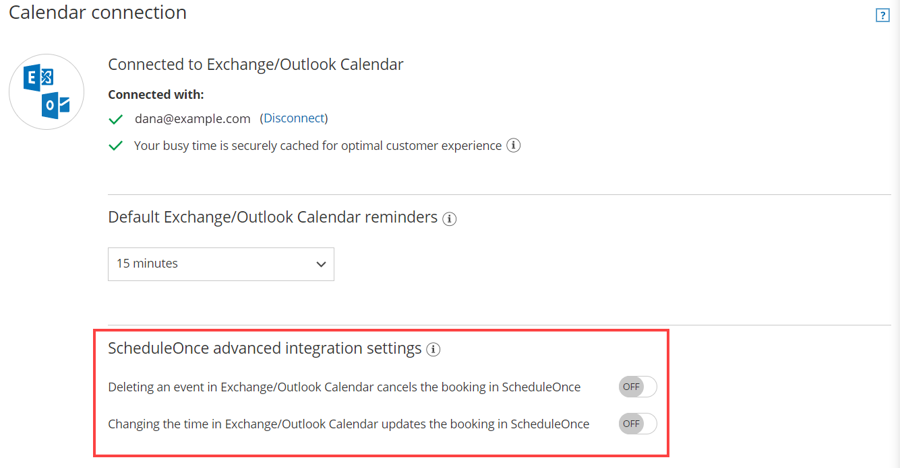

import { Aside } from "@astrojs/starlight/components";

OnceHub communicates with your Exchange/Outlook Calendar using the Exchange Web Services (EWS) API, a well-established official Microsoft protocol. All credentials and data traffic are fully encrypted. [Learn more about how your sign-in credentials are stored and protected by OnceHub](/security-compliance/security/storing-and-protecting-your-sign-in-credentials "How your sign-in credentials are stored and protected by OnceHub")

Once you have [connected to your Exchange/Outlook Calendar](/scheduleonce/user-integrations/exchange-outlook-calendar-connection/managing-your-oncehub-integration-with-microsoft-exchange-calendar "Connecting to your personal Exchange Calendar"), you can select whether changes made in your connected calendar are reflected in the OnceHub User app or not.

<Aside type="note">

This article applies to calendar actions done by Users while connected to Exchange/Outlook Calendar. It does not apply to other calendar integrations, or to any calendar action done by the Customer.

</Aside>

In this article, you'll learn about cancelling and rescheduling from your Exchange/Outlook calendar.

## Adjusting OnceHub advanced integration settings

Open OnceHub and click on your profile image or initials in the top right corner and select **Calendar connection**.

Under the **OnceHub** **advanced integration settings** heading, you will see two toggles (Figure 1). These control how the Exchange/Outlook Calendar two-way sync will function. By default, both toggles are set to **OFF**.

Figure 1: Calendar connection—OnceHub advanced integration settings

## Canceling an event in your connected Exchange/Outlook Calendar

If you delete a calendar event created by a OnceHub booking while the **Deleting an event in Exchange/Outlook Calendar cancels the booking in OnceHub** toggle i set to **ON**, the booking will be automatically canceled in OnceHub . The following actions are performed, as if you (the User) canceled the booking in OnceHub:

- Your Customer receives a [cancellation notification](/scheduleonce/event-types-booking-pages/customer-notifications/notifications-to-customers "Notifications to Customers").
- The event is deleted from your calendar, and the time is set to available.
- If you're using any other integrations (like CRM, video conferencing, or [Zapier](/scheduleonce/account-integrations/automation/zapier/connect-zapier-to-oncehub "The ScheduleOnce connector for Zapier")), they are updated with the cancellation.
- If you're using [Payment integration](/scheduleonce/account-integrations/payment-collection/paypal/oncehub-connector-for-paypal "The ScheduleOnce connector for PayPal"), no refund is issued. If your Customer is entitled to a refund, you can [refund them manually via OnceHub ](/scheduleonce/account-integrations/payment-collection/paypal/manual-refunds-via-oncehub "Manual refund via ScheduleOnce")or via PayPal.

<Aside type="note">

&#x20;In cases of [Panel meetings](/scheduleonce/master-pages-resource-pools/panel-meetings/introduction-to-panel-meetings "Introduction to Panel Meetings"), if the [Primary team member](/scheduleonce/master-pages-resource-pools/panel-meetings/booking-owners "Primary Team Members") deletes the calendar event, the booking is automatically canceled in OnceHub for all Panel members. That means for both the Primary team member and all [Additional team members](/scheduleonce/master-pages-resource-pools/panel-meetings/additional-team-members "Additional Team members").

</Aside>

If you delete a calendar event created by a OnceHub booking while the first toggle is set to **OFF** in the Exchange/Outlook Calendar integration settings above, the booking remains unchanged in OnceHub , no email notifications are sent, and no integrations are updated.

## Rescheduling an event in your connected Exchange/Outlook Calendar

The **Changing the time in Exchange/Outlook Calendar updates the booking in OnceHub** option determines how OnceHub is updated with the new time of the event. When you move a booking in your connected calendar, you're actually rescheduling on behalf of your Customer. Therefore, the time change must be coordinated with your Customer. No email notifications are sent to you or your Customer.

<Aside type="note">

&#x20;The reschedule functionality will only work when events are modified in the same calendar. Modifications in [Additional booking calendars](/scheduleonce/event-types-booking-pages/booking-pages/booking-pages-associated-calendars "Booking page: Associated calendars section") are disregarded.

</Aside>

When you move an event in your calendar while the second toggle is set to **ON**, the following actions are performed:

- The OnceHub booking time is updated immediately.
- All [reminders](/scheduleonce/event-types-booking-pages/customer-notifications/notifications-to-customers "Notifications to Customers") are sent on schedule.
- All integrations (CRM, video conferencing, Zapier, and payment) are updated as well.
- The [status](/scheduleonce/managing-bookings/analytics/activity-stream-managing-activities "Understanding activity statuses") of future events is changed to "Rescheduled".

If the second toggle is set to **OFF**, the OnceHub booking time is only updated when the next reminder is due, subsequent reminders are sent on schedule and integrations are not updated.

<Aside type="note">

&#x20;In cases of [Panel meetings](/scheduleonce/master-pages-resource-pools/panel-meetings/introduction-to-panel-meetings "Introduction to Panel Meetings"), if the [Primary team member](/scheduleonce/master-pages-resource-pools/panel-meetings/booking-owners "Primary Team Members") moves a booking in their connected calendar, the booking is automatically rescheduled for all Panel members. That means for both the Primary team member and all [Additional team members](/scheduleonce/master-pages-resource-pools/panel-meetings/additional-team-members "Additional team members").

</Aside>
