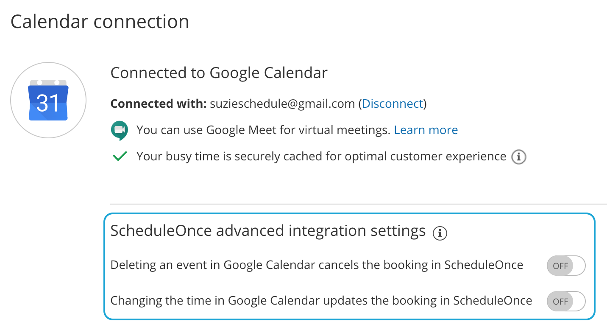
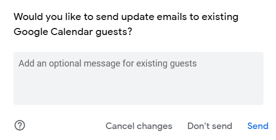

import { Aside } from "@astrojs/starlight/components";
import YouTubeEmbed from "~/components/YouTubeEmbed.astro";

<YouTubeEmbed
  id="N-dyqUCI-Qk"
  title="User action: Cancel/reschedule in Google Calendar"
/>
When you're [connected to a Google
Calendar](/scheduleonce/user-integrations/google-calendar-connection/managing-your-oncehub-integration-with-google-workspace
"Introduction to Google Calendar connection"), you can select whether changes
made in your connected calendar are reflected in OnceHub .

In this article, you'll learn about canceling and rescheduling from your Google Calendar.

## Adjusting OnceHub advanced integration settings

Open OnceHub and click on your profile image or initials in the top right corner and select **Calendar connection**.

Under the **OnceHub** **advanced integration settings** heading, you'll see two toggles (Figure 1). These control how your Google Calendar two-way sync will function. By default, both toggles are set to **OFF**.

Figure 1: Calendar connection—OnceHub advanced integration settings

## Canceling an event in your connected Google Calendar

If you delete a calendar event created by a OnceHub booking while the **Deleting an event in Google Calendar cancels the booking in OnceHub** toggle is set to **ON**, the booking will be automatically canceled in OnceHub. The following actions are performed, as if you (the User) canceled the booking in OnceHub:

- Your Customer receives a [cancellation notification](/scheduleonce/event-types-booking-pages/customer-notifications/notifications-to-customers "Notifications to Customers").
- The event is deleted from your calendar, and the time is set to available.
- If you are using any other integrations (like CRM, video conferencing or [Zapier](/scheduleonce/account-integrations/automation/zapier/connect-zapier-to-oncehub "The ScheduleOnce connector for Zapier")) – they are updated with the cancellation.
- If you are using [Payment integration](/scheduleonce/account-integrations/payment-collection/paypal/payment-integration-throughout-booking-lifecycle "Payment integration throughout the booking lifecycle"), no refund is issued. If your Customer is entitled to a refund, you can [refund them manually via OnceHub ](/scheduleonce/account-integrations/payment-collection/paypal/manual-refunds-via-oncehub "Manual refund via ScheduleOnce")or via PayPal.

If you delete a calendar event created by a OnceHub booking while the first toggle is set to **OFF**, the booking remains unchanged in OnceHub, no email notifications are sent, and no integrations are updated.

<Aside type="note">

In cases of [Panel meetings](/scheduleonce/master-pages-resource-pools/panel-meetings/introduction-to-panel-meetings "Introduction to Panel meetings"), if the [Primary team member](/scheduleonce/master-pages-resource-pools/panel-meetings/booking-owners "Primary team members") deletes the calendar event, the booking is automatically canceled in OnceHub for all Panel members. That means for both the Primary team member and all [Additional team members](/scheduleonce/master-pages-resource-pools/panel-meetings/additional-team-members "Additional team members").

</Aside>

## Rescheduling an event in your connected Google Calendar

The **Changing the time in Google Calendar updates the booking in OnceHub** option determines how OnceHub is updated with the new time of the event. When you move a booking in your connected calendar, you're actually rescheduling on behalf of your Customer. Therefore, the time change must be coordinated with your Customer. No email notifications are sent to you or your Customer.

<Aside type="note">

The reschedule functionality will only work when events are modified in the same calendar. Modifications in [Additional booking calendars](/scheduleonce/event-types-booking-pages/booking-pages/booking-pages-associated-calendars "Booking page: Associated calendars section") are disregarded.

</Aside>

When you move an event in your calendar while the second toggle is set to **ON**, the following actions are performed:

- The OnceHub booking time is updated immediately.
- All [reminders](/scheduleonce/event-types-booking-pages/customer-notifications/customer-notification-scenarios "Customer notification scenarios") are sent on schedule.
- All integrations (CRM, video conferencing, Zapier, and payment) are updated as well.
- The [status](/scheduleonce/managing-bookings/analytics/activity-stream-managing-activities "Understanding ScheduleOnce activity statuses") of future events is changed to "Rescheduled".

If the second toggle is set to **OFF**, the OnceHub booking time is only updated when the next reminder is due, subsequent reminders are sent on schedule and Integrations are not updated.

<Aside type="note">

&#x20;In cases of a [Panel meeting](/scheduleonce/master-pages-resource-pools/panel-meetings/introduction-to-panel-meetings "Introduction to Panel Meetings"), if the [Primary team member](/scheduleonce/master-pages-resource-pools/panel-meetings/booking-owners "Primary Team Members") moves or delete a booking in their connected calendar, the booking is automatically rescheduled or canceled for all panel members. That means for both the Primary team member and all [Additional team members](/scheduleonce/master-pages-resource-pools/panel-meetings/additional-team-members "Additional team members").

</Aside>

## The Customer calendar event

Whether your Customer’s calendar will be updated or not depends on your choice in Google’s **Would you like to send update emails to existing Google Calendar guests** pop-up. Make sure to click the **Send** button, so that your Customer’s calendar is updated. [Learn more about the Customer's calendar event](/scheduleonce/event-types-booking-pages/customer-notifications/customer-calendar-event-options "Customer Calendar Event options")

Figure 2: Send updates to Calendar guests
