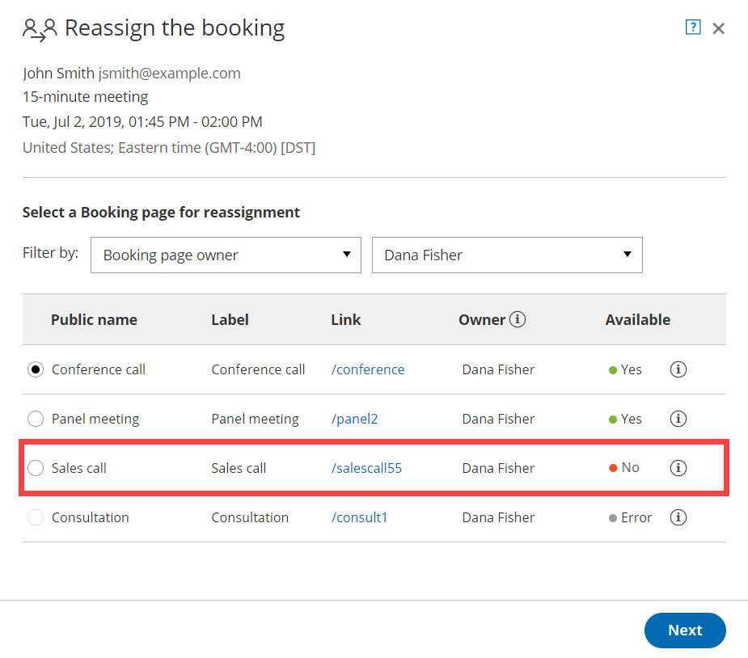

import { Aside } from "@astrojs/starlight/components";

[Booking reassignment](/scheduleonce/managing-bookings/reassign/introduction-to-booking-reassignment "Introduction to Booking reassignment") allows you to reassign bookings in your [Activity stream](/scheduleonce/managing-bookings/analytics/activity-stream-viewing-activities "Introduction to the ScheduleOnce Activity stream") from one Team member to another. This is useful in situations such as when a Team member is unavailable, or when a different Team member is better able to serve a specific Customer.

In this article, you'll find answers to some of the most common questions related to Booking reassignment.

## How do I reassign a booking?

To reassign a booking, select the booking activity in your [Activity stream](/scheduleonce/managing-bookings/analytics/activity-stream-viewing-activities "Introduction to the ScheduleOnce Activity stream"). Then, in the **Details** pane, select **Reassign the booking** (Figure 1).

Follow the steps in the **Reassign the booking** pop-up to reassign the booking from one Team member to another.

Figure 1: Reassign the booking

[Learn more how to reassign bookings from the Activity stream](/scheduleonce/managing-bookings/reassign/user-action-reassign-booking "User Action: Reassign a booking")

## Why don't I see the 'Reassign the booking' option?

If you don't see the **Reassign the booking** option in the **Details** pane of a particular activity, this means the booking activity is not eligible for reassignment. There are a number of reasons why the booking may not be eligible for reassignment.

- Only OnceHub Administrators can reassign booking.
- Additionally, you must be [the Owner, an Editor, or a Viewer](/scheduleonce/event-types-booking-pages/booking-pages/booking-page-access-permissions "Booking page access permissions") of the [Booking page](/scheduleonce/event-types-booking-pages/booking-pages/introduction-to-booking-pages "Introduction to Booking pages") that the booking was made on.
- A booking must be a [one-on-one meeting](/scheduleonce/event-types-booking-pages/scheduling-options/one-on-one-or-group-sessions "One-on-one or Group session") to be eligible for reassignment.

## Can I reassign a booking to a Booking page that already has a booking at the same time?

Yes, you can. In the **Reassign the booking** pop-up, Booking pages that are [eligible for reassignment](/scheduleonce/managing-bookings/reassign/eligibility-for-booking-reassignment-faqs "Eligibility for Booking reassignment FAQs") but not available during that specific time slot are marked in the **Available** column as **No** (Figure 2).

You can still reassign bookings to these Booking pages, but this will create a double-booking. To resolve this, you'll need to [reschedule, cancel](/scheduleonce/managing-bookings/cancel-reschedule/introduction-to-canceling-and-rescheduling "Introduction to canceling and rescheduling"), or [reassign](/scheduleonce/managing-bookings/reassign/introduction-to-booking-reassignment "Introduction to Booking reassignment") one of the bookings.

Figure 2: Reassign the booking pop-up

## Can I reassign a booking to a Booking page that has no availability at the meeting time?

Yes, you can. In the **Reassign the booking** pop-up, Booking pages that are [eligible for reassignment](/scheduleonce/managing-bookings/reassign/eligibility-for-booking-reassignment-faqs "Eligibility for Booking reassignment FAQs") but not available during that specific time slot are marked in the **Available** column as **No** (Figure 3).

However, the booking might be scheduled outside of the Booking page's [recurring](/scheduleonce/event-types-booking-pages/booking-pages/booking-pages-recurring-availability "Booking page: Recurring availability section") or [date-specific availability](/scheduleonce/event-types-booking-pages/booking-pages/booking-pages-date-specific-availability "Booking page: Date-specific availability section").

Figure 3: Reassign the booking pop-up

## Can I reassign a booking to a new Booking page when the location of the original booking page is not the same as the location of the new Booking page?

Yes, you can. However, you'll need to update the [location details](/scheduleonce/event-types-booking-pages/booking-pages/booking-pages-location-settings "Booking page: Location settings section") for the booking manually. The location details will not appear in future [User notifications](/scheduleonce/event-types-booking-pages/user-notifications/introduction-to-user-notifications "Introduction to User notifications section") or [Customer notifications](/scheduleonce/event-types-booking-pages/customer-notifications/introduction-to-customer-notifications "Introduction to the Customer notifications section"), calendar events, or the [Activity stream](/scheduleonce/managing-bookings/analytics/activity-stream-viewing-activities "Introduction to the ScheduleOnce Activity stream") for the reassigned booking.

## Why can't I see all the Booking pages in my account in the Reassign the booking pop-up?

Only Booking pages that are [eligible for reassignment](/scheduleonce/managing-bookings/reassign/eligibility-for-booking-reassignment-faqs "Eligibility for Booking reassignment FAQs") appear in the **Reassign the booking** pop-up.

For example, a Booking page that only offers [Group sessions](/scheduleonce/event-types-booking-pages/scheduling-options/one-on-one-or-group-sessions "One-on-One or Group session") will not be eligible for reassignment.

## Why does the Reassign the booking pop-up say there is an Error with a certain Booking page?

A Booking page may be marked as **Error** if the page cannot accept bookings due to a system error. This can happen because the target Booking page is disabled, or there may be a calendar connection error with the Booking page.

## Does the Customer know that reassignment is taking place?

No. When a booking is reassigned, the experience is invisible to Customers. From your Customer’s perspective, the event remains as originally scheduled. The Customer will receive notifications for the event as originally planned.

If required, you can provide the Customer with a **Booking reassignment reason** in the **Notification** step of the **Reassign the booking** pop-up (Figure 4).

Figure 4: Reassign the booking pop-up—Notification step

[Learn more about the effects of Booking reassignment](/scheduleonce/managing-bookings/reassign/effects-of-booking-reassignment "Effects of Booking reassignment")

## Who is notified when I reassign a booking?

The original Booking owner and Reassigned Booking owner, and associated [Booking page Editors](/scheduleonce/event-types-booking-pages/booking-pages/booking-page-access-permissions "Booking page access permissions") are notified of the reassignment via email and, if selected, [SMS notification](/scheduleonce/insights-operations/profile-management/introduction-to-sms-notifications "Introduction to SMS notifications").

Can I reassign a booking multiple times?

Yes. You can reassign a booking as many times as you need to. Each time you reassign a booking, the original Booking owner, the Reassigned Booking owner and associated Editors are notified of the Booking reassignment.

If you reassign a booking more than once, the original Booking owner is always notified, along with the new Reassigned booking owner. However, any previous Reassigned Booking owners are not notified.

## If I am the original Booking owner or Editor of a booking, do I get reminder notifications and follow-up notifications after it has been reassigned?

No. All reminder and follow-up notifications are sent to the Reassigned Booking owner and associated Editors, based on the [User notification](/scheduleonce/event-types-booking-pages/user-notifications/introduction-to-user-notifications "Introduction to User notifications section") settings of the reassigned Booking page.

## What happens when a request to reschedule is sent or the booking is rescheduled after reassignment?

The rescheduling process is always based on the original [Booking page settings](/scheduleonce/managing-bookings/cancel-reschedule/customer-cancelreschedule-policy "The Customer Cancel/reschedule policy"). Notifications are sent to the original Booking owner, the Reassigned booking owner and associated Editors based on the original Booking page's [User notifications](/scheduleonce/event-types-booking-pages/user-notifications/introduction-to-user-notifications "Introduction to User notifications section") setting.

## What happens when the booking is canceled after reassignment?

If the booking is canceled, the Reassigned Booking owner and Editors may be notified based on the reassigned Booking page's [User notifications](/scheduleonce/event-types-booking-pages/user-notifications/introduction-to-user-notifications "Introduction to User notifications section") setting.

The original Booking owner and associated Editors will not receive any notifications.

## Who has access to the reassigned booking in the Activity stream?

The Reassigned Booking owner, Editors, and Viewers can access the booking in the [Activity stream](/scheduleonce/managing-bookings/analytics/activity-stream-viewing-activities "Introduction to the ScheduleOnce Activity stream"). If the booking is reassigned multiple times, previous Reassigned Booking owners, Editors, and Viewers will not have access to the booking in the Activity stream.

## Which calendars support Booking reassignment?

Booking reassignment is available between Users who are both connected to [Google Calendar](/scheduleonce/user-integrations/google-calendar-connection/managing-your-oncehub-integration-with-google-workspace "Introduction to Google Calendar connection"), or between Users who are both **not connected** to any calendar. [Learn more about Booking reassignment eligibility](/scheduleonce/managing-bookings/reassign/eligibility-for-booking-reassignment-faqs "Eligibility for Booking reassignment FAQs")

<Aside type="note">

Reassignment when connected to Zoom is only supported when both parties have a Professional-level Zoom account.

</Aside>
