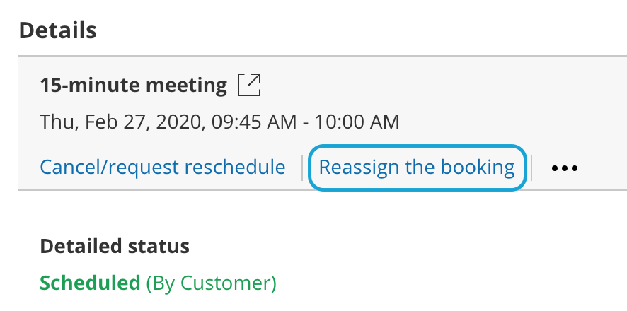
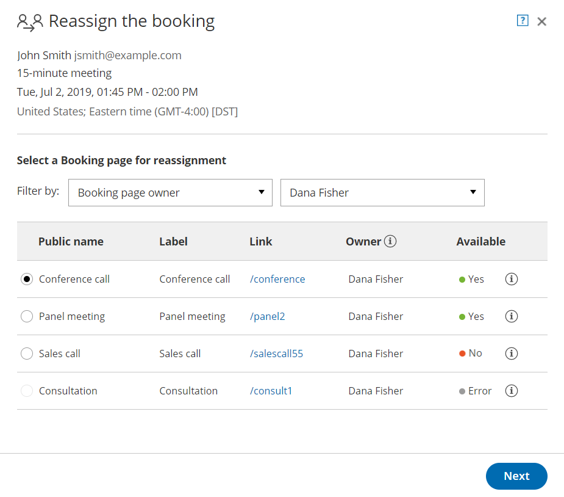

import { Aside } from "@astrojs/starlight/components";

Booking reassignment allows you to reassign bookings in your [Activity stream](/scheduleonce/managing-bookings/analytics/activity-stream-viewing-activities "Introduction to the ScheduleOnce Activity stream") from one Team member to another. In this article, you'll learn how to reassign a booking.

## Requirements

- You must be a OnceHub Administrator.
- Additionally, you must be [the Owner, an Editor, or a Viewer](/scheduleonce/event-types-booking-pages/booking-pages/booking-page-access-permissions "Booking page access permissions") of the [Booking page](/scheduleonce/event-types-booking-pages/booking-pages/introduction-to-booking-pages "Introduction to Booking pages") that the booking was made on.
- Booking reassignment is only available between Users who are both connected to [Google Calendar](/scheduleonce/user-integrations/google-calendar-connection/managing-your-oncehub-integration-with-google-workspace "Introduction to Google Calendar connection"), or Users who are both **not connected** to any calendar.
- The meeting type must be a [one-on-one meeting](/scheduleonce/event-types-booking-pages/scheduling-options/one-on-one-or-group-sessions "One-on-One or Group session"). Panel or team-hosted meetings cannot be reassigned

## Reassigning a booking

1. Select the booking that you want to reassign in the [Activity stream](/scheduleonce/managing-bookings/analytics/activity-stream-viewing-activities "Introduction to the ScheduleOnce Activity stream").

2. In the **Details** pane, select **Reassign the booking** (Figure 1). 

   Figure 1: Reassign the booking

   <Aside type="note">

   **Note** If the **Reassign booking** action is not available for the booking, it means that the booking is not eligible for reassignment. [Learn more about the eligibility for Booking reassignment](/scheduleonce/managing-bookings/reassign/eligibility-for-booking-reassignment-faqs "Eligibility for booking reassignment")

   </Aside>

3. The **Reassign the booking** pop-up will open.

4. Select the Booking page which you would like to reassign the booking to (Figure 2). You can filter by **Booking page Owner** or by **Booking pages with available time** using the left drop-down menu. 

   Figure 2: Reassign the booking pop-up

5. You can reassign a booking to a Booking page labeled **Yes** or **No** under the **Available** column.

   - **Yes:** The Booking page is available at the designated time.
   - **No:** The Booking page is either busy at the designated time, or the designated time is outside of the User’s [recurring](/scheduleonce/event-types-booking-pages/booking-pages/booking-pages-recurring-availability "Booking page: Recurring availability section") or [date-specific availability](/scheduleonce/event-types-booking-pages/booking-pages/booking-pages-date-specific-availability "Booking page: Date-specific availability section"). You can still reassign the booking to a Booking page that is not available.
   - **Error:** The page cannot accept bookings due to a system error. The Booking page may be disabled, or there may be a calendar connection error. It can also mean that the Booking page is [not eligible for reassignment](/scheduleonce/managing-bookings/reassign/eligibility-for-booking-reassignment-faqs "Eligibility for booking reassignment").

6. Click **Next**.

7. In the **Notification** step, you can add a **Booking reassignment reason** that will be provided to the Customer. This step is optional. The **Booking reassignment reason** is shown in the **Details** pane of the Activity stream for a reassigned booking. It is also included in the email notifications sent to the original Booking owner, the new Booking owner, and [any additional stakeholders](/scheduleonce/event-types-booking-pages/user-notifications/subscribing-to-booking-notifications "Access permissions for subscribing to Booking notifications"). This allows you to communicate the reason for reassigning a booking to relevant Users.

8. Click **Next**.

9. In the **Review** step, confirm the details of the booking that you're about to reassign.

10. Click **Reassign booking**.

11. In the **Confirmation** step, you'll receive confirmation that the booking has been successfully reassigned.
