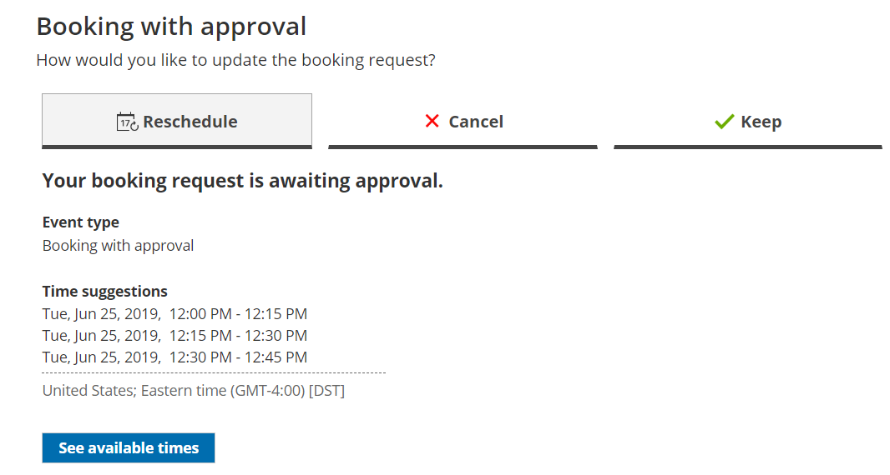

import { Aside } from "@astrojs/starlight/components";

A Customer can resubmit a booking request as many times as they like. Booking requests are not subject to the [Reschedule policy](/scheduleonce/managing-bookings/cancel-reschedule/customer-cancelreschedule-policy "The Customer Cancel/reschedule policy") set by the meeting organizer. The Reschedule policy applies only to scheduled or rescheduled bookings.

## How Customers resubmit a booking request

1. To resubmit a booking request, the Customer clicks the **Cancel/Reschedule** link in the scheduling confirmation email (Figure 1). Figure 1: Booking request confirmation email
2. The [Cancel/reschedule page](/scheduleonce/managing-bookings/cancel-reschedule/customer-cancelreschedule-page "The Customer Cancel/Reschedule page") will open.
3. On the **Reschedule** tab, the Customer clicks the **See available times** button (Figure 2). Figure 2: Reschedule tab
4. The Customer selects new dates and times and provides a reason for requesting new times if it is required by your [Cancel/reschedule policy](/scheduleonce/managing-bookings/cancel-reschedule/customer-cancelreschedule-policy "The Customer Cancel/reschedule policy").
5. The [Booking form step](/scheduleonce/event-types-booking-pages/booking-forms-redirect/collecting-customer-data-with-booking-forms "Collecting Customer data with Booking forms") is skipped because all the required information was already provided by the Customer when they made the booking.
6. After rescheduling, the Customer will receive a reschedule email notification, along with the [Booking page Owner](/scheduleonce/event-types-booking-pages/booking-pages/booking-page-access-permissions "Booking page access permissions") and [any additional stakeholders](/scheduleonce/event-types-booking-pages/user-notifications/subscribing-to-booking-notifications "Subscribing to Booking notifications").

[Learn more about the effect of rescheduling](/scheduleonce/managing-bookings/cancel-reschedule/effects-of-rescheduling "Effect of rescheduling")
