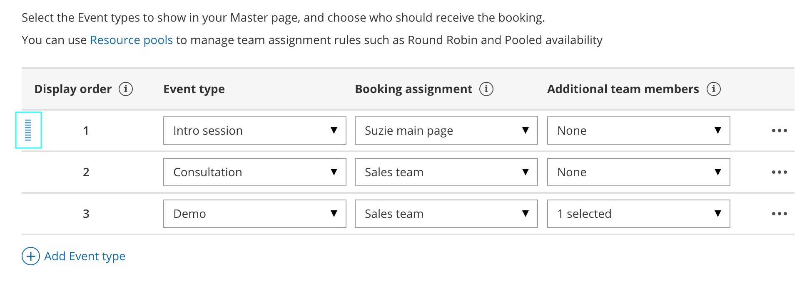

import { Aside } from "@astrojs/starlight/components";
import YouTubeEmbed from "~/components/YouTubeEmbed.astro";

With OnceHub, you can automatically distribute bookings to Team members according to rules you define. Rules can be defined for [Master pages](/scheduleonce/master-pages-resource-pools/master-pages/introduction-to-master-pages "Introduction to Master Pages") using [team or panel pages](/scheduleonce/master-pages-resource-pools/master-pages/master-page-scenario-team-or-panel-page "Master page scenario: Team or panel pages").

<YouTubeEmbed id="Ssnc5V_bDns" title="Assignment with team or panel pages" />

<Aside type="tip">

When you use a Master page with team or panel pages, you can also [generate one-time links](/scheduleonce/sharing-publishing/general-one-time-links/using-one-time-links "Using One-time links with your Master page") which are good for one booking only, eliminating any chance of unwanted repeat bookings. A Customer who receives the link will only be able to use it for the intended booking and will not have access to your underlying [Booking page](/scheduleonce/event-types-booking-pages/booking-pages/introduction-to-booking-pages "Introduction to Booking pages"). One-time links [can be personalized](/scheduleonce/sharing-publishing/personalized-links/using-personalized-links "Using Personalized links"), allowing the Customer to pick a time and schedule without having to fill out the [Booking form](/scheduleonce/event-types-booking-pages/booking-forms-redirect/collecting-customer-data-with-booking-forms "Collecting Customer data with Booking forms").

</Aside>

In this article, you'll learn about using Master pages with the team or panel page scenario.

## Requirements

To set up a Master page with team or panel pages, you must be a [OnceHub Administrator](/account-administration/user-management/user-roles-overview "Differences between Administrator and Member").

## Setting up a Master page with a team or panel page scenario

1. [Create a Master page](/scheduleonce/master-pages-resource-pools/master-pages/creating-master-page "Creating a Master Page") by clicking the Plus button  in the **Master pages** pane.

2. In the [Scenario](/scheduleonce/master-pages-resource-pools/master-pages/master-page-scenarios "Master page scenarios") field of the **New Master page** pop-up, select the [Team or panel page](/scheduleonce/master-pages-resource-pools/master-pages/master-page-scenario-team-or-panel-page "Master page scenario: Team or panel pages") scenario (Figure 1). Figure 1: New Master page pop-up

3. Populate the pop-up with a **Public name**, **Internal label**, **Public link**, and an image if you choose. Then, click **Save & Edit**. You'll be redirected to the [Master page Overview section](/scheduleonce/master-pages-resource-pools/master-pages/master-pages-overview "Master page: Overview section") to continue editing your settings.

4. Go to the [Event types and assignment section](/scheduleonce/master-pages-resource-pools/master-pages/master-pages-event-types-and-assignment "Master Page: Event types and assignment section") of the Master page.

5. Click **Add Event type**. Figure 2: Add Event type to a Master page

6. Select which Event types will be offered on your Master page (Figure 3). Master pages with team or panel pages can only include Event types configured to [Automatic booking](/scheduleonce/event-types-booking-pages/scheduling-options/automatic-booking-or-booking-with-approval "Automatic booking or Booking with approval") and Single sessions. [Learn more about conflicting settings when using team or panel pages](/scheduleonce/master-pages-resource-pools/master-pages/conflicting-settings-when-using-team-or-panel-pages "Conflicting settings when using team or panel pages")

7. Next, use the [Booking assignment](/scheduleonce/master-pages-resource-pools/panel-meetings/booking-owners "Booking assignment") drop-down to select who will provide your Event types. The Booking assignment can be a specific Booking page or a Resource pool.

8. If your Event type requires multiple team members from your organization, use the [Additional team members](/scheduleonce/master-pages-resource-pools/panel-meetings/additional-team-members "Additional Team Members") drop-down to add them.

   <Aside type="note">

   **Note**The same Resource pool cannot be selected as the Booking assignment and as the Additional team member in a single rule. [Learn more about conflicting settings when using team or panel pages](/scheduleonce/master-pages-resource-pools/master-pages/conflicting-settings-when-using-team-or-panel-pages "Conflicting settings when using team or panel pages").

   </Aside>

9. Reorder the Event types to make sure they appear on your Master page in the order that you want. You can move a row up or down by clicking on the left side of the row and dragging to the position you want (Figure 4). Figure 3: Click and drag a row to reorder

10. Click **Save**.

## Scenarios with team or panel pages

There are a wide variety of scenarios that team or panel pages allow you to create. Here are some of the most common.

### One-on-one meetings with prospects and Customers

When you conduct one-on-one meetings with prospects and Customers, you may have multiple team members who are capable of conducting the meetings. For example, your Account Executives might conduct product demos, or your Customer Success Managers might conduct onboarding sessions.

Using team or panel pages, bookings can be automatically assigned to team members in a [Resource pool](/scheduleonce/master-pages-resource-pools/resource-pools/introduction-to-resource-pools "Introduction to ScheduleOnce Resource pools"). Bookings will be assigned according to the distribution method you choose for the pool, whether via [Round robin](/scheduleonce/master-pages-resource-pools/resource-pools/round-robin-distribution-method "Resource pool distribution method: Round robin"), [Pooled availability](/scheduleonce/master-pages-resource-pools/resource-pools/pooled-availability-distribution-method "Resource pool distribution method: Pooled availability"), or [Pooled availability with priority](/scheduleonce/master-pages-resource-pools/resource-pools/resource-pool-distribution-method-pooled-availability-with-priority "Resource pool distribution method: Pooled availability with priority").

### Meetings with multiple team members simultaneously

You may offer meetings that need the participation of multiple team members from your organization. For example, a consulting firm might need a team of consultants to attend a meeting, or a university conducting admissions interviews might need multiple faculty members and professors to attend the interview.

With team or panel pages, you can create [Panel meetings](/scheduleonce/master-pages-resource-pools/panel-meetings/introduction-to-panel-meetings/ "Introduction to Panel meetings") with multiple team members. Each Panel meeting has a [Booking assignment](/scheduleonce/master-pages-resource-pools/panel-meetings/booking-owners "Booking assignment") that determines the owner of the meeting. You can select any number of [Additional team members](/scheduleonce/master-pages-resource-pools/panel-meetings/additional-team-members "Additional Team Members") to participate in the meeting. You can select specific Booking pages to participate in your meetings, or [Resource pools](/scheduleonce/master-pages-resource-pools/resource-pools/resource-pools-overview) to automatically assign a team member. When Customers visit your Master page, they will only see availability for the possible panel combinations.

### Scheduling one-off meetings using one-time links

When you use a Master page with team or panel pages, you can [generate one-time links](/scheduleonce/sharing-publishing/general-one-time-links/using-one-time-links "Using One-time links with your Master page") which you can send to your Customers to schedule bookings with you. One-time links are good for one booking only, eliminating any chance of unwanted repeat bookings. A Customer who receives the link will only be able to use it for the intended booking and will not have access to your underlying [Booking page](/scheduleonce/event-types-booking-pages/booking-pages/introduction-to-booking-pages "Introduction to Booking pages").

For example, you may have a Customer who wants to schedule a Support meeting to resolve a specific issue. However, you want to restrict access to your Support team because their time is limited. You can send this Customer a one-time link to schedule a booking for this specific issue.

After the Customer schedules the booking, they won't be able to use that one-time link to schedule bookings for any other issues.

<Aside type="tip">

You can use the [OnceHub for Gmail extension](/user-integrations/browser-extension/introduction-to-oncehub-for-gmail "https://help.oncehub.com/help/introduction-to-oncehub-for-gmail") to schedule with general links directly from your Gmail account. You can generate links, copy them in a single click, and send them in an email.

[Learn more about OnceHub for Gmail](/user-integrations/browser-extension/introduction-to-oncehub-for-gmail "Introduction to OnceHub for Gmail")

</Aside>
