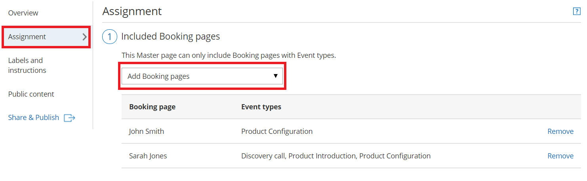

import { Aside } from "@astrojs/starlight/components";
import YouTubeEmbed from "~/components/YouTubeEmbed.astro";

<YouTubeEmbed
  id="lA0FCpzqWcc"
  title="Booking pages first (Event types second)"
/>

[Master pages](/scheduleonce/master-pages-resource-pools/master-pages/introduction-to-master-pages "Introduction to Master pages") with Booking pages first (Event types second) allow Customers to first select which [Booking page](/scheduleonce/event-types-booking-pages/booking-pages/introduction-to-booking-pages "Introduction to Booking pages") they prefer. They can then choose an [Event type](/scheduleonce/event-types-booking-pages/event-types/creating-an-event-type "Creating an Event type") from the ones that are associated with that Booking page. Finally, the Customer schedules the meeting. The [preexisting associations between Booking pages and Event types](/scheduleonce/event-types-booking-pages/booking-pages/adding-event-types-to-booking-pages "Adding Event types to Booking pages") determine which Event types are offered on your Master page.

<Aside type="tip">

If you would like to [generate one-time links](/scheduleonce/sharing-publishing/general-one-time-links/using-one-time-links "Using one-time links with your Master page") which are good for one booking only, you should use a Master page using [Rule-based assignment](/scheduleonce/master-pages-resource-pools/master-pages/master-page-scenario-team-or-panel-page "Master page scenario: Rule-based assignment") with [Dynamic rules](/scheduleonce/master-pages-resource-pools/master-pages/assignment-with-team-or-panel-pages "Rule-based assignment: Dynamic rules").

One-time links eliminate any chance of unwanted repeat bookings. A Customer who receives the link will only be able to use it for the intended booking and will not have access to your underlying [Booking page](/scheduleonce/event-types-booking-pages/booking-pages/introduction-to-booking-pages "Introduction to Booking pages"). One-time links [can be personalized](/scheduleonce/sharing-publishing/personalized-links/using-personalized-links "Using Personalized links"), allowing the Customer to pick a time and schedule without having to fill out the [Booking form](/scheduleonce/event-types-booking-pages/booking-forms-redirect/collecting-customer-data-with-booking-forms "Collecting Customer data with Booking forms"). [Learn more about one-time links](/scheduleonce/sharing-publishing/general-one-time-links/using-one-time-links "Using one-time links with your Master page")

</Aside>

In this article, you'll learn about Master pages with Booking pages first.

## The Customer flow

Figure 1: Customer flow for Booking pages first. With Booking pages types first, the Customer first selects the Booking page they prefer and then chooses from the Event types offered by that Booking page.

After selecting an Event type, the Customer is presented with the availability of the Booking page they selected. They can choose a date and time and schedule the meeting.

<Aside type="note">

If there is only one Booking page included in the Master page, the Customer skips the Booking page selection step. They move directly to choosing an Event type.

If the selected [Booking page offers only one Event type](/scheduleonce/event-types-booking-pages/booking-pages/adding-event-types-to-booking-pages "Adding Event types to Booking pages"), the Customer skips the Event type selection step and moves directly to choosing a time slot.

</Aside>

## Requirements

To create a Master page with a Booking pages first scenario, you must be a [OnceHub Administrator](/account-administration/user-management/user-roles-overview "Differences between Administrator and Member").

## Setting up a Master page with Booking pages first

1. [Create a Master page](/scheduleonce/master-pages-resource-pools/master-pages/creating-master-page "Creating a Master page") by clicking the Plus button  in the **Master pages** pane.
2. In the [Scenario](/scheduleonce/master-pages-resource-pools/master-pages/master-page-scenarios "Master page scenarios") field of the **New Master page** pop-up (Figure 2), select **Booking pages first (Event types second)**. Figure 2: New Master page pop-up
3. Populate the pop-up with a **Public name**, **Internal label**, **Public link**, and an image if you choose. Then click **Save & Edit**. You'll be redirected to the [Master page Overview section](/scheduleonce/master-pages-resource-pools/master-pages/master-pages-overview "Master page: Overview section") to continue editing your settings.
4. Go to the [Assignment section](/scheduleonce/master-pages-resource-pools/master-pages/master-pages-event-types-and-assignment "Master page: Assignment section") of the Master page.
5. Use the drop-down menu to select the Booking pages that you want to include in the Master page (Figure 3). Only [Booking pages associated with Event types](/scheduleonce/event-types-booking-pages/booking-pages/adding-event-types-to-booking-pages "Adding Event types to Booking pages") can be included in this Master page.Figure 3: Add Booking pages
6. In the **Assignment upon reschedule** section (Figure 4), you can choose to assign a rescheduled booking to the same Booking page it was originally assigned to it. To enable this, check the box marked **Reschedule is only possible on the page on which the booking was made**. Figure 4: Assignment upon reschedule enabled
7. Click **Save**.
