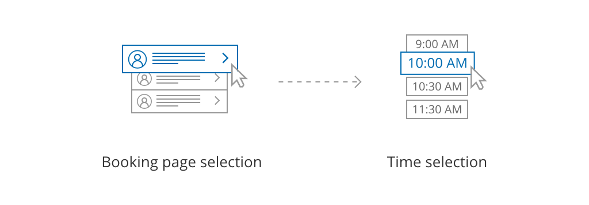
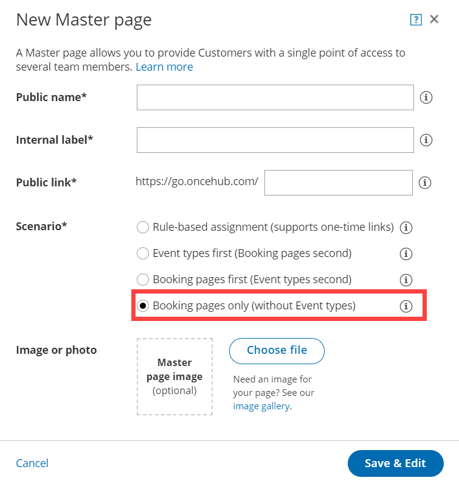
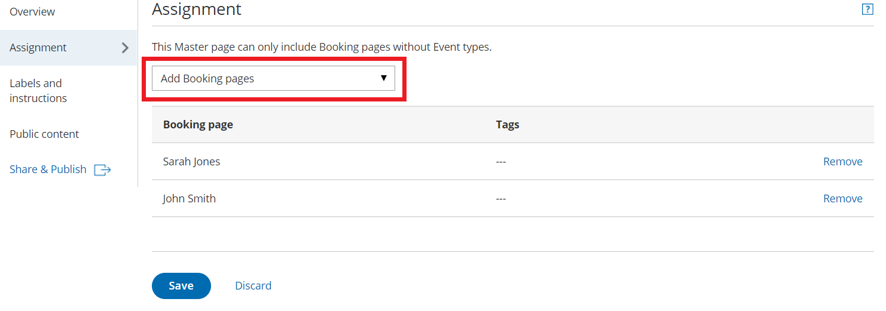

import { Aside } from "@astrojs/starlight/components";
import YouTubeEmbed from "~/components/YouTubeEmbed.astro";

<YouTubeEmbed
  id="ToeaPtEKRqQ"
  title="Booking pages only (without Event types)"
/>

[Master pages](/scheduleonce/master-pages-resource-pools/master-pages/introduction-to-master-pages "Introduction to Master pages") with Booking pages only (without Event types) allow Customers to only select which [Booking page](/scheduleonce/event-types-booking-pages/booking-pages/introduction-to-booking-pages "Introduction to Booking pages") they prefer. Bookings are assigned according to the Customer’s selection. This option is useful if you don't use [Event types](/scheduleonce/event-types-booking-pages/event-types/introduction-to-event-types "Introduction to Event types") and there are no shared settings between your Booking pages.

<Aside type="tip">

If you would like to [generate one-time links](/scheduleonce/sharing-publishing/general-one-time-links/using-one-time-links "Using one-time links with your Master page") which are good for one booking only, you should use a Master page using [Rule-based assignment](/scheduleonce/master-pages-resource-pools/master-pages/master-page-scenario-team-or-panel-page "Master page scenario: Rule-based assignment") with [Dynamic rules](/scheduleonce/master-pages-resource-pools/master-pages/assignment-with-team-or-panel-pages "Rule-based assignment: Dynamic rules").

One-time links eliminate any chance of unwanted repeat bookings. A Customer who receives the link will only be able to use it for the intended booking and will not have access to your underlying [Booking page](/scheduleonce/event-types-booking-pages/booking-pages/introduction-to-booking-pages "Introduction to Booking pages"). One-time links [can be personalized](/scheduleonce/sharing-publishing/personalized-links/using-personalized-links "Using Personalized links"), allowing the Customer to pick a time and schedule without having to fill out the [Booking form](/scheduleonce/event-types-booking-pages/booking-forms-redirect/collecting-customer-data-with-booking-forms "Collecting Customer data with Booking forms"). [Learn more about one-time links](/scheduleonce/sharing-publishing/general-one-time-links/using-one-time-links "Using one-time links with your Master page")

</Aside>

In this article, you'll learn about Master pages with Booking pages only.

## The Customer flow

Figure 1: Customer flow for Booking pages only With Booking pages only, the Customer selects a Booking page and is presented with the Booking page’s availability. The Customer then selects a date and time and schedules the meeting.

## Requirements

To create a Master page with a Booking pages only scenario, you must be a [OnceHub Administrator](/account-administration/user-management/user-roles-overview "Differences between Administrator and Member").

## Setting up a Master page with Booking pages only

1. [Create a Master page](/scheduleonce/master-pages-resource-pools/master-pages/creating-master-page "Creating a Master Page") by clicking the Plus button  in the **Master pages** pane.
2. In the [Scenario](/scheduleonce/master-pages-resource-pools/master-pages/master-page-scenarios "Master page scenarios") field of the **New Master page** pop-up (Figure 2), select **Booking pages only (without Event types)**. Figure 2: New Master page pop-up
3. Populate the pop-up with a **Public name**, **Internal label**, **Public link**, and an image if you choose. Then click **Save & Edit**. You'll be redirected to the [Master page Overview section](/scheduleonce/master-pages-resource-pools/master-pages/master-pages-overview "Master page: Overview section") to continue editing your settings.
4. Go to the [Assignment](/scheduleonce/master-pages-resource-pools/master-pages/master-pages-event-types-and-assignment "Master Page: Assignment section") section of the Master page.
5. Use the drop-down menu to select the Booking pages that you want to include in the Master page (Figure 3). Only Booking pages that are not associated with any Event types can be included in this Master page.Figure 3: Add Booking pages to your Master page
6. Click **Save**.
