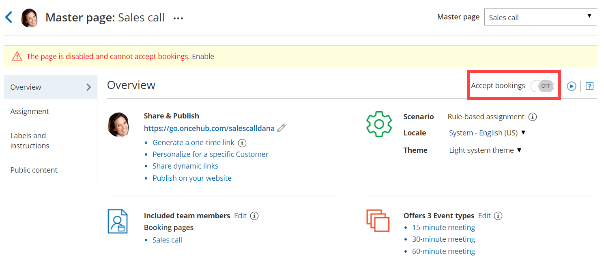

import { Aside } from "@astrojs/starlight/components";

If you don't want to accept bookings on your [Master page](/scheduleonce/master-pages-resource-pools/master-pages/introduction-to-master-pages "Introduction to Master pages") but don't want to delete it, you can disable it instead. When you disable your Master page, your settings remain intact and you can enable it again at any time.

In this article, you'll learn how to disable your Master page.

## Disabling your Master page

1. Go to **Booking pages** on the left.
2. Select the specific Master page that would like to disable.
3. In the Master page [Overview section](/scheduleonce/master-pages-resource-pools/master-pages/master-pages-overview "Master Page: Overview section"), set the **Accept bookings** toggle to OFF (Figure 1). Figure 1: Accept bookings toggle set to OFF

<Aside type="note">

If you want to completely delete your Master page, go to **Booking pages** on the left, click the action menu (three dots) of the relevant Master page, and select **Delete**.

When you delete your Master page, all the settings associated with the page are permanently deleted too.

</Aside>

## Effects of disabling your Master page

When your Master page is disabled, Customers are not able to make new bookings or to reschedule or cancel existing bookings.

- The [Public content section](/scheduleonce/master-pages-resource-pools/master-pages/master-pages-public-content "Master Page: Public Content section") is still visible to your Customers whether your page is enabled or disabled. This means that you may need to consider changing your personal message.
- An alert message is shown on the Master page Overview section with a link to re-enable the page.
- The status of the Master page is indicated as **\[Disabled]** in the Master page list (Figure 2). Figure 2: Master page list
- The following message is shown to Customers when they try to scheduling a booking using the Master page (Figure 3). Figure 3: No times are currently available message
