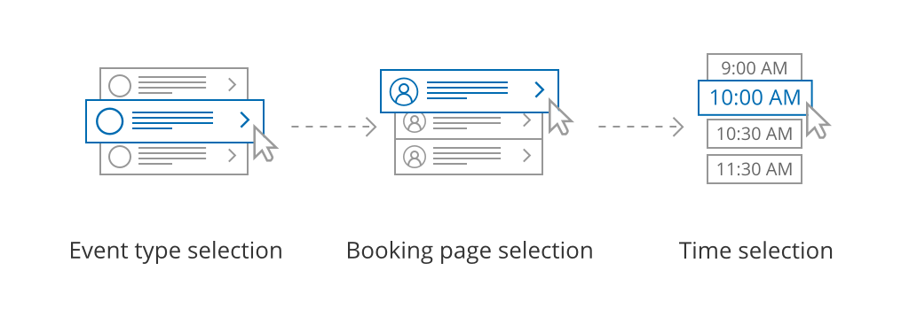
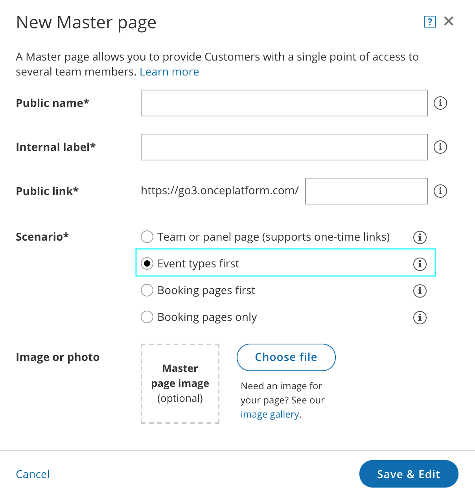
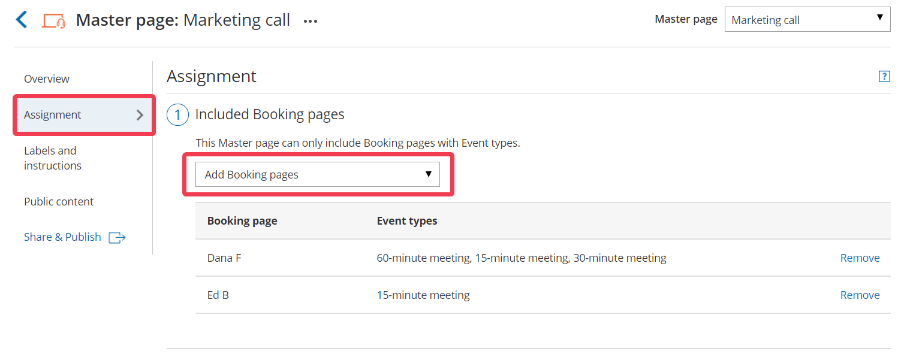
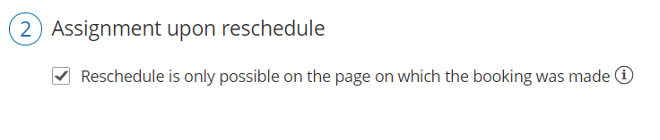

import { Aside } from "@astrojs/starlight/components";

<iframe
  src="https://www.youtube.com/embed/iOUAFhU9xFY?si=81e8l3B6t4ciI6OX"
  width="100%"
  height="400"
  frameborder="0"
  allowfullscreen
></iframe>

[Master pages](/scheduleonce/master-pages-resource-pools/master-pages/introduction-to-master-pages "Introduction to Master pages") with Event types first (Booking pages second) allow Customers to first select which [Event type](/scheduleonce/event-types-booking-pages/event-types/introduction-to-event-types "Introduction to Event types") they prefer. They can then choose a [Booking page](/scheduleonce/event-types-booking-pages/booking-pages/introduction-to-booking-pages "Introduction to Booking pages") from the ones that are [associated with that Event type](/scheduleonce/event-types-booking-pages/booking-pages/adding-event-types-to-booking-pages "Adding Event types to Booking pages"). Finally, the Customer schedules the meeting. The [pre-existing associations between Booking pages and Event types](/scheduleonce/event-types-booking-pages/booking-pages/adding-event-types-to-booking-pages "Adding Event types to Booking pages") determine which Event types are offered on your Master page.

<Aside type="tip">

If you would like to [generate one-time links](/scheduleonce/sharing-publishing/general-one-time-links/using-one-time-links "Using one-time links with your Master page") which are good for one booking only, you should use a Master page using [team or panel pages](/scheduleonce/master-pages-resource-pools/master-pages/master-page-scenario-team-or-panel-page "Master page scenario: Team or panel pages").

One-time links eliminate any chance of unwanted repeat bookings. A Customer who receives the link will only be able to use it for the intended booking and will not have access to your underlying [Booking page](/scheduleonce/event-types-booking-pages/booking-pages/introduction-to-booking-pages "Introduction to Booking pages"). One-time links [can be personalized](/scheduleonce/sharing-publishing/personalized-links/using-personalized-links "Using Personalized links"), allowing the Customer to pick a time and schedule without having to fill out the [Booking form](/scheduleonce/event-types-booking-pages/booking-forms-redirect/collecting-customer-data-with-booking-forms "Collecting Customer data with Booking forms"). [Learn more about one-time links](/scheduleonce/sharing-publishing/general-one-time-links/using-one-time-links "Using one-time links with your Master page")

</Aside>

In this article, you'll learn about Master pages with Event types first.

## The Customer flow

Figure 1: Customer flow for Event types first

With Event types first, the Customer first selects the Event type they prefer and then chooses from the Booking pages that provide that Event type.

After selecting a Booking page, the Customer is presented with the availability of the Booking page they selected. They can choose a date and slot and schedule the meeting.

<Aside type="note">

&#x20;If there is only one Event type included in the Master page, the Customer skips selecting an Event type, moving directly to choosing a Booking page.

If only one Booking page provides the selected Event type, the Customer skips selecting a Booking page, moving directly to choosing a time slot.

</Aside>

## Requirements

To create a Master page with an Event types first scenario, you must be a [OnceHub Administrator](/account-administration/user-management/user-roles-overview "Differences between Administrator and Member").

## Setting up the Master page with Event types first

1. [Create a Master page](/scheduleonce/master-pages-resource-pools/master-pages/creating-master-page "Creating a Master Page") by clicking the Plus button  in the **Master pages** pane.
2. In the [Scenario](/scheduleonce/master-pages-resource-pools/master-pages/master-page-scenarios "Master page scenarios") field of the **New Master page** pop-up (Figure 2), select **Event types first**. Figure 2: New Master page pop-up
3. Populate the pop-up with a **Public name**, **Internal label**, **Public link**, and an image if you choose. Then click **Save & Edit**. You'll be redirected to the [Master page **Overview** section](/scheduleonce/master-pages-resource-pools/master-pages/master-pages-overview "Master page: Overview section") to continue editing your settings.
4. Go to the [**Event types and assignment**](/scheduleonce/master-pages-resource-pools/master-pages/master-pages-event-types-and-assignment "Master Page: Assignment section") section of the Master page.
5. Use the drop-down menu to select the Booking pages that you want to include in the Master page (Figure 3). Only [Booking pages associated with Event types](/scheduleonce/event-types-booking-pages/booking-pages/adding-event-types-to-booking-pages "Adding Event types to Booking pages") can be included in this Master page. Figure 3: Add Booking pages to your Master page
6. In the **Assignment upon reschedule** section (Figure 4), you can choose to assign a rescheduled booking to the same Booking page it was originally assigned to it. To enable this, check the box marked **Reschedule is only possible on the page on which the booking was made**. Figure 4: Assignment upon reschedule enabled
7. Click **Save**.
